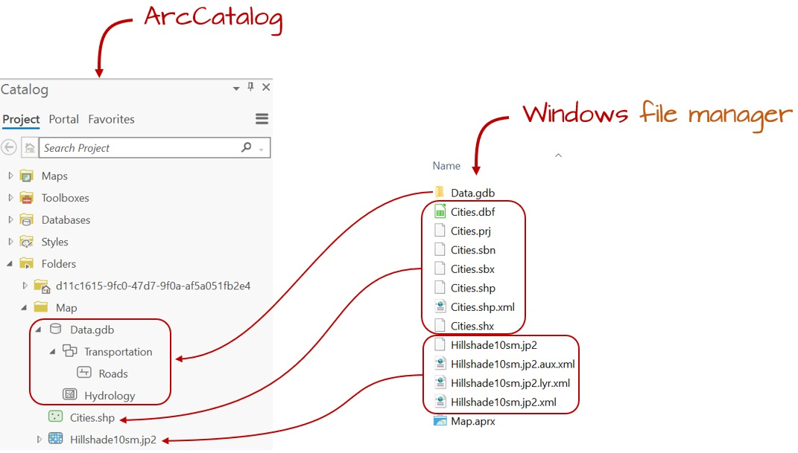
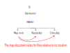
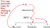

# GIS Data Management

## GIS File Data Formats

In the GIS world, you will encounter many different GIS file formats. Some file formats are unique to specific GIS applications, others are universal. For this course, we will focus on a subset of spatial data file formats: **shapefiles** for vector data, **Imagine** and **GeoTiff** files for rasters and **file geodatabases** and **geopackages** for both vector and raster data.

### Vector Data File Formats

#### Shapefile

A **shapefile** is a file-based data format native to ArcView 3.x software (a much older version of ArcMap). Conceptually, a shapefile is a feature class--it stores a collection of features that have the same geometry type (point, line, or polygon), the same attributes, and a common spatial extent.

Despite what its name may imply, a "single" shapefile is actually composed of at least three files, and as many as eight. Each file that makes up a "shapefile" has a common filename but different extension type.

The list of files that define a "shapefile" are shown in the following table. Note that each file has a specific role in defining a shapefile.

| File extension | Content                       |
|----------------|-------------------------------|
| .dbf           | Attribute information         |
| .shp           | Feature geometry              |
| .shx           | Feature geometry index        |
| .aih           | Attribute index               |
| .ain           | Attribute index               |
| .prj           | Coordinate system information |
| .sbn           | Spatial index file            |
| .sbx           | Spatial index file            |

#### File Geodatabase

A **file geodatabase** is a relational database storage format. It's a far more complex data structure than the shapefile and consists of a **.gdb** folder housing dozens of files. Its complexity renders it more versatile allowing it to store multiple feature classes and enabling topological definitions (i.e. allowing the user to define rules that govern the way different feature classes relate to one another). An example of the contents of a geodatabase is shown in the following figure.

```{r f02-gdb, echo=FALSE, fig.cap = "Sample content of an ArcGIS file geodatabase. (src: esri)", out.width=444, fig.align='center'}

knitr::include_graphics("img/geodatabase.jpg")
```

#### GeoPackage

This is a relatively new data format that follows [open format standards](https://en.wikipedia.org/wiki/Open_format) (i.e. it is non-proprietary). It's built on top of SQLite (a self-contained relational database). Its one big advantage over many other vector formats is its compactness--coordinate value, metadata, attribute table, projection information, etc..., are all stored in a *single* file which facilitates portability. Its filename usually ends in `.gpkg`. Applications such as QGIS (2.12 and up), R and ArcGIS will recognize this format (ArcGIS version 10.2.2 and above will read the file from ArcCatalog but requires a script to create a GeoPackage).

### Raster Data File Formats

Rasters are in part defined by their pixel depth. Pixel depth defines the range of distinct values the raster can store. For example, a 1-bit raster can only store 2 distinct values: 0 and 1.

```{r pixeldepth, echo=FALSE, fig.cap = "Examples of different pixel depths.",  fig.height=3, fig.width=3, fig.align='center'}

## Function
pal <- function(col, border = "light gray", txt =TRUE,...)
{ n <- length(col)
  plot(0, 0, type="n", xlim = c(0, 1), ylim = c(0, 1),
       axes = FALSE, xlab = "", ylab = "", cex.main=1.5,...)
  rect(0:(n-1)/n, 0, 1:n/n, 1, col = col, border = border)
  if(txt == TRUE){
    text(0:(n-1)/n +(0.5/n), 0.4, as.character(seq(0,(n-1))),col=rev(h),cex=1)
  }

}

OP <- par(mfrow=c(5,1),mar=c(0,0,3,0))
# Binary
h <- grey(seq(0,1, length.out=2))
pal(h, main="1 bit (binary)")

# 2 bits
h <- grey(seq(0,1, length.out=4))
pal(h,main="2 bits")

# 4 bits
h <- grey(seq(0,1, length.out=16))
pal(h,main="4 bits")

# 8 bits
h <- grey(seq(0,1, length.out=256))
pal(h,main="8 bits",border="transparent",txt=FALSE)
text(c(0.05,0.95), 0.4, as.character(c(0,255)),col=c("white","black"),cex=1)

# 16 bits
h <- grey(seq(0,1, length.out=65536))
pal(h,main="16 bits",border="transparent",txt=FALSE)
text(c(0.05,0.95), 0.4, as.character(c(0,65535)),col=c("white","black"),cex=1)
par(OP)
```

There is a wide range of raster file formats used in the GIS world. Some of the most popular ones are listed below.

#### Imagine

The **Imagine** file format was originally created by an image processing software company called ERDAS. This file format consists of a single **.img** file. This is a simpler file format than the vector shapefile. It is sometimes accompanied by an .xml file which usually stores metadata information about the raster layer.

#### GeoTiff

A popular public domain raster data format is the **GeoTIFF** format. If maximum portability and platform independence is important, this file format may be a good choice.

#### File Geodatabase

A raster file can also be stored in a file geodatabase alongside vector files. Geodatabases have the benefit of defining image mosaic structures thus allowing the user to create "stitched" images from multiple image files stored in the geodatabase. Also, processing very large raster files can be computationally more efficient when stored in a file geodatabase as opposed to an Imagine or GeoTiff file format.

## Managing GIS Files in ArcGIS

Unless you are intimately familiar with the file structure of a GIS file, it is best to copy/move/delete GIS files from within the software environment. 

```{r f02-catalog, echo=FALSE, fig.cap = "Windows File Explorer view vs. ArcGIS Catalog view. Note, for example, how the many files that make up the Cities shapefile (as viewed in a Windows file manager environment) appears as a single entry in the Catalog view. This makes it easier to rename the shapefile since it needs to be done only for a single entry in the GIS software (as opposed to renaming the Cities files seven times in the Windows file manager environment).", out.width=1071, fig.align='center'}


```

## Managing a Map Project in ArcGIS

Unlike many other software environments such as word processors and spreadsheets, a GIS map project is not self-contained in a single file. A GIS map consists of many files: ArcGIS' *.aprx* file and the various vector and/or raster files used in the map project. The *.aprx* file only stores information about how the different layers are to be symbolized and the GIS file locations these layers point to.

Because of the complex data structure associated with GIS maps, it's usually best to store the *.aprx* and all associated GIS files under a single project directory. Then, when you are ready to share your map project with someone else, just pass along that project folder as is or compressed in a zip or tar file.

Because .*aprx* map files read data from GIS files, it must know where to find these files on your computer or across the network. There are two ways in which a map document can store the location to the GIS files: as a **relative pathname** or a **full pathname**. In older esri GIS applications, like **ArcMap**, the user had the choice to save a project using **relative** or **full** pathnames.

> Note that ArcMap is a legacy GIS software replaced by ArcGIS Pro. What follows pertains to the ArcMap software environment and not the ArcGIS Pro software environment.

A *relative pathname* defines the location of the GIS files relative to the location of the map file on your computer. For example, let's say that you created a project folder called HW05 under D:/Username/. In that folder, you have an ArcMap map document, Map.aprx (ArcMap GIS files have an *.mxd* extension and not an *.aprx* extension). The GIS document displays two layers stored in the GIS files Roads.shp and Cities.shp. In this scenario, the *.mxd* document and shapefiles are in the same project folder. If you set the **Pathnames** parameter to **"Store relative pathnames to data sources"** (accessed from ArcMap's **File \>\> Map Document Properties menu**) ArcMap will not need to know the entire directory structure above the HW05/ folder to find the two shapefiles as illustrated below.

```{r echo=FALSE, fig.align='center'}


```

If the **"Store relative pathnames to data sources"** is not checked in the map's document properties, then ArcMap will need to know the *entire* directory structure leading to the HW05/ folder as illustrated below.

```{r echo=FALSE, fig.align='center'}


```

Your choice of full vs relative pathnames matters if you find yourself having to move or copy your project folder to another directory structure. For example, if you share you HW05/ project folder with another user and that user places the project folder under a different directory structure such as C:/User/Jdoe/GIS/, ArcMap will not find the shapefiles if the pathnames is set to full (i.e. the *Store relative pathnames* option is not checked). This will result in **exclamation marks** in your map document TOC. This problem can be avoided by making sure that the map document is set to use relative pathnames and by placing all GIS files (raster and vector) in a common project folder.

> NOTE: Exclamation marks in your map document indicate that the GIS files are missing or that the directory structure has changed.


```{r excla1, echo=FALSE, out.width=100, fig.align='center', fig.cap = "In ArcGIS, an exclamation mark next to a layer indicates that the GIS file the layer is pointing to cannot be found."}
knitr::include_graphics("img/Exclamation_marks.jpg")
```
