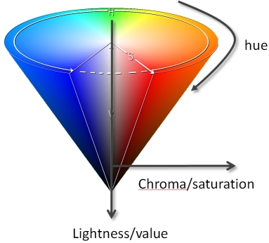
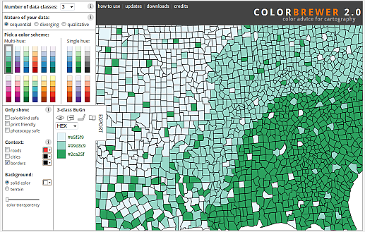
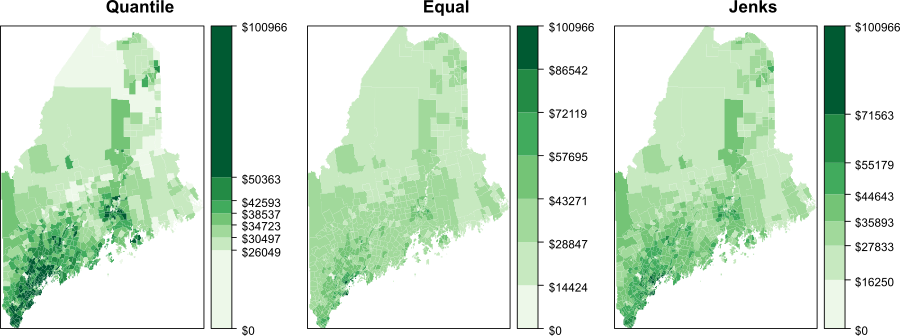
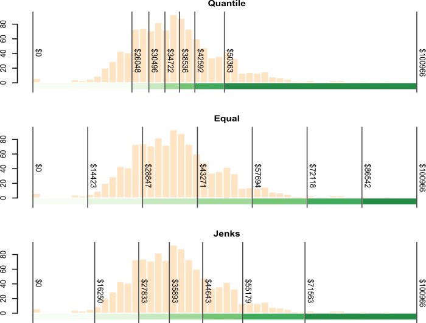

# Symbolizing features

## Introduction

Effective map design is not just about placing data on a map, it's about communicating information clearly and accurately. This chapter explores the principles and practices behind symbolizing spatial features, focusing on how color and classification schemes can be used to enhance the readability and interpretability of maps.

The chapter begins by breaking down the three perceptual dimensions of color--**hue**, **lightness**, and **saturation**--and explains how each can be used to represent different types of data. It then introduces the concept of color spaces, including the commonly used HSV (Hue-Saturation-Value) model and perceptually accurate models like CIELAB and Munsell, highlighting how human perception of color can differ from software-generated color models.

The chapter also covers classification schemes used in choropleth mapping:

+ **Qualitative** schemes for categorical data,
+ **Sequential** schemes for ordered data,
+ **Divergent** schemes for data with a meaningful midpoint.

It emphasizes the importance of choosing appropriate classification intervals, such as **equal interval**, **quantile**, and **Jenks natural breaks**, and demonstrates how different choices can significantly affect the appearance and interpretation of a map.

Finally, the chapter introduces tools like ColorBrewer, which help cartographers select color palettes that are visually effective, colorblind-safe, and suitable for grayscale printing.

## Color

Color plays a central role in map design, influencing how effectively spatial patterns and relationships are communicated. In cartography, color is not just aesthetic--it encodes meaning and guides interpretation. To use color effectively, it’s important to understand its three perceptual dimensions: **hue**, **lightness** and **saturation**. These dimensions interact to shape how we perceive and differentiate features on a map. In the following sections, we’ll explore each dimension and its implications for symbolizing different types of data.

### Hue

**Hue** is the perceptual dimension most commonly associated with color names--such as red, green, or blue. In cartography, hue is typically used to represent **categorical** data, where each category is assigned a distinct color. This allows map readers to easily differentiate between classes without implying any order or magnitude. However, the choice of hues should be made carefully, as some colors may carry cultural connotations or be difficult to distinguish for individuals with color vision deficiencies. 

```{r}
#| label: fig-hue
#| fig.height: 0.2
#| fig.width: 3
#| fig.align: "center"
#| fig-cap: "An example of eight different hues. Hues are associated with color names such as green, red or blue."
#| echo: false

library(munsell)
library(colorspace)

# Function
pal <- function(col, border = "light gray", ...)
{ n <- length(col)
  plot(0, 0, type="n", xlim = c(0, 1), ylim = c(0, 1),
       axes = FALSE, xlab = "", ylab = "", ...)
  rect(0:(n-1)/n, 0, 1:n/n, 1, col = col, border = border) }

# Create different hues
OP <- par( mar=c(0,0,0,0))
  h <- rainbow(8, s = 1, v = 0.8)
  pal(h)
par(OP)

```

Note that magentas and purples are not part of the natural visible light spectrum; instead they are a mix of reds and blues (or violets) from the spectrum's tail ends. 

### Lightness

**Lightness**--sometimes referred to as **value**--describes how much light is reflected or emitted from a surface, influencing how bright or dark a color appears. In cartographic design, lightness is particularly useful for symbolizing **ordinal**, **interval**, or **ratio** data (i.e., data that have a meaningful ordering or numeric scale), where a progression from light to dark can intuitively represent increasing values. Unlike hue, which separates categories, lightness enables us to show variation within a single category or color. However, care should be taken to maintain sufficient contrast between classes, especially in grayscale or colorblind-safe designs 

```{r}
#| label: fig-lightness
#| fig.height: 0.8
#| fig.width: 3
#| fig.align: "center"
#| fig-cap: "Eight different hues (across columns) with decreasing lightness values (across rows)."
#| echo: false

# Function
pal <- function(col, border = "light gray", ...)
{ n <- length(col)
  plot(0, 0, type="n", xlim = c(0, 1), ylim = c(0, 1),
       axes = FALSE, xlab = "", ylab = "", ...)
  rect(0:(n-1)/n, 0, 1:n/n, 1, col = col, border = border) }

# Different lightness values
h1 <- rainbow(8, s = 1, v = 0.8)
h2 <- rainbow(8, s = 1, v = 0.6)
h3 <- rainbow(8, s = 1, v = 0.4)
h4 <- rainbow(8, s = 1, v = 0.2)

OP <- par( mfrow=c(4,1), mar=c(0,0,0,0))
pal(h1); pal(h2); pal(h3); pal(h4)
par(OP)

```

### Saturation

**Saturation**--also referred to as chroma--describes the intensity or vividness of a color. Highly saturated colors appear bold and vibrant, while low-saturation colors appear muted or grayish. In cartographic design, saturation can be used to **emphasize specific features** or categories, but it should be applied with care. Overuse can lead to visual clutter or misinterpretation, especially when combined with other color dimensions. Saturation is best used to subtly enhance contrast or draw attention to key map elements.

```{r}
#| label: fig-saturation
#| fig.height: 0.8
#| fig.width: 3
#| fig.align: "center"
#| fig-cap: "Eight different hues (across columns) with decreasing saturation values (across rows)."
#| echo: false

library(munsell)
library(colorspace)

# Function
pal <- function(col, border = "light gray", ...)
{ n <- length(col)
  plot(0, 0, type="n", xlim = c(0, 1), ylim = c(0, 1),
       axes = FALSE, xlab = "", ylab = "", ...)
  rect(0:(n-1)/n, 0, 1:n/n, 1, col = col, border = border) }

# Different saturation values
h1 <- rainbow(8, v = 1, s = 0.8)
h2 <- rainbow(8, v = 1, s = 0.6)
h3 <- rainbow(8, v = 1, s = 0.4)
h4 <- rainbow(8, v = 1, s = 0.2)

OP <- par( mfrow=c(4,1), mar=c(0,0,0,0))
pal(h1); pal(h2); pal(h3); pal(h4)
par(OP)

```

## Color Space

The three perceptual dimensions of color--hue, lightness, and saturation--can be visualized as forming a **three-dimensional color space**. While one might expect this space to be a **cube**, it is more accurately represented as a **cone**: hue wraps around the circumference, saturation extends outward from the center, and lightness runs vertically. 

```{r}
#| label: fig-color_space
#| fig.align: "center"
#| fig-cap: "A conventional hue-saturation-lightness color space. Hue varies around the circumference, saturation increases outward from the center, and lightness varies vertically."
#| echo: false


```

This model helps explain how colors blend, fade, or become indistinguishable as saturation or lightness changes.

However, most software-defined color spaces assume symmetry which does not reflect how humans actually perceive color. For example, we can distinguish more shades of blue than yellow at the same saturation and lightness. 

```{r}
#| label: fig-munsell
#| fig.height: 0.5
#| fig.width: 8
#| fig.align: "center"
#| fig-cap: "A cross section of the color space with constant hues and lightness values and decreasing saturation values where the two hues merge."
#| echo: false

library(munsell)
library(colorspace)

# Function
pal <- function(col, border = "light gray", ...)
{ n <- length(col)
  plot(0, 0, type="n", xlim = c(0, 1), ylim = c(0, 1),
       axes = FALSE, xlab = "", ylab = "", ...)
  rect(0:(n-1)/n, 0, 1:n/n, 1, col = col, border = border) }

# Create slice from symmetrical HSV colorspace
h = rep(0.127,12); v = rep(.7,12); s = seq(.0,.8,length.out=30)
cl1.hex = hsv(h,rev(s),v)
cl2.hex = hsv(h+0.5,s,v)

OP <- par( mar=c(0,0,0,0))
pal(c(cl1.hex,cl2.hex), border=NA)
par(OP)

```

How many distinct yellows can you perceive? How many distinct blues? Do the counts seem to match? Unless you have exceptionally acute color vision, you’ll likely notice a discrepancy--even though the software has generated exactly 30 distinct shades of each. To confirm this, we can add borders around each color swatch to visually verify that the number of distinct colors is indeed the same.

```{r}
#| label: fig-munsell_bis
#| fig.height: 0.5
#| fig.width: 8
#| fig.align: "center"
#| fig-cap: "A cross section of the color space with each color distinctly outlined."
#| echo: false

## Function
pal <- function(col, border = "light gray", ...)
{ n <- length(col)
  plot(0, 0, type="n", xlim = c(0, 1), ylim = c(0, 1),
       axes = FALSE, xlab = "", ylab = "", ...)
  rect(0:(n-1)/n, 0, 1:n/n, 1, col = col, border = border) }

# Create slice from symmetrical HSV colorspace
h = rep(0.127,12); v = rep(.7,12); s = seq(.0,.8,length.out=30)
cl1.hex = hsv(h,rev(s),v)
cl2.hex = hsv(h+0.5,s,v)

OP <- par( mar=c(0,0,0,0))
pal(c(cl1.hex,cl2.hex))
par(OP)

```


By now, it should be evident that symmetrical color spaces—like those commonly used in software--do not accurately reflect how humans perceive color. Our visual system is more sensitive to certain hues and less so to others, resulting in perceptual asymmetries that these models fail to capture. More rigorously designed color spaces, such as **CIELAB** and **Munsell**, address this limitation by modeling color as a non-symmetrical space that better aligns with human perception. 

The Munsell color space is designed so that equal visual differences correspond more closely to equal perceptual differences.

```{r}
#| label: fig-munsell_slice
#| fig.height: 2
#| fig.width: 4
#| fig.align: "center"
#| fig-cap: "A slice of the Munsell color space illustrating that the range of distinguishable colors varies by hue, reflecting human color perception more accurately than symmetrical HSV models."
#| echo: false

library(ggplot2)
OP <- par( mar=c(0,0,0,0))
p <- complement_slice("5Y")
p$layers[[2]] <- NULL # remove text layer
p 
par(OP)

```

As illustrated by the Munsell color space, our ability to distinguish colors is not uniform across hues. For example, we can perceive fewer distinct shades of yellow than blue at comparable lightness levels. In one comparison, 29 unique shades of yellow were discernible (excluding grayscale values where saturation = 0), while 36 shades of blue were distinguishable.

Understanding how humans perceive color helps us choose colors that communicate data effectively. The next step is determining how colors should be assigned to map features based on the type of data being mapped. 

The next section introduces three foundational color schemes--**qualitative**, **sequential** and **divergent**--each tailored to different types of data and mapping goals.

## Color Schemes

Once you've selected an appropriate color space, the next step is to determine how to apply color to your data. This involves choosing a classification scheme--a method for grouping data values into discrete **classes**, each of which is represented by a distinct **color swatch**. The choice of classification scheme depends on the nature of your data and the message you want your map to convey. In the following sections, we’ll explore three common color schemes: **qualitative**, **sequential**, and **divergent**.

### Qualitative color scheme

**Qualitative** color schemes are used to symbolize data that have no inherent order--such as categories or types. These schemes assign distinct hues to each class. To maintain perceptual balance, the hues are typically chosen to have equal lightness and saturation, ensuring that no category appears more prominent than another.  

```{r}
#| label: fig-qualitative
#| fig.height: 1
#| fig.width: 4
#| fig.align: "center"
#| fig-cap: "Example of four different qualitative color schemes. Color hex numbers are superimposed on each palette."
#| echo: false

library(RColorBrewer)
n <- 6
OP <- par( mfrow=c(4,1), mar=c(0.5,0,0,0))
image(x=1:n, y=1,as.matrix(1:n), col = brewer.pal(n,"Set1"), ylab = "", xaxt = "n", yaxt = "n", 
      bty = "n",xlab=" ")
text(x=seq(1,n, length.out=n), y=0.75, brewer.pal(n,"Set1"),col="grey20",cex=0.8)

image(x=1:n, y=1,as.matrix(1:n), col = brewer.pal(n,"Set2"), ylab = "", xaxt = "n", yaxt = "n", 
      bty = "n",xlab="")
text(x=seq(1,n, length.out=n), y=0.75, brewer.pal(n,"Set2"),col="grey50",cex=0.8)

image(x=1:n, y=1,as.matrix(1:n), col = brewer.pal(n,"Paired"), ylab = "", xaxt = "n", yaxt = "n", 
      bty = "n",xlab="")
text(x=seq(1,n, length.out=n), y=0.75, brewer.pal(n,"Paired"),col="grey30",cex=0.8)

image(x=1:n, y=1,as.matrix(1:n), col = brewer.pal(n,"Pastel1"), ylab = "", xaxt = "n", yaxt = "n", 
      bty = "n",xlab="")
text(x=seq(1,n, length.out=n), y=0.75, brewer.pal(n,"Pastel1"),col="grey40",cex=0.8)
par(OP)

```

These schemes are ideal for mapping variables like land cover types, political affiliations, or survey responses. However, care should be taken when selecting hues, especially in contexts where cultural associations may influence interpretation. For example, it may not make sense to assign *blue* to Republican regions or *red* to Democratic ones on a political map.

```{r}
#| label: fig-qualitative_map
#| fig.height: 3
#| fig.width:  4
#| fig.align: "center"
#| fig-cap: "Map of 2012 election results shown in a qualitative color scheme. Note the use of three hues (red, blue and gray) of equal lightness and saturation."
#| echo: false

library(sf)

# Read in map data and compute a rate for mapping
s <- readRDS("Data/ME_elections_2012.rds")

# Using plot.sf
OP <- par(mar=c(0,0,0,0), cex.axis = 0.7)
plot(s["W"], pal = c("blue","#dddddd","red"), main = NULL, border = NA )
par(OP)
```

### Sequential color scheme

**Sequential** color schemes are used to represent data that follow a meaningful order, such as income, temperature, elevation, or infection rates. These schemes typically progress from light to dark, with lighter shades representing lower values and darker shades representing higher ones. This visual gradient helps convey magnitude and direction in the data. Most sequential schemes use a single hue, but some may incorporate two hues to emphasize a broader range of values. 

```{r}
#| label: fig-sequential
#| fig.height: 1
#| fig.width:  4
#| fig.align: "center"
#| fig-cap: "Example of four different sequential color schemes. Color hex numbers are superimposed on each palette."
#| echo: false

n <- 6
OP <- par( mfrow=c(4,1), mar=c(0.5,0,0,0))
image(x=1:n, y=1,as.matrix(1:n), col = brewer.pal(n,"Blues"), ylab = "", xaxt = "n", yaxt = "n", 
      bty = "n",xlab=" ")
text(x=seq(1,n, length.out=n), y=0.75, brewer.pal(n,"Blues"),col="grey20",cex=0.7)

image(x=1:n, y=1,as.matrix(1:n), col = brewer.pal(n,"Oranges"), ylab = "", xaxt = "n", yaxt = "n", 
      bty = "n",xlab="")
text(x=seq(1,n, length.out=n), y=0.75, brewer.pal(n,"Oranges"),col="grey50",cex=0.7)

image(x=1:n, y=1,as.matrix(1:n), col = brewer.pal(n,"YlGn"), ylab = "", xaxt = "n", yaxt = "n", 
      bty = "n",xlab="")
text(x=seq(1,n, length.out=n), y=0.75, brewer.pal(n,"YlGn"),col="grey50",cex=0.7)

image(x=1:n, y=1,as.matrix(1:n), col = brewer.pal(n,"YlOrBr"), ylab = "", xaxt = "n", yaxt = "n", 
      bty = "n",xlab="")
text(x=seq(1,n, length.out=n), y=0.75, brewer.pal(n,"YlOrBr"),col="grey40",cex=0.7)
par(OP)
```

A **choropleth** map is a thematic map in which polygons are symbolized according to the value of an associated attribute. The symbolization is typically achieved using colors grouped into discrete classes or displayed as a continuous gradient. Choropleth maps are widely used to visualize spatial variation in quantities such as income, population density, housing value, and unemployment rates. Because the appearance of a choropleth map depends on both the choice of color scheme and the method used to classify the data, different representations of the same dataset can emphasize different spatial patterns.

The following example shows a **choropleth** map of household income in Maine using a green sequential color scheme. 

```{r}
#| label: fig-sequential_MAP
#| fig.height: 3
#| fig.width:  4
#| fig.align: "center"
#| fig-cap: "Map of household income (in dollars) shown in a sequential color scheme. Note the use of a single hue (green) and 7 different lightness levels."
#| echo: false
#| 
library(classInt)

s <- readRDS("Data/Maine_income_ed.rds")
n <- 7 
brk <- classIntervals(s$Income,n,style="equal")

OP <- par(mar=c(0,0,0,2), las = 1, omi=c(0,0,0,0.6), cex.axis = 0.7)
plot(s["Income"], main = NULL, breaks = brk$brk, border = NA,
     pal = RColorBrewer::brewer.pal(n , "Greens"),
     at = brk$brks)
par(OP)
```


### Divergent color scheme

**Divergent** color schemes are used to represent ordered data that revolve around a meaningful **central value**--such as a median, mean, or zero. A divergent scheme is essentially two sequential schemes joined at a common midpoint. These schemes are particularly effective when the goal is to highlight differences on either side of a reference point, making them well-suited for visualizing change, deviation, or polarity.

A typical divergent scheme uses two contrasting hues—one for values below the center and one for values above. Lightness and saturation are adjusted symmetrically to reflect the magnitude of deviation from the central value. This approach helps viewers quickly identify extremes and interpret the direction and intensity of variation.

The following examples showcase several divergent palettes:

```{r}
#| label: fig-divergent
#| fig.height: 1
#| fig.width:  4
#| fig.align: "center"
#| fig-cap: "Example of four different divergent color schemes. Color hex numbers are superimposed onto each palette."
#| echo: false
#| 
n <- 6
OP <- par( mfrow=c(4,1), mar=c(0.5,0,0,0))
image(x=1:n, y=1,as.matrix(1:n), col = brewer.pal(n,"BrBG"), ylab = "", xaxt = "n", yaxt = "n", 
      bty = "n",xlab=" ")
text(x=seq(1,n, length.out=n), y=0.75, brewer.pal(n,"BrBG"),col="grey20",cex=0.7)

image(x=1:n, y=1,as.matrix(1:n), col = brewer.pal(n,"RdBu"), ylab = "", xaxt = "n", yaxt = "n", 
      bty = "n",xlab="")
text(x=seq(1,n, length.out=n), y=0.75, brewer.pal(n,"RdBu"),col="grey50",cex=0.7)

image(x=1:n, y=1,as.matrix(1:n), col = brewer.pal(n,"PuOr"), ylab = "", xaxt = "n", yaxt = "n", 
      bty = "n",xlab="")
text(x=seq(1,n, length.out=n), y=0.75, brewer.pal(n,"PuOr"),col="grey50",cex=0.7)

image(x=1:n, y=1,as.matrix(1:n), col = brewer.pal(n,"RdYlGn"), ylab = "", xaxt = "n", yaxt = "n", 
      bty = "n",xlab="")
text(x=seq(1,n, length.out=n), y=0.75, brewer.pal(n,"RdYlGn"),col="grey40",cex=0.7)
par(OP)

```

Building on the income data from the previous section, we can also represent income using a divergent color scheme--particularly useful when emphasizing variation around a central value. In this case, we center the scheme on the median household income of $36,641. Values below the median are shown using a brown hue, while values above the median are represented with a green-blue hue. Each hue is further divided into progressively lighter or darker shades to reflect the degree of deviation from the median, allowing for a more nuanced interpretation of income disparities across regions.

```{r}
#| label: fig-divergent_map
#| fig.height: 3
#| fig.width:  4
#| fig.align: "center"
#| fig-cap: "This map of household income uses a divergent color scheme where two different hues (brown and blue-green) are used for two sets of values separated by the median income of $36,641. Each hue is further divided into progressively lighter or darker shades."
#| echo: false

n = 6
brk <- classIntervals(s$Income, n, style="quantile")

OP <- par(mar=c(0,0,0,2), las = 1, omi=c(0,0,0,0.6))
plot(s["Income"], main = NULL, breaks = brk$brks, border = NA,
     pal = RColorBrewer::brewer.pal(n, "BrBG"),
     at = brk$brks)
par(OP)
```

## Choosing an Appropriate Color Scheme

Selecting the right color scheme for your map depends on both the nature of your data and the number of classes you wish to represent. Fortunately, most modern GIS software packages, including ArcGIS Pro and QGIS, provide built-in qualitative, sequential, and divergent color schemes that have been designed to be perceptually balanced and cartographically effective. As a result, users rarely need to create color schemes from scratch.

Many of these palettes are derived from or inspired by  **[ColorBrewer](http://colorbrewer2.org/)**, a widely used resource developed by Cynthia Brewer and colleagues at Pennsylvania State University. ColorBrewer offers curated palettes tailored to different data types--qualitative, sequential, and divergent--and provides guidance on selecting colorblind-safe schemes and palettes that reproduce well in grayscale, making them especially useful for printed maps.

```{r}
#| label: fig-colorbrewer_site
#| out.width: "70%"
#| fig.align: "center"
#| fig-cap: "The ColorBrewer website, which provides cartographically designed qualitative, sequential, and divergent color schemes."
#| echo: false
#| 

```

One important design consideration is the number of color swatches used. ColorBrewer limits most schemes to 12 or fewer swatches, reflecting the reality that human perception struggles to reliably distinguish more than a handful of colors in a legend. For example, try matching nine shades of green in a map to their corresponding legend entries--it quickly becomes a challenge.

## Classification Intervals

The way data values are grouped into intervals can significantly affect how a map looks and how its patterns are interpreted. In the previous examples, two different classification schemes were used: an **equal interval** scheme for the sequential map and a **quantile interval** scheme for the divergent map.

Classification intervals define how the full range of data is divided into discrete classes, each represented by a color swatch. Different schemes produce different visual outcomes, even when applied to the same dataset. For instance, **equal interval** schemes divide the data range into evenly spaced segments, which is useful for uniformly distributed data. In contrast, **quantile schemes** ensure that each class contains an equal number of features, which can help balance visual representation across a map.

Other options include the **Jenks natural breaks** method which uses an algorithm to identify clusters in the data, optimizing class boundaries to reflect inherent groupings. The following figure compares these three schemes--quantile, equal interval, and Jenks--applied to the same income dataset. Notice how each scheme emphasizes different aspects of the distribution.


```{r}
#| label: fig-diff_class
#| fig.align: "center"
#| fig-cap: "The same income dataset classified using quantile, equal interval, and Jenks natural breaks methods. Note how different interval schemes reveal different spatial patterns."
#| echo: false
#| out.width: "90%"


```

The **quantile interval** scheme ensures that each color swatch is represented an equal number of times. If we have 20 polygons and 5 classes, the interval breaks will be such that each color is assigned to 4 different polygons.

The **equal interval** scheme divides the range of values into equal interval widths. If the polygon values range from 10,000 to 25,000 and we have 5 classes, the intervals will be [10,000 ; 13,000], [13,000 ; 16,000], ..., [22,000 ; 25,000].

The **Jenks interval** scheme (aka natural breaks) uses an algorithm that identifies clusters in the dataset. The number of clusters is defined by the desired number of intervals.

It may help to view the breaks when superimposed on top of a distribution of the attribute data. In the following figure, the three classification intervals are superimposed on a histogram of the per-household income data. The histogram shows the distribution of values as “bins” where each bin represents a range of income values. The y-axis shows the frequency (or number of occurrences) for values in each bin.


```{r}
#| label: fig-diff_maps
#| fig.align: "center"
#| fig-cap: "Three different classification intervals used in the three maps. Note how each interval scheme encompasses different ranges of values."
#| echo: false
#| out.width: "90%"


```

## Summary

This chapter introduces key principles for symbolizing spatial data using color and classification schemes to improve map readability and interpretation.

+ **Color Dimensions**: Explains how hue, lightness, and saturation represent different data types--categorical, ordered, and intensity based--and how they interact **perceptually**.
+ **Color Spaces**: Highlights the limitations of symmetrical hue-saturation-lightness models and introduces perceptually accurate alternatives such as **CIELAB** and **Munsell**.
+ **Color Schemes**: Describes three main approaches:
    + **Qualitative** for unordered categories,
    + **Sequential** for ordered data,
    + **Divergent** for data centered around a meaningful midpoint.
+ Color Selection Tools: Introduces **ColorBrewer** for choosing effective, accessible palettes.
+ **Choropleth Maps**: Introduces choropleth maps as thematic maps in which polygons are symbolized according to attribute values and explains how qualitative, sequential, and divergent color schemes can be used to communicate different types of data. 
+ **Classification Intervals**: Compares equal interval, quantile, and Jenks natural breaks, showing how each affects data representation.