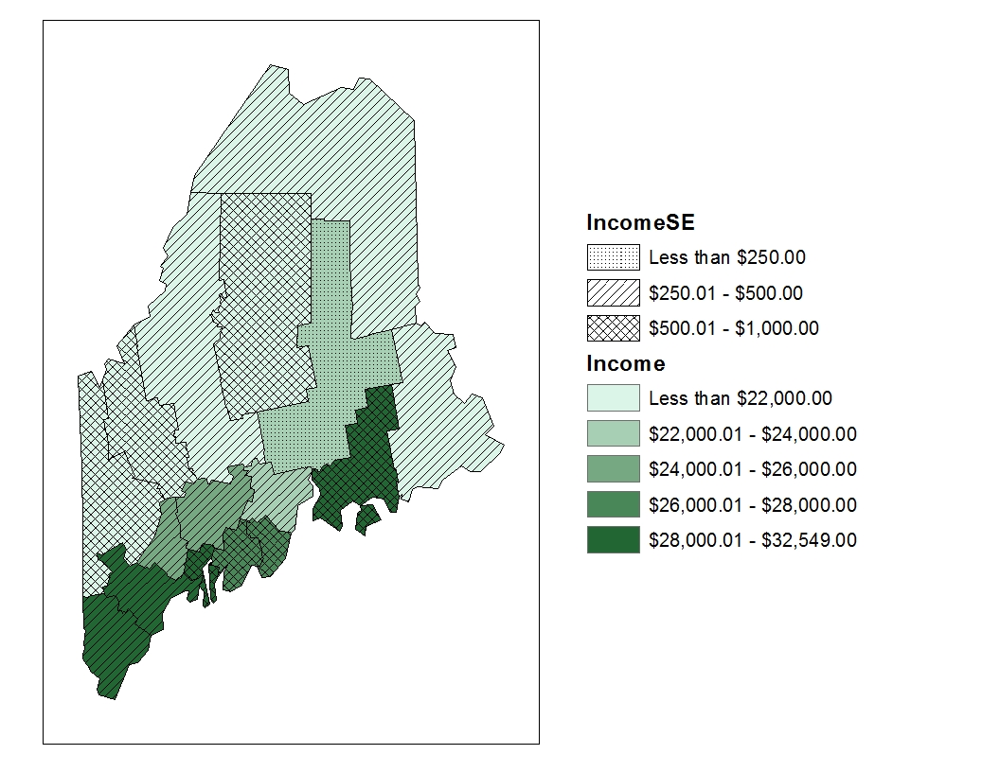

# Statistical maps

```{r, message=FALSE,warning=FALSE,echo=FALSE}
library(sf)

load("Data/moransI.RData")
ma <- readRDS("Data/ma2.rds")
```


## Introduction

In the previous chapter, equal interval and quantile classification schemes were introduced as tools for symbolizing choropleth maps. In this chapter, we revisit these methods from a statistical perspective and explore additional classification approaches that are based on the underlying distribution of the data.

This chapter builds on those foundations by focusing on the statistical principles that underlie map classification. A key challenge in choropleth mapping is deciding how to convert a continuous distribution of values into a manageable number of classes. Different classification methods can produce very different representations of the same dataset and may emphasize different spatial patterns. We therefore examine several commonly used approaches, including equal intervals, quantiles, boxplot-based classifications, and standard deviation units.

Even after selecting a classification scheme, an important question remains: how much confidence should we place in the mapped patterns? Many spatial datasets, particularly those derived from sample surveys, are estimates accompanied by margins of error or standard errors. These uncertainties can affect rankings, classifications, and the apparent strength of spatial patterns. The chapter concludes by introducing techniques for visualizing and evaluating uncertainty in statistical maps.

By the end of this chapter, you should be able to select and interpret common classification schemes and assess how uncertainty influences the conclusions drawn from choropleth maps.

## Statistical distribution maps

Many spatial variables, such as income, temperature, elevation, or population density, are measured on a continuous scale. As a result, every geographic unit in a dataset can potentially have a unique value. In a choropleth map, these values are represented by varying shades or colors assigned to polygons. For example, a map of Massachusetts displaying median household income could assign a unique color to every census tract. Although this approach preserves the full variability in the data, the resulting map can be visually overwhelming and may obscure broader spatial patterns.

```{r}
#| label: fig-continuous
#| fig.height: 2.5
#| fig.width: 6.5
#| fig.align: "center"
#| fig-cap: "Choropleth map of household income using a continuous color gradient. Although each tract receives a color that closely reflects its value, the large number of unique colors makes broader spatial patterns difficult to identify."
#| echo: false

library(ggplot2)
library(gridExtra)
library(classInt)
ma$per_vac <- ma$vacant / ma$units * 100


ggplot(ma, aes(fill=house_inc)) + geom_sf() + theme_void() +
  scale_fill_gradientn(colours = c("lightgreen", "darkgreen"), name = "Income ($)")


```

While technically accurate, such maps often obscure broader patterns and make interpretation difficult. To improve interpretability, continuous values are often grouped into a smaller number of classes before colors are assigned to the map. The challenge then becomes determining where the class boundaries should be placed.

```{r}
#| label: fig-equalint
#| fig.height: 2.5
#| fig.width: 6.5
#| fig.align: "center"
#| fig-cap: "Equal interval classification of household income. The full range of income values is divided into 10 intervals of equal width. The histogram shows the number of polygons assigned to each interval, illustrating that equal-width classes do not necessarily contain equal numbers of observations."
#| echo: false

nbins <- 10
clint <- classIntervals(ma$house_inc, style = "equal", n = nbins)$brks

p1 <- ggplot(ma, aes(fill=house_inc)) + geom_sf() + theme_void() +
  scale_fill_stepsn(colors = c("#D9EF8B",  "darkgreen") ,
                    breaks = clint[2:(length(clint)-1) ],
                    values = scales::rescale(clint[2:(length(clint)-1) ], c(0,1)),
                    guide = guide_coloursteps(even.steps = FALSE,
                                              show.limits = TRUE,
                                              title = NULL,
                                              barheight = unit(2.3, "in"),
                                              barwidth = unit(0.15, "in"),
                                              label.position = "left")) 

p2<- ggplot(ma, aes(house_inc)) + geom_histogram(bins = nbins) + 
  scale_x_continuous(breaks = c(0,125000.5, 250001),position = "top", expand = c(0, 0)) + 
  coord_flip() + scale_y_continuous(labels = NULL, breaks = NULL) +
  ylab(NULL) +xlab(NULL) +
   theme(plot.margin = margin(0.13,0,0.1,0.1, "in"),
         axis.text = element_text(colour = "grey"))  
grid.arrange(p1,p2, layout_matrix=rbind(c(1,1,1,2)))
```

The histogram accompanying the map is rotated vertically so that each bin aligns with its corresponding color swatch in the legend. The length of each gray bar represents the number of polygons assigned to that class, allowing us to see how observations are distributed across the classification intervals.

In an **equal interval** classification, the full range of values is divided into intervals of equal width. As a result, each color swatch represents the same span of income values, but not necessarily the same number of polygons. This distinction is evident in the histogram, where some classes contain many observations while others contain relatively few. Because equal interval classification does not emphasize a central reference point, a sequential color scheme--typically progressing from light to dark--is used to represent increasing values.

### Quantile map

While an equal interval classification ensures that each color swatch represents the same range of values, it does not guarantee that each class contains the same number of polygons. When the data distribution is skewed, some classes may contain many observations while others contain only a handful. 

**Quantile** classification takes the opposite approach by dividing the data so that each class contains approximately the same number of polygons. As a result, every color swatch appears with roughly equal frequency on the map, often making spatial patterns and clusters easier to identify.

```{r}
#| label: fig-quantile
#| fig.height: 2.5
#| fig.width: 6.5
#| fig.align: "center"
#| fig-cap: "Quantile classification of household income. Each class contains approximately the same number of polygons, although the range of income values represented by each class may differ substantially."
#| echo: false

clint <- classIntervals(ma$house_inc, style = "quantile", n = 6)$brks

p1 <- ggplot(ma, aes(fill=house_inc)) + geom_sf() + theme_void() +
  scale_fill_stepsn(colors = c("#D9EF8B",  "darkgreen") ,
                    breaks = clint[2:(length(clint)) ],
                    values = scales::rescale(clint[1:(length(clint)) ], c(0,1)),
                    guide = guide_coloursteps(even.steps = FALSE,
                                              show.limits = FALSE,
                                              title = NULL,
                                              barheight = unit(2.3, "in"),
                                              barwidth = unit(0.15, "in"),
                                              label.position = "left")) 

p2<-  ggplot(ma, aes(house_inc)) + geom_histogram(breaks = clint, col = "white") + 
  scale_x_continuous(breaks = c(0,125000.5, 250001),position = "top", expand = c(0, 0)) + 
  coord_flip() + scale_y_continuous(labels = NULL, breaks = NULL) +
  ylab(NULL) +xlab(NULL) +
  theme(plot.margin = margin(0.13,0,0.1,0.1, "in"),
        axis.text = element_text(colour = "grey")) 

grid.arrange(p1,p2, layout_matrix=rbind(c(1,1,1,2)))
options(scipen = 9999)
```

Unlike the equal interval choropleth map, the class widths shown in the legend are not equal. Some color swatches represent a narrow range of income values while others represent a much wider range. This occurs because the classification is designed to place approximately the same number of polygons into each class. The histogram illustrates this tradeoff: the bars are more balanced in height than in the equal interval example, but the intervals themselves vary considerably in width.

Quantile choropleth maps are particularly useful for exploratory analysis because they emphasize relative rankings and ensure that all classes are well represented. However, this comes at a cost: the intervals are not equal in width, and observations with very similar values may be assigned to different classes while observations with very different values may be placed in the same class.

Equal interval and quantile maps represent two common approaches to classification: one prioritizes equal value ranges, while the other prioritizes equal numbers of observations. The next methods use summary statistics from the distribution itself to define class boundaries.

### Boxplot map

Equal interval and quantile classifications divide the distribution into classes using either the range of values or the number of observations. A **boxplot** classification takes a different approach by using **summary statistics** derived directly from the distribution itself. A boxplot summarizes a distribution using measures of location and spread, including the lower quartile (Q1), median, upper quartile (Q3), and whiskers that extend toward the most extreme non-outlying observations. It also identifies observations that fall unusually far from the rest of the data, commonly referred to as outliers. The distance between Q1 and Q3 is known as the interquartile range (IQR) and contains the middle 50% of the observations.

In the context of mapping, these summary statistics can be used to define classification breaks. A **boxplot map** applies color swatches to polygons based on where their values fall within the boxplot-defined intervals. 

This method is particularly useful when the goal is to highlight the shape of the distribution--whether it is symmetrical, skewed, or contains outliers. Because the boxplot includes a measure of centrality (the median), a divergent color scheme is often appropriate. This allows the map to visually emphasize deviations from the center, helping to identify regions that are unusually high or low relative to the bulk of the data.

Unlike the previous examples, the following graphic is a boxplot rather than a histogram because the classification breaks are derived directly from boxplot summary statistics.

```{r}
#| label: fig-boxmap
#| fig.height: 2.5
#| fig.width: 6.5
#| fig.align: "center"
#| fig-cap: "Boxplot classification of household income. Class boundaries are defined by the quartiles and whiskers of the income distribution, creating categories that highlight the center, spread, and potential outliers in the data."
#| echo: false

clint <- classIntervals(ma$house_inc, style = "box")$brks

p1 <- ggplot(ma, aes(fill=house_inc)) + geom_sf() + theme_void() +
  scale_fill_stepsn(colors = c("#1A9850", "#91CF60", "#D9EF8B", 
                               "#FEE08B", "#FC8D59", "#D73027") ,
                    breaks = clint[2:(length(clint)) ],
                    values = scales::rescale(clint[2:(length(clint)) ], c(0,1)),
                    guide = guide_coloursteps(even.steps = FALSE,
                                              show.limits = FALSE,
                                              title = NULL,
                                              barheight = unit(2.1, "in"),
                                              barwidth = unit(0.15, "in"),
                                              label.position = "left")) 

p2<- ggplot(ma, aes(house_inc)) + geom_boxplot() + 
  scale_x_continuous(breaks = clint[1:length(clint)],
                     labels = clint[1:length(clint)], 
                     position = "top") + 
                                 coord_flip() +
  scale_y_continuous(labels = NULL, breaks = NULL) + xlab("") +
   theme(plot.margin = margin(0.13, 0.0, 0.11, 0.1, "in"),
         axis.text = element_text(colour = "grey"))
grid.arrange(p1,p2, layout_matrix=rbind(c(1,1,1,2)))
```

Boxplot choropleth maps are particularly useful when the objective is to identify values that are typical, unusually high, or unusually low relative to the rest of the distribution. Because the classification is anchored to robust summary statistics rather than equal ranges or counts, the resulting map is less sensitive to skewed distributions and extreme values.

### IQR map

The boxplot map uses several summary statistics from the distribution to create multiple classes. In some situations, however, our primary interest is simply determining which observations fall within the central portion of the distribution and which fall outside it. The **interquartile range (IQR) map** simplifies the boxplot classification by focusing on the middle 50% of observations--those lying between the first quartile (Q1) and third quartile (Q3). Values are therefore grouped into three categories: below the IQR, within the IQR, and above the IQR.

This approach is particularly useful when the goal is to highlight the "core" of the distribution--those observations that are neither exceptionally high nor low. By emphasizing the middle range, the IQR map can reveal spatial patterns that are less influenced by outliers or extreme values. For example, while previous maps may have consistently emphasized an east-west gradient in income across Massachusetts, the IQR map may show that middle-income households are more evenly distributed across the state.

Because the objective is to emphasize the middle of the distribution rather than the extremes, the IQR category is often assigned the most visually prominent color. In the following example, the middle 50% of income values are symbolized using a darker shade (black), while observations above and below the IQR are shown using lighter shades. 
 
```{r}
#| label: fig-iqr
#| fig.height: 2.5
#| fig.width: 6.5
#| fig.align: "center"
#| fig-cap: "IQR classification of household income. Black polygons represent observations within the middle 50% of the distribution (between the first and third quartiles), while lighter shades identify observations below and above this central range."
#| echo: false

clint <- classIntervals(ma$house_inc, style = "box")$brks
clint <- clint[c(1,3,5,7)]

p1 <- ggplot(ma, aes(fill=house_inc)) + geom_sf(col="grey70") + theme_void() +
  scale_fill_stepsn(colors = c("#FFA50000", "black", "#00660000") ,
                    breaks = clint[1:(length(clint)) ],
                    values = scales::rescale(clint[1:(length(clint)) ], c(0,1)),
                    guide = guide_coloursteps(even.steps = FALSE,
                                              show.limits = FALSE,
                                              title = NULL,
                                              barheight = unit(2.0, "in"),
                                              barwidth = unit(0.15, "in"),
                                              label.position = "left")) 

p2<- ggplot(ma, aes(house_inc)) + geom_boxplot() + 
  scale_x_continuous(breaks = clint[1:length(clint)],
                     labels = clint[1:length(clint)], 
                     position = "top") + 
                                 coord_flip() +
  scale_y_continuous(labels = NULL, breaks = NULL) + xlab("") +
   theme(plot.margin = margin(0.22, 0.0, 0.17, 0.1, "in"),
         axis.text = element_text(colour = "grey"))
grid.arrange(p1,p2, layout_matrix=rbind(c(1,1,1,2)))
```

Unlike previous classification schemes, the IQR map is not intended to distinguish fine differences among all observations. Instead, it emphasizes which regions are representative of the overall distribution and which fall outside its central range.


### Standard deviation map

Quantile maps and **standard deviation maps** both classify observations according to their relationship to the overall distribution. Quantile maps do so using percentiles, ensuring that each class contains approximately the same number of observations. Standard deviation maps take a different approach by measuring how far observations fall above or below the mean. Rather than emphasizing an observation's rank within the distribution, they emphasize its deviation from the average.

When a dataset is approximately normally distributed (i.e., follows a bell-shaped distribution), class boundaries can be defined using units of standard deviation. A standard deviation map groups observations according to their distance from the mean, with class breaks commonly placed at ±1, ±2, and ±3 standard deviations.

Each class therefore represents a specific degree of departure from the mean, making it easier to identify regions that fall within the expected range and those that stand out as unusually high or low. For example, observations within one standard deviation of the mean are often considered typical, whereas those beyond two or three standard deviations may be regarded as exceptional.

Standard deviation choropleth maps are particularly useful when the goal is to evaluate how unusual a value is relative to the average rather than to compare absolute ranges or percentile ranks. Because the classification is centered on the mean, a divergent color scheme is typically used, with a neutral color representing average values and increasingly intense hues indicating greater departures above and below the mean.

The accompanying histogram is overlaid with a normal distribution curve because standard deviation classifications are most meaningful when the underlying data are approximately bell-shaped. Unlike equal interval or quantile maps, the class boundaries correspond to fixed distances from the mean rather than equal value ranges or equal numbers of observations.

```{r}
#| label: fig-sdmap
#| fig.height: 2.5
#| fig.width: 6.5
#| fig.align: "center"
#| fig-cap: "Standard deviation classification of household income. Class boundaries are defined by ±1, ±2, and ±3 standard deviations from the mean income, allowing regions to be interpreted according to their distance from the average."
#| echo: false

inc_sd <- sd(ma$house_inc)
inc_mean <- mean(ma$house_inc)
clint <- c(inc_mean - 3 * inc_sd,  inc_mean - 2 * inc_sd, inc_mean - inc_sd, inc_mean, 
           inc_mean + inc_sd, inc_mean + 2 * inc_sd, inc_mean + 3 * inc_sd )

p1 <- ggplot(ma, aes(fill=house_inc)) + geom_sf() + theme_void() +
  scale_fill_stepsn(colors = c("#1A9850", "#91CF60", "#D9EF8B", 
                               "#FEE08B", "#FC8D59", "#D73027") ,
                    breaks = clint[1:(length(clint)) ],
                    values = scales::rescale(clint[1:(length(clint)-1) ], c(0,1)),
                    limits = range(clint),
                    guide = guide_coloursteps(even.steps = FALSE,
                                              show.limits = FALSE,
                                              title = NULL,
                                              barheight = unit(2.0, "in"),
                                              barwidth = unit(0.15, "in"),
                                              label.position = "left")) 

p2<- ggplot(ma, aes(house_inc)) + 
  geom_histogram(aes(y = after_stat(density)), bins = 15, fill = "grey70") + 
  coord_flip() +
  stat_function(fun = dnorm, args = list(mean = inc_mean, sd = inc_sd), 
                colour = "blue") +
  scale_x_continuous(breaks = clint, 
                     labels = c("-3SD", "-2SD" , "-1SD", "Mean", "1SD", "2SD", "3SD"), 
                     position = "top", limits = range(clint),
                     expand = c(0, 0)) +
  scale_y_continuous(labels = NULL, breaks = NULL) +
  ylab(NULL) + xlab(NULL) +
  theme(plot.margin = margin(0.24, 0, 0.22, 0.1, "in"),
        panel.grid.minor=element_blank(),
        axis.text = element_text(colour = "grey", size=9))

grid.arrange(p1,p2, layout_matrix=rbind(c(1,1,1,2)))
```

Standard deviation maps are most informative when the data are approximately symmetrical and the mean provides a meaningful measure of central tendency. For highly skewed distributions or datasets containing extreme outliers, the resulting classes may be unbalanced and can lead to misleading interpretations. As with any classification method, the suitability of a standard deviation map should be evaluated in the context of the underlying distribution.

### Outlier maps

The classification methods discussed thus far have focused on describing the overall distribution of values by assigning every observation to a meaningful class. In some situations, however, our primary interest is not in the full distribution but in identifying the relatively small number of observations that differ markedly from the rest. Such observations are commonly referred to as outliers.

Outlier maps are designed to emphasize these unusually high or low values while treating the remaining observations as a background reference. They are particularly useful when the goal is to identify regions that warrant further investigation, such as areas with exceptionally high income, unusually low population density, or elevated disease rates.

Importantly, there is no single definition of an outlier. Different statistical approaches identify unusual observations in different ways, often leading to different sets of highlighted regions. The following sections introduce three common approaches: **boxplot outlier map**, **standard deviation outlier maps** and **quantile outlier maps**. 

#### Boxplot outlier map

Recall that a boxplot identifies outliers as observations lying beyond the whiskers, which typically extend 1.5 times the interquartile range (IQR) beyond the first and third quartiles. A **boxplot outlier map** applies this definition spatially by highlighting only those observations that fall outside the whisker boundaries. Values within the whiskers are grouped into a single background class, allowing unusually high and low observations to stand out clearly.

```{r}
#| label: fig-outlier1
#| fig.height: 2.5
#| fig.width: 6.5
#| fig.align: "center"
#| fig-cap: "Boxplot outlier map of household income. Tracts with income values beyond the upper or lower boxplot whiskers are highlighted, while all remaining tracts are grouped into a neutral background class."
#| echo: false

clint <- classIntervals(ma$house_inc, style = "box")$brks

p1 <- ggplot(ma, aes(fill=house_inc)) + geom_sf(colour = "grey70") + theme_void() +
  scale_fill_stepsn(colors = c("#1A9850", "#f7f7f7"  , "#D73027") ,
                    breaks = clint[ c(2, length(clint) -1, length(clint)) ],
                    values = scales::rescale(clint[ c(1,2, length(clint) -1, length(clint)) ], c(0,1)),
                    guide = guide_coloursteps(even.steps = FALSE,
                                              show.limits = FALSE,
                                              title = NULL,
                                              barheight = unit(2.0, "in"),
                                              barwidth = unit(0.15, "in"),
                                              label.position = "left")) 

p2<- ggplot(ma, aes(house_inc)) + geom_boxplot() + 
  scale_x_continuous(breaks = clint[c(1, 2, length(clint) -1,  length(clint))],
                     labels = clint[c(1, 2, length(clint) -1,  length(clint))], 
                     position = "top") + 
                                 coord_flip() + 
  scale_y_continuous(labels = NULL, breaks = NULL) + xlab("") +
   theme(plot.margin = margin(0.22, 0.0, 0.15, 0.1, "in"),
         axis.text = element_text(colour = "grey"))
grid.arrange(p1,p2, layout_matrix=rbind(c(1,1,1,2)))
```

You'll note the asymmetrical distribution of outliers, with more than a dozen tracts identified as unusually high-income and only one tract identified as unusually low-income. This imbalance reflects the right-skewed nature of the income distribution, where a small number of very high values extend farther from the bulk of the data than the lowest values.

#### Standard deviation outlier map

While a standard deviation map assigns all observations to classes based on their distance from the mean, a **standard deviation outlier map** focuses only on the most extreme departures from the average. A common approach is to define outliers as observations that fall more than two standard deviations above or below the mean. If the data are approximately normally distributed, these thresholds correspond to the outer tails of the distribution representing only a small fraction of the observations. Values within ±2 standard deviations of the mean are grouped into a neutral background category allowing unusually high and low values to stand out more clearly.

```{r}
#| label: fig-outlier2
#| fig.height: 2.5
#| fig.width: 6.5
#| fig.align: "center"
#| fig-cap: "Standard deviation outlier map of household income. Regions with values beyond ±2 standard deviations from the mean are highlighted, while all other regions are grouped into a neutral background class."
#| echo: false

inc_sd <- sd(ma$house_inc)
inc_mean <- mean(ma$house_inc)
clint <- c(inc_mean - 3 * inc_sd, inc_mean - 2 * inc_sd, inc_mean + 2 * inc_sd, inc_mean + 3 * inc_sd)

p1 <- ggplot(ma, aes(fill=house_inc)) + geom_sf() + theme_void() +
  scale_fill_stepsn(colors = c("#1A9850", "#f7f7f7"  , "#D73027") ,
                    breaks = clint[1:(length(clint)) ],
                    values = scales::rescale(clint[1:(length(clint)) ], c(0,1)),
                    limits = range(clint),
                    guide = guide_coloursteps(even.steps = FALSE,
                                              show.limits = FALSE,
                                              title = NULL,
                                              barheight = unit(2.0, "in"),
                                              barwidth = unit(0.15, "in"),
                                              label.position = "left")) 

p2<- ggplot(ma, aes(house_inc)) + 
  geom_histogram(aes(y = after_stat(density)), bins = 15, fill = "grey70") + 
  coord_flip() +
  stat_function(fun = dnorm, args = list(mean = inc_mean, sd = inc_sd), 
                colour = "blue") +
  scale_x_continuous(breaks = clint, 
                     labels = c("-Inf", "-2SD" , "2SD", "Inf"), 
                     position = "top", limits = range(clint),
                     expand = c(0, 0)) +
  scale_y_continuous(labels = NULL, breaks = NULL) +
  ylab(NULL) + xlab(NULL) +
  theme(plot.margin = margin(0.24, 0, 0.22, 0.1, "in"),
        panel.grid.minor=element_blank(),
        axis.text = element_text(colour = "grey", size=9))

grid.arrange(p1,p2, layout_matrix=rbind(c(1,1,1,2)))
```

Unlike the boxplot outlier map, the observations identified here depend directly on the mean and standard deviation of the dataset. As a result, the regions highlighted as outliers may differ from those identified using the boxplot approach, particularly when the distribution is skewed or contains extreme values. 

Because this method depends on the mean and standard deviation, it performs best when the distribution is approximately symmetrical. 

#### Quantile outlier map

Unlike boxplot and standard deviation outlier maps, which define outliers using specific statistical properties of the distribution, a **quantile outlier map** defines outliers according to rank. Observations are classified by their percentile position within the dataset, and only those falling beyond selected percentile thresholds are highlighted. For example, the upper and lower 2.5 percent of observations can be identified by dividing the dataset into 40 quantiles and mapping only the outermost classes.

Because quantile outlier maps are based on ranks rather than distances from the mean or quartiles, they guarantee that a fixed proportion of observations will be labeled as outliers. This makes them particularly useful for skewed distributions where mean- or variance-based definitions may perform poorly.

```{r}
#| label: fig-outlier3
#| fig.height: 2.56
#| fig.width: 7.3
#| fig.align: "center"
#| fig-cap: "Quantile outlier map of household income. Regions falling within the lowest and highest 2.5 percent of values are highlighted, while all remaining regions are grouped into a neutral background category."
#| echo: false

clint <- classIntervals(ma$house_inc, style = "quantile", n = 40)$brks
clint <- clint[c(1,2,40,41)]
p1 <- ggplot(ma, aes(fill=house_inc)) + geom_sf() + theme_void() +
  scale_fill_stepsn(colors = c("#1A9850", "#f7f7f7"  , "#D73027") ,
                    breaks = clint[1:(length(clint)) ],
                    values = scales::rescale(clint[1:(length(clint)) ], c(0,1)),
                    guide = guide_coloursteps(even.steps = FALSE,
                                              show.limits = FALSE,
                                              title = NULL,
                                              barheight = unit(2.0, "in"),
                                              barwidth = unit(0.15, "in"),
                                              label.position = "left")) 


p2<-  ggplot(ma, aes(house_inc)) + geom_histogram(breaks = c(0,50505.85, 194872.45, 250001), col = "white") + 
  scale_x_continuous(breaks = c(50505.85, 194872.45),position = "top",
                     labels = sprintf("%1.1f%%", c(0.025,0.975)*100),
                     expand = c(0, 0)) + 
  coord_flip() + scale_y_continuous(labels = NULL, breaks = NULL) +
  ylab(NULL) +xlab(NULL) +
  theme(plot.margin = margin(0.22,0,0.22,0.1, "in"),
        axis.text = element_text(colour = "grey")) 

#grid.arrange(p1,p2, layout_matrix=rbind(c(1,1,1,1,1,1,2,2,2)))
grid.arrange(p1,p2, layout_matrix=rbind(c(1,1,1,2)))
```

Unlike the standard deviation outlier map, this approach identifies a fixed proportion of observations as outliers regardless of the shape of the distribution. As a result, some observations may be classified as outliers even though they lie relatively close to the center of the data. The method therefore emphasizes **relative rank** rather than **statistical distance**.

Quantile outlier maps are particularly useful for exploratory analysis because they provide a simple, distribution-free approach to identifying unusually high and low observations. However, because the number of outliers is determined by user-defined percentile thresholds, the observations that are flagged are not necessarily statistically unusual. Instead, they represent the highest- and lowest-ranked values in the dataset.

The classification methods described so far assume that the mapped values are known exactly. In practice, however, many spatial datasets are estimates accompanied by uncertainty.

## Mapping uncertainty

Thus far, the classification methods presented in this chapter have treated mapped values as if they were known exactly. In practice, however, many spatial datasets—particularly those derived from sample surveys such as the U.S. Census Bureau's American Community Survey (ACS)—are estimates rather than direct measurements. As a result, every estimate is accompanied by a measure of uncertainty.

Uncertainty is commonly expressed as either a **standard error (SE)** or a **margin of error (MoE)**. These measures indicate how much the reported estimate might vary from the true population value due to sampling variability. For example, the ACS reports margins of error based on a 90% confidence interval, meaning that if many samples were repeatedly drawn from the same population, approximately 90% of the resulting intervals would contain the true value.

This uncertainty presents an important challenge for map interpretation. A map may suggest that one region has a higher income, population, or unemployment rate than another, but if the uncertainty surrounding the estimates is large, that apparent difference may not be statistically meaningful. As a result, understanding uncertainty is often just as important as understanding the estimates themselves.

One common approach to visualizing uncertainty is to create a separate map showing the uncertainty measure alongside the map of estimated values. The following figure presents an example using household income estimates and their associated standard errors.

```{r}
#| label: fig-map1
#| fig.height: 3
#| fig.width: 7
#| fig.align: "center"
#| fig-cap: "Maps of household income estimates (left) and their associated standard errors (right). Areas with high estimated incomes do not necessarily have low uncertainty, highlighting the importance of considering both maps when interpreting spatial patterns."
#| echo: false

library(RColorBrewer)
brks1 <- quantile(s1$Income, seq(0,1,0.2))
brks1[length(brks1)] <- brks1[length(brks1)] + 1
brks2 <- quantile(s1$IncomeSE, seq(0,1,0.2))
brks2[length(brks2)] <- brks2[length(brks2)] + 1
P1 <- raster::spplot(s1, "Income", at=brks1, col.regions=brewer.pal(7,"Greens"))
P2 <- raster::spplot(s1, "IncomeSE", at=brks2, col.regions=brewer.pal(7,"Reds"))

print(P1, split=c(1, 1, 2, 1), more=TRUE) 
print(P2, split=c(2, 1, 2, 1), more=FALSE) 
```

While side-by-side maps separate estimates from uncertainty, they require viewers to compare two visualizations simultaneously and mentally integrate the information. An alternative is to overlay uncertainty directly onto the estimate map using textures or hatch marks. For example, a map of income estimates might use shades of green to represent income levels, with different hatch patterns indicating the degree of uncertainty. This approach allows viewers to assess both value and reliability within a single display.

```{r}
#| label: fig-map2
#| out.width: "70%"
#| fig.align: "center"
#| fig-cap: "Household income estimates represented by color intensity and associated uncertainty represented by hatch patterns. The map allows viewers to evaluate both the magnitude of an estimate and the confidence that can be placed in it."
#| echo: false


```

Although overlay techniques allow estimates and uncertainty to be displayed simultaneously, they require viewers to interpret two visual variables at once. Another approach is to map the upper and lower bounds of the confidence interval as separate maps. These maps provide a direct representation of the range of plausible values but still require viewers to compare multiple maps and mentally synthesize the information.

```{r}
#| label: fig-map_MoE
#| fig.width: 7
#| fig.height: 3
#| fig.align: "center"
#| fig-cap: "Upper (left) and lower (right) bounds of the 90% confidence interval for household income. Together, the maps depict the range of plausible income values for each region."
#| echo: false

library(RColorBrewer)
s1$IncMax <- s1$Income + 1.645 * s1$IncomeSE
s1$IncMin <- s1$Income - 1.645 * s1$IncomeSE
brks <- quantile(c(s1$IncMax, s1$IncMin), seq(0,1,0.2))
brks[length(brks)] <- brks[length(brks)] + 1
P1 <- raster::spplot(s1, "IncMax", at=brks, col.regions=brewer.pal(7,"Greens"))
P2 <- raster::spplot(s1, "IncMin", at=brks, col.regions=brewer.pal(7,"Greens"))

print(P1, split=c(1, 1, 2, 1), more=TRUE) 
print(P2, split=c(2, 1, 2, 1), more=FALSE) 
```

Mapping the upper and lower confidence limits provides a more complete picture of uncertainty than a map of standard errors alone. By showing the range of plausible values for each region, these maps help convey the extent to which estimates may vary due to sampling error. However, they still leave an important question unanswered: how does uncertainty affect our interpretation of spatial patterns? Addressing this question requires examining how rankings and spatial relationships change when uncertainty is taken into account.

### Evaluating Spatial Patterns Under Uncertainty

While the maps presented earlier in this chapter offer ways to visualize uncertainty such as margins of error or standard errors, they do not fully address a key reason we map data in the first place: to compare values across space. In spatial analysis, we are often interested in identifying regions with relatively high or low values and ranking them accordingly. These comparisons implicitly assume that the observed estimates are stable and that their relative ordering would persist if a different sample were collected. However, this assumption is not always justified.

To explore this issue, we begin by examining confidence intervals associated with each polygon's estimate. These intervals reveal that many regions have overlapping ranges of plausible values, meaning that the true value for one region could be higher or lower than that of a neighboring region. For example, a county that appears to have a lower income than another may, in fact, have a higher income once sampling uncertainty is taken into account. Such overlap reduces our confidence in spatial rankings and raises questions about the stability of the patterns we observe on a map. 


```{r}
#| label: fig-MoE_plot1
#| fig.width: 5
#| fig.height: 3
#| fig.align: "center"
#| fig-cap: "County income estimates and their associated 90% confidence intervals. Note that many confidence intervals overlap, indicating that apparent differences in county rankings may not be statistically meaningful."
#| echo: false

library(gplots)
# Sort data by INCOME
Y   = s1$Income[order(s1$Income)]  # per capita income
YSE = s1$IncomeSE[order(s1$Income)] # SE
lbs = s1$NAME[order(s1$Income)]

# Plot the estimate along with the MoE
OP <- par(mar=c(3,7,0,1))
plotCI(Y,1:16, ui= Y+(1.645*YSE), li=(Y-1.645*YSE),pch=16, lwd=1, barcol="red",sfrac=.005, err="x", col="grey50",
       ylab = "", xlab="", axes=FALSE, gap=0.5)
axis(1, cex.axis=0.8)
axis(2, at=1:16, labels=lbs,las=2,cex.axis=0.8)
mtext("Income ($)", side= 1,line=2)
par(OP)
```

Consider Piscataquis County, whose income estimate (represented by the gray point in the plot) is lower than that of neighboring Oxford County. Based solely on the point estimates, we might conclude that Oxford ranks above Piscataquis in income. However, their 90% confidence intervals overlap substantially, indicating that this apparent difference may not be statistically reliable. If a different sample were drawn from each county, the resulting estimates could shift enough to reverse their ranking. In other words, the ordering implied by the point estimates may not reflect the ordering of the true underlying values. The following example demonstrates how such rank reversals can occur when sampling uncertainty is taken into account, potentially altering the spatial patterns observed on a map.


```{r}
#| label: fig-sim_values
#| fig.width: 5
#| fig.height: 3
#| fig.align: "center"
#| fig-cap: "One possible realization of county income estimates generated from the 90% confidence intervals. Note that the ordering of several counties differs from that shown in the original estimates."
#| echo: false

# This function creates a normal distribution that is capped
# at the lower limit by 0 or X - SE * number of SE and at the
# upper limit by X + SE * number of SE
rnorml <- function(x,se,numse) {  # numse is the number of SEs
  rx = rep(-1,length(x))          # Initialize rx
  ri = rx < 0 | rx < x - (numse * se) | rx > x + (numse * se)
  # Recalculate rnorm for all rx values outside of the limit
  while( length(ri[ri==TRUE]) > 0){
    rx[ri] = rnorm(length(ri[ri==TRUE]),x[ri],se[ri])
    ri = rx < 0 | rx < x - (numse * se) | rx > x + (numse * se)
  } 
  return(rx)
}

library(gplots)
# Sort data by INCOME
set.seed(31)
Yrnd = rnorml(Y, YSE, 1.645)

# Plot the estimate along with the MoE
OP <- par(mar=c(3,6,0,1))
plotCI(Yrnd,1:16, ui= Yrnd+(1.645*YSE), li=(Yrnd-1.645*YSE),pch=16, lwd=2, barcol="white",sfrac=.005, err="x", col="grey50",
       ylab = "", xlab="", axes=FALSE, gap=0.5)
axis(1, cex.axis=0.8)
axis(2, at=1:16, labels=lbs,las=2, cex.axis=0.8)
mtext("Income ($)", side= 1,line=2)
par(OP)
```

In one such simulated sample, Oxford County’s income estimate falls below those of both Piscataquis and Franklin counties, reversing their original rankings. A similar shift occurs for Sagadahoc County, which drops below Hancock and Lincoln counties. These changes illustrate how sampling uncertainty can affect not only individual estimates but also the relative ordering of regions. What appears to be a clear spatial hierarchy in the original data may, in fact, be sensitive to the particular sample used to generate the estimates.

But how do these shifts affect the geographic patterns we see on a map? One way to assess this is to compare the **original** income map with a **simulated** income map generated by randomly sampling values within each county’s confidence interval. Such a comparison provides insight into the stability of observed spatial patterns and helps reveal which features of the map are robust to uncertainty and which may be artifacts of sampling variability.

```{r}
#| label: fig-sim_map
#| fig.width: 5
#| fig.height: 3
#| fig.align: "center"
#| fig-cap: "Original county income estimates (left) and one simulated realization generated from the associated 90% confidence intervals (right). Note that some counties change relative rank, altering the spatial pattern of income across the state."
#| echo: false

library(RColorBrewer)
s1$R1 <- Yrnd
brks <- quantile(c(s1$Income, s1$R1), seq(0,1,0.2))
brks[length(brks)] <- brks[length(brks)] + 1
P1 <- raster::spplot(s1, "Income", at=brks, col.regions=brewer.pal(7,"Greens"))
P2 <- raster::spplot(s1, "R1", at=brks, col.regions=brewer.pal(7,"Greens"))

print(P1, split=c(1, 1, 2, 1), more=TRUE) 
print(P2, split=c(2, 1, 2, 1), more=FALSE) 
```

The previous figure showed only one possible realization of the income estimates. Because many values within each county's confidence interval are plausible, numerous alternative maps could be generated. A few additional simulated realizations are shown below.

```{r}
#| label: fig-sim_map2
#| fig.width: 10
#| fig.height: 3.1
#| fig.align: "center"
#| fig-cap: "Original county income estimates (left) and four simulated maps generated from the associated 90% confidence intervals (R2–R5). Features that appear consistently across the realizations are more likely to represent robust spatial patterns, whereas features that vary among maps may be artifacts of sampling variability."
#| echo: false

set.seed(421); s1$R2 <- rnorml(Y, YSE, 1.645)
set.seed(1231); s1$R3 <- rnorml(Y, YSE, 1.645)
set.seed(326); s1$R4 <- rnorml(Y, YSE, 1.645)
set.seed(5441); s1$R5 <- rnorml(Y, YSE, 1.645)
brks <- quantile(c(s1$R1,s1$R2,s1$R3,s1$R4,s1$R5), seq(0,1,0.2))
brks[length(brks)] <- brks[length(brks)] + 1
raster::spplot(s1, c("R1","R2","R3","R4","R5"),at=brks, col.regions=brewer.pal(7,"Greens"))
```

### Class comparison maps 

```{r echo=FALSE}
brks <- c(0,20600, 22800,25000,27000,34000)
```

Effectively conveying both estimates and their associated uncertainty in a single map remains a challenge. As Sun and Wong [@DataQuality2010] note, the appropriate strategy often depends on the context and purpose of the analysis. One useful approach is the **class comparison method**, which evaluates whether a polygon's margin of error (MoE) extends beyond the boundaries of its assigned classification. In a choropleth map, class membership is often interpreted as meaningful because polygons assigned to different classes are assumed to represent different levels of the mapped variable. If uncertainty allows an estimate to fall into one or more adjacent classes, confidence in that classification is reduced. The class comparison method addresses this issue by displaying not only the estimated value but also whether the confidence interval surrounding that estimate crosses into neighboring classes. 

For example, if we adopt the classification breaks [`r sprintf("%i ",brks)`], we find that many polygons have MoEs that span multiple class boundaries. 

```{r}
#| label: fig-compInt
#| fig.width: 5.5
#| fig.height: 3
#| fig.align: "center"
#| fig-cap: "County income estimates and their associated 90% confidence intervals. Vertical dashed lines represent class boundaries. Several confidence intervals cross into adjacent classes, indicating uncertainty in class assignment."
#| echo: false

# Plot the estimate along with the MoE
OP <- par(mar=c(3,6,0,1))
plotCI(Y,1:16, ui= Y+(1.645*YSE), li=(Y-1.645*YSE),pch=16, lwd=1, barcol="red",
       sfrac=.005, err="x", col="grey50", ylab = "", xlab="", axes=FALSE, gap=0.5,
       xlim = c(19000 , 34100))
axis(1, cex.axis=0.8, at = brks)
axis(2, at=1:16, labels=lbs,las=2,cex.axis=0.8)
mtext("Income ($)", side= 1,line=2)
abline(v=brks, col=rgb(0,.6,0), lty = 3)
par(OP)
```

Consider Piscataquis County. Its income estimate falls within the second classification interval (`r sprintf("%i",brks[2])` to `r sprintf("%i ",brks[3])`), yet the lower end of its 90% confidence interval extends into the first interval. This means that we cannot be 90% confident that the county truly belongs in the second class; its actual value may fall in the lower class instead. In contrast, counties such as Cumberland and Penobscot have confidence intervals that remain entirely within their assigned classes, providing greater confidence in their classification.

Rather than requiring the reader to inspect confidence intervals individually, this information can be incorporated directly into a choropleth map using hatch patterns. The underlying color continues to represent the estimated income value, while the hatch pattern indicates whether the estimate's confidence interval extends beyond its assigned class. 

For example, income could be plotted using varying shades of green with hatch symbols indicating if the lower interval crosses into a lower class (135&deg; hatch), if the upper interval crosses into an upper class (45&deg; hatch), if both interval ends cross into a different class (90&deg;-vertical-hatch) or if both interval ends remain inside the estimate's class (no hatch).

```{r}
#| label: fig-ComPlot
#| fig.height: 3.5
#| fig.align: "center"
#| fig.margin: treu
#| fig-cap: "Class comparison map of household income. Colors represent income classes, while hatch patterns indicate whether the associated confidence intervals remain within the assigned class or extend into neighboring classes."
#| echo: false

IncInt <- findInterval(s1$Income, brks)
LowInt <- findInterval(s1$Income - 1.645 * s1$IncomeSE, brks )
HiInt <- findInterval(s1$Income + 1.645 * s1$IncomeSE, brks )
s1$Comp <- 1 # Both MoE ends are in the same class as estimate
s1$Comp[IncInt > LowInt] <- 2 # lower  MoE end is in a class below that of the estimate
s1$Comp[IncInt > LowInt & IncInt < HiInt] <- 3 # lower  MoE end is in a class below that of the estimate
s1$Comp[IncInt < HiInt]  <- 4 # upper  MoE end is in a class above that of the estimate

color <- brewer.pal(7,"Greens")
ang <- (0:3) * 45
dens <- c(0,10,10, 10)
OP <- par(mar=c(0,0,0,0))
sp::plot(s1, col = color[findInterval(s1$Income, brks)])
sp::plot(s1, density = dens[s1$Comp], angle = ang[s1$Comp], add=TRUE)
par(OP)
```

Class comparison maps provide a practical way to visualize uncertainty directly within a choropleth map. Rather than portraying uncertainty as a separate variable, they focus on whether an observation's class assignment is reliable. Regions with hatch marks should be interpreted cautiously because their true values may belong to neighboring classes. As a result, class comparison maps help distinguish robust classifications from those that are sensitive to sampling variability.

## Summary

This chapter explored statistical approaches to classifying and interpreting continuous spatial data. Different classification methods emphasize different aspects of a distribution and can produce very different representations of the same dataset.

+ **Equal interval maps** divide the range of values into classes of equal width and are useful when comparing absolute differences among observations. 
+ **Quantile maps** assign approximately the same number of observations to each class, emphasizing relative rank and often revealing spatial patterns that may be hidden in equal interval maps.
+ **Boxplot, IQR, and standard deviation maps** use statistical properties of the distribution to define class boundaries and highlight different aspects of the data, such as central tendency, variability, and deviation from the mean. 
+ **Outlier maps** focus attention on unusually high or low values using definitions based on boxplots, standard deviations, or quantiles. 
+ The choice of classification scheme influences how spatial patterns are perceived and interpreted. No single method is universally superior; each has strengths and limitations that depend on the distribution of the data and the objectives of the analysis. 
+ Many spatial datasets contain **uncertainty**, often expressed as a standard error or margin of error. Ignoring this uncertainty can lead to overconfidence in spatial rankings and apparent patterns. 
+ **Confidence interval plots, simulated maps, and class comparison maps** provide ways to assess how uncertainty affects classifications, rankings, and the stability of observed spatial patterns.

Understanding both the statistical distribution of mapped values and the uncertainty associated with those values leads to more informed and defensible interpretations of choropleth maps.