# Pitfalls to avoid

```{r include=FALSE, cache=FALSE}
knitr::opts_chunk$set(
  comment = "",
  message = FALSE,
  tidy = FALSE,
  cache = TRUE,
  warning = FALSE,
  encoding = "UTF-8",
  fig.show='hold')

knitr::opts_knit$set(list(width = 80))

# Set margins
knitr::knit_hooks$set(small.mar = function(before, options, envir) {
  if (before) par(mar = c(4, 4, 1, 1))  # smaller margin on top and right
})

knitr::knit_hooks$set(no.mar = function(before, options, envir) {
  if (before) par(mar = c(0, 0, 0, 0))  # no margins
})


```


## Introduction

While the previous chapter focused on uncertainty arising from sampling error and estimation, this chapter examines sources of uncertainty and bias that arise from how spatial data are represented, aggregated, and interpreted.

Spatial data analysis offers powerful tools for uncovering patterns, relationships, and insights across geographic space. However, with this power comes a set of challenges that can easily mislead if not properly understood and addressed. This chapter explores several common pitfalls in spatial analysis, focusing on how data representation, aggregation, and interpretation can distort our understanding of spatial phenomena.

We begin by examining how the representation of raw counts can create misleading choropleth maps when differences in area or population are ignored. We then explore how the choice of spatial units and aggregation schemes can dramatically alter the appearance of spatial patterns, a problem known as the **Modifiable Areal Unit Problem (MAUP)**. Closely related to this issue is the **ecological fallacy**, where inferences about individuals are mistakenly drawn from aggregate-level data.

The chapter concludes by examining the challenges associated with mapping rates, particularly when rates are based on small population counts. These situations can produce unstable estimates that exaggerate spatial variation and create misleading patterns. To address this problem, we introduce techniques for normalizing data and smoothing unstable rates. 


## Representing Count

Consider a 16km x 16km square study area populated by individuals arranged in a perfect grid. The distribution is intentionally uniform so that every location has the same underlying population density. If we overlay two different zoning schemes--one using a regular grid and another using irregular polygons--and count the number of individuals within each zone, we produce two choropleth maps that suggest very different spatial distributions. Yet, the underlying point pattern is identical.

```{r}
#| label: fig-grid_vs_tess_layout
#| fig.align: "center"
#| fig-cap: "Uniformly distributed individuals overlaid with two alternative zoning schemes: a regular grid and an irregular tessellation. Although the underlying point pattern is identical in both cases, the aggregation units differ."
#| echo: false
#| out-width: "500px"

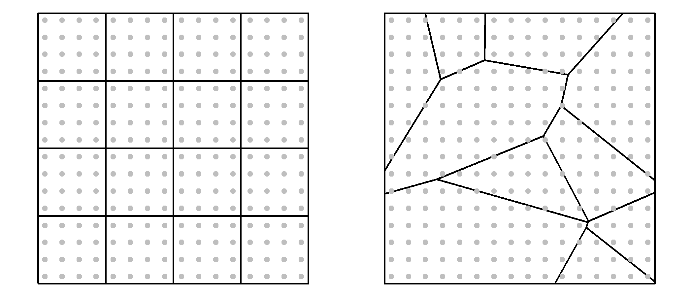
```


```{r}
#| label: fig-grid_vs_tess_count
#| fig.align: "center"
#| fig-cap: "Raw counts summarized by two different aggregation schemes. Although the underlying population density is uniform, differences in polygon size and shape create the appearance of different spatial patterns."
#| echo: false
#| out-width: "500px"

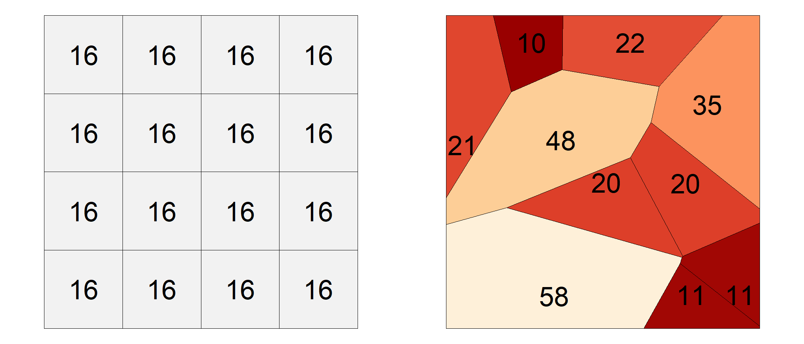
```

This discrepancy illustrates a fundamental pitfall in spatial analysis: counts are influenced not only by the phenomenon being measured but also by the size and shape of the reporting units. Larger polygons tend to accumulate larger counts than smaller polygons, even when the underlying distribution is uniform. As a result, choropleth maps based on raw counts can create misleading impressions of clustering or dispersion where none exists.

To mitigate this issue, counts are often converted to ratios or rates. For example, population can be expressed per square kilometer and disease occurrence can be expressed per capita. These normalized measures account for differences in polygon size or population and therefore provide a more meaningful basis for comparison across regions. In @fig-grid_vs_tess_density, switching from raw counts to density maps reveals a more consistent and interpretable spatial pattern.


```{r}
#| label: fig-grid_vs_tess_density
#| fig.align: "center"
#| fig-cap: "Point density choropleth maps derived from the same underlying point pattern. Unlike the raw count maps shown in Figure 6.2, the density maps reveal a nearly uniform distribution regardless of the aggregation scheme. Minor deviations from a density of 1 in the tessellated map occur because some polygon boundaries do not coincide exactly with the spacing between points, resulting in slight differences in the area assigned to each observation."
#| echo: false
#| out-width: "500px"

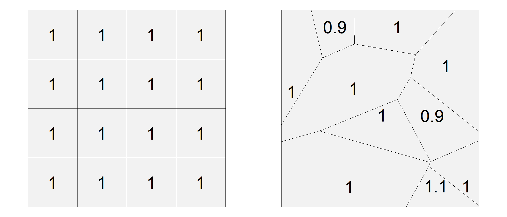
```

The same principle applies in many real-world applications. For example, comparing disease counts across counties is often less informative than comparing disease rates because counties differ dramatically in population size.

## MAUP

The **Modifiable Areal Unit Problem (MAUP)** [@openshaw1983maup] is a well-documented issue in spatial analysis that arises when data are aggregated into spatial units such as census tracts, counties, or states. These units are often arbitrary with respect to the phenomena being studied. O'Sullivan and Unwin [@Unwin1] further emphasize that MAUP is not just a technical nuisance--it challenges the validity of spatial inference when based on aggregated data.

Consider a uniform distribution of individuals across a study area, each with two recorded variables: v1 and v2. The variables are symbolized as varying shades of green and reds in the two left-hand maps of @fig-v1_and_v2_raw. 

```{r}
#| label: fig-v1_and_v2_raw
#| fig.align: "center"
#| fig-cap: "Individual-level values for variables v1 and v2. Although both variables exhibit spatial variation, there is little or no relationship between them at the individual level, as confirmed by the scatterplot."
#| echo: false
#| out-width: "700px"

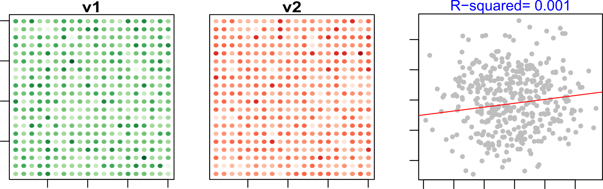
```

At the individual level, the relationship between v1 and v2 is essentially absent. If aggregation preserved statistical relationships perfectly, we would expect this lack of association to remain unchanged after summarizing the data into larger spatial units. The following examples demonstrate that this is not necessarily the case.


```{r}
#| label: fig-v1_and_v2_unif
#| fig.align: "center"
#| fig-cap: "Data aggregated using a uniform zoning scheme. Although the variables are uncorrelated at the individual level, aggregation produces a weak positive relationship."
#| echo: false
#| out-width: "650px"

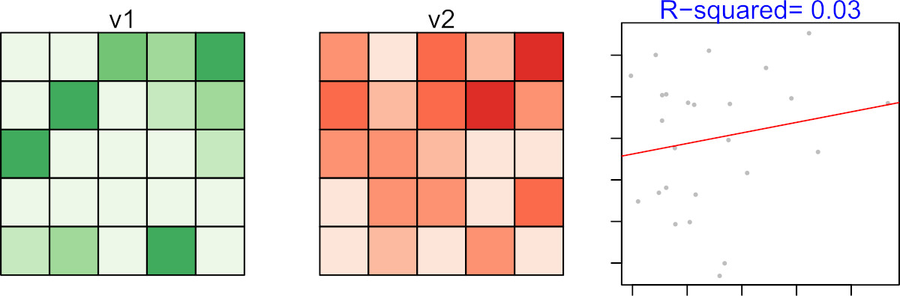
```

If we then apply a non-uniform aggregation scheme, the correlation appears even stronger, with a much higher $R^2$ value.

```{r}
#| label: fig-v1_and_v2_nonunif
#| fig.align: "center"
#| fig-cap: "Data aggregated using a non-uniform zoning scheme. The apparent relationship between v1 and v2 becomes substantially stronger despite the absence of such a relationship at the individual level."
#| echo: false
#| out-width: "650px"

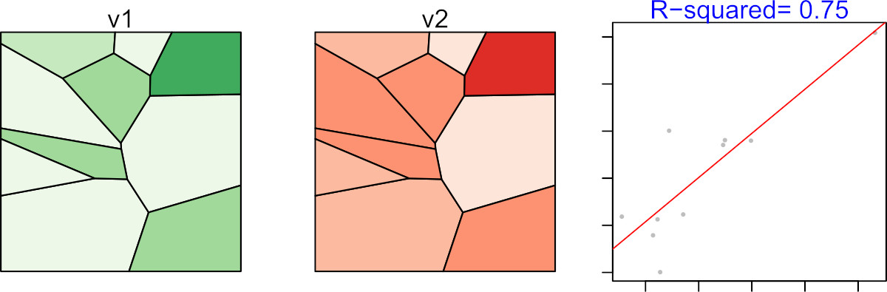
```

This discrepancy is not due to any real relationship between v1 and v2, but rather to the aggregation scheme itself. In fact, it is possible to design an aggregation scheme that produces a near-perfect correlation between two variables that are entirely uncorrelated at the individual level. This is the essence of the Modifiable Areal Unit Problem: analytical conclusions may depend as much on how the data are aggregated as on the data themselves.

Because MAUP arises whenever aggregated data are analyzed, it also creates an important interpretive challenge: relationships observed for groups may not reflect relationships that exist for individuals. This issue is explored in the next section as the ecological fallacy.

## Ecological Fallacy

Whereas the MAUP concerns how aggregation can alter analytical results, the ecological fallacy concerns how aggregated results are interpreted. In practice, analysts are often constrained to working with data summarized at the level of counties, census tracts, school districts, or other reporting units. A common mistake is to assume that relationships observed for these groups also apply to the individuals within them. This error is known as the **ecological fallacy** [@freedman1999ecological].

For example, after observing the strong relationship in @fig-v1_and_v2_nonunif, it might be tempting to conclude that individuals with high values of v1 also tend to have high values of v2. However, this conclusion does not follow from the data because the relationship was observed **only after values were aggregated into spatial units**. The observed correlation exists *only* at the level of the aggregated units--it may not hold, and often does not hold, at the individual level.  
To avoid the ecological fallacy, analysts should carefully distinguish between the scale of the data and the scale of the conclusions being drawn. It is appropriate to state, *“At this level of aggregation, we observe a strong relationship between v1 and v2,”*. but it is incorrect to claim that this relationship necessarily exists at finer scales. It is *not* appropriate to conclude that the same relationship necessarily exists among the individuals within those aggregated units. 

The ecological fallacy highlights the risks of interpreting aggregated data. Another challenge arises when the aggregated values themselves are unstable, particularly when they are expressed as rates based on small populations. This issue is explored in the next section.

## Mapping rates

You learned earlier in this chapter of the pitfalls in mapping raw counts without accounting for differences in the size or shape of the spatial units. In a rate calculation, the population at risk serves as the denominator. When that denominator is small, the resulting rate can become highly unstable.

To illustrate this, let’s examine a series of maps showing kidney cancer death rates by county for the period 1980-1984.


```{r}
#| label: fig-kidney0
#| fig.align: "center"
#| fig-cap: "Kidney cancer death rates by county for the period 1980–1984. At first glance, the map suggests substantial geographic variation in mortality risk."
#| echo: false
#| out-width: "550px"
#| 
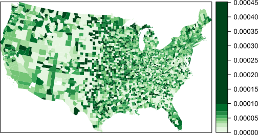
```

We begin by looking at the counties with the highest death rates:

```{r}
#| label: fig-kidney1
#| fig.align: "center"
#| fig-cap: "Counties in the highest 10% of kidney cancer death rates. Surprisingly, many of these counties occur in sparsely populated regions."
#| echo: false
#| out-width: "500px"

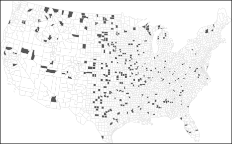
```

Now compare this to the counties with the lowest death rates:

```{r}
#| label: fig-kidney2
#| fig.align: "center"
#| fig-cap: "Counties in the lowest 10% of kidney cancer death rates. Note that many occur near counties with some of the highest reported rates."
#| echo: false
#| out-width: "500px"

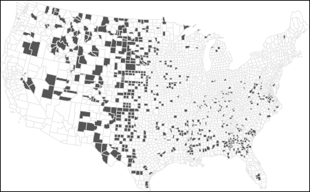
```

At first glance, these maps suggest that both high and low rates are clustered in similar regions. In fact, many of the counties with the lowest rates are adjacent to those with the highest rates. This raises questions: If environmental factors are driving kidney cancer mortality, why would they affect one county but not its neighbor? Could differences in local regulations or healthcare access explain the pattern?

Before jumping to conclusions, we need to examine the population counts behind these rates:

```{r}
#| label: fig-kidney3
#| fig.align: "center"
#| fig-cap: "Population count for each county. Note that a quantile classification scheme is adopted forcing a large range of values to be assigned a single color swatch."
#| echo: false
#| out-width: "550px"

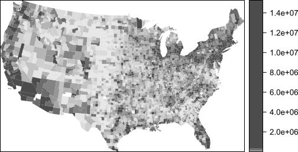
```

The central part of the states where we are observing both very high and very low cancer death rates have low population counts. Recall that population serves as the denominator used to compute the mortality rate. Could population count have something to do with this odd congruence of high and low cancer rates? 

To explore this further, let’s examine the relationship between death rates and population counts:

```{r}
#| label: fig-kidney_plot
#| fig.align: "center"
#| fig-cap: "Kidney cancer death rates versus county population. Variability in the rates is much greater among counties with small populations"
#| echo: false
#| out-width: "300px"
#| 
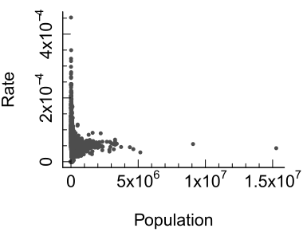
```

The scatterplot reveals a wide spread of rates among counties with small populations. When we transform both axes to a logarithmic scale, the pattern becomes clearer:

```{r}
#| label: fig-kidney_plot_trans
#| fig.align: "center"
#| fig-cap: "Kidney cancer death rates versus county population on logarithmic axes. The funnel-shaped pattern reveals that rate variability decreases as population size increases."
#| echo: false
#| out-width: "300px"

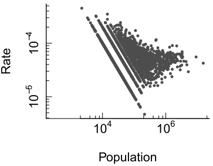
```

Here, we see that as population increases, the variability in death rates decreases. This is expected: larger populations provide more stable estimates of underlying rates. In contrast, small populations produce unstable rates that can distort spatial patterns.

This issue is well-documented in spatial analysis literature. O'Sullivan and Unwin [@Unwin1] emphasize that mapping raw rates without considering population size can lead to misleading interpretations, especially in public health contexts.

To illustrate the problem, consider a county with a population of 1,000. If the true death rate is 5 per 100,000, we would expect 0.05 deaths--that's less than one person. But if one person dies, the observed rate in that county becomes 1 per 1,000, or 100 per 100,000--twenty times higher than the expected rate! This demonstrates how **small denominators can inflate rates** and create artificial hotspots and coldspots.

Rates computed from small denominator values are often referred to as **unstable rates** because even small changes in the numerator can produce large changes in the estimated rate. While this chapter uses disease mortality rates as an example, the same problem can arise when mapping the percentage of electric vehicles, unemployment rates, housing vacancy rates, or any other measure based on a small underlying count.

The next section introduces one approach--Empirical Bayes smoothing--for reducing the influence of unstable rates and producing more reliable maps.

## Empirical Bayes Smoothing

When mapping disease rates, especially for rare conditions, small population counts can lead to unstable rate estimates. These unstable rates often manifest as extreme values (either very high or very low) in sparsely populated counties. To address this problem, we turn to a statistical technique known as **Empirical Bayes (EB) smoothing**. The basic idea is straightforward: rates computed from small denominator values are considered less reliable than rates computed from large denominator values. EB smoothing therefore adjusts rates toward the overall mean, with larger adjustments applied to less reliable estimates.

Let’s begin by revisiting the kidney cancer example where we observed that counties with small populations tend to produce highly variable death rates. This variability is not necessarily indicative of true differences in cancer risk--it’s often a mathematical artifact. To mitigate this, EB smoothing adjusts each county’s rate toward the overall mean, with the degree of adjustment depending on the population size. Counties with large populations already provide relatively stable estimates and therefore receive little adjustment, whereas counties with small populations receive more substantial adjustments toward the overall mean.

An EB smoothed representation of kidney cancer deaths gives us the following rate vs population plot:

```{r}
#| label: fig-EBRate_vs_pop_log
#| fig.align: "center"
#| fig-cap: "Empirical Bayes-smoothed kidney cancer death rates versus county population. The variability among counties with small populations is reduced relative to the raw-rate plot shown in @fig-kidney_plot_trans."
#| echo: false
#| out-width: "300px"

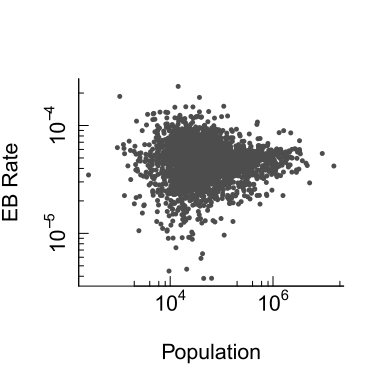
```

The variability in rates for smaller counties has decreased. The range of rate values has dropped from 0.00045 to 0.00023. Variability remains greater among smaller counties than among larger counties, but the extreme values have been moderated. This suggests that some of the apparent variation observed in the original rate map was attributable to instability arising from small denominator values rather than true differences in cancer risk. 

Let’s now examine how EB smoothing affects the spatial distribution of extreme rates. First, we look at the top 10% of counties with the highest EB-smoothed death rates:

```{r}
#| label: fig-top10_EB
#| fig.align: "center"
#| fig-cap: "Counties in the highest 10% of EB-smoothed kidney cancer death rates. The spatial pattern differs from that observed in the unsmoothed data because unstable rates in sparsely populated counties have been moderated."
#| echo: false
#| out-width: "550px"
#| 
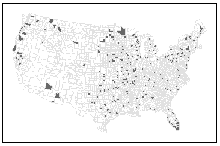
```

Next, we examine the bottom 10%:

```{r}
#| label: fig-bottom10_EB
#| fig.align: "center"
#| fig-cap: "Counties in the lowest 10% of EB-smoothed kidney cancer death rates. The resulting pattern is less influenced by extreme values associated with small denominator counts."
#| echo: false
#| out-width: "550px"

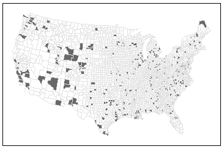
```

Notice how the spatial pattern has changed. High-rate counties now appear in Florida, which aligns with expectations given the region’s older population. However, it’s important to remember that EB smoothing does not uncover the *true* underlying rates--it simply reduces the influence of unreliable estimates. EB smoothing should therefore be viewed as a tool for improving the stability of mapped rates rather than as a method for recovering the true underlying process.

Beyond EB smoothing, other strategies for dealing with unstable rates include:

 * Grouping small counties into larger ones--thus increasing population sample size.

 * Increasing the study's time interval. In this working example, data were aggregated over a five year period (1980-1984) but they could be increased by adding five more years worth of data.

* Grouping small counties and increasing the study's time interval.

These solutions involve tradeoffs because they reduce either spatial resolution, temporal resolution, or both. A thoughtful analysis will weigh these options based on the goals of the study and the nature of the data. 

## Summary

This chapter examined several common pitfalls that can arise when representing, aggregating, and interpreting spatial data. Although maps can reveal important spatial patterns, those patterns may be influenced by the way data are summarized, normalized, or analyzed.

+ **Raw counts** can mislead because larger spatial units tend to accumulate more observations than smaller units. 
+ **MAUP** occurs when analytical results change because of the size or arrangement of aggregation units. 
+ **Ecological fallacy** occurs when group-level relationships are incorrectly assumed to apply to individuals. 
+ **Rates are usually more meaningful than counts**, but rates based on small denominator values can be unstable. 
+ **Small denominators produce greater variability**, creating artificial hotspots and coldspots. 
+ **Empirical Bayes smoothing** reduces the influence of unstable rates by borrowing information from the overall population. 
+ **All aggregations and smoothing methods involve tradeoffs** and should be interpreted with caution.

Careful consideration of aggregation units, denominator size, and rate stability is essential for drawing reliable conclusions from spatial data and choropleth maps.

