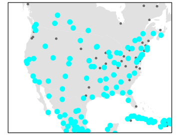
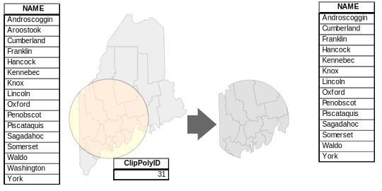
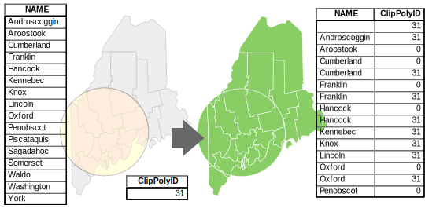

```{r include=FALSE, cache=FALSE}
knitr::opts_chunk$set(
  comment = "",
  message = FALSE,
  tidy = FALSE,
  cache = TRUE,
  warning = FALSE,
  encoding = "UTF-8",
  fig.show='hold')

knitr::opts_knit$set(list(width = 80))

# Set margins
knitr::knit_hooks$set(small.mar = function(before, options, envir) {
  if (before) par(mar = c(4, 4, 1, 1))  # smaller margin on top and right
})

knitr::knit_hooks$set(no.mar = function(before, options, envir) {
  if (before) par(mar = c(0, 0, 0, 0))  # no margins
})


```
# Spatial Operations and Vector Overlays


## Selection by Attribute

Features in a GIS layer can be selected graphically or by querying attribute values. For example, if a GIS layer represents land parcels, one could use the *Area* field to select all parcels having an area greater than 2.0 acres. 

**Set algebra** is used to define conditions that are to be satisfied while **Boolean algebra** is used to combine a *set* of conditions. 

### Set Algebra

Set algebra consists of four basic operators: 

 * less than (`<`), 
 * greater than (`>`), 
 * equal to (`=`)
 * not equal to (`<>`).

> In some programming environments (such as R and Python), the equality condition is presented as **two** equal signs, `==`, and not one. In such an environment `x = 3` is interpreted as "*pass the value 3 to x*" and `x == 3` is interpreted as "*is x equal to 3?*.


If you have a GIS layer of major cities and you want to identify all census tracts having a population count greater than 50000, you would write the expression as `"POP" > 50000` (of course, this assumes that the attribute field name for population count is `POP`).

```{r f08-sel1, echo=FALSE, fig.cap = "An example of the *Select Layer by Attributes* tool in ArcGIS Pro  where the pull-down menu is used to define the selection.", out.width=358}

knitr::include_graphics("img/Select_attribute_1.jpg")
```

```{r f08-sel2, echo=FALSE, fig.cap = "An example of the *Select Layer by Attributes* tool in ArcGIS Pro  where the SQL syntax is used to define the selection.", out.width=358}

knitr::include_graphics("img/Select_attribute_2.jpg")
```

```{r f08-sel1-result, echo=FALSE, fig.cap = "Selected cities meeting the criterion are shown in cyan color in ArcGIS Pro."}

```


The result of this operation is a selected subset of the Cities point layer. Note that in most GIS applications the selection process *does not* create a new layer.

### Boolean Algebra

You can combine conditions from set algebra operations using the following Boolean algebra operators: 

 * `or` (two conditions *can* be met), 
 * `and` (two conditions *must* be met), 
 * `not` (condition *must not* be met).
 
Following up with the last example, let's now select cities having a population greater than 50000 and that are in the US (and not Canada or Mexico). Assuming that the country field is labeled `FIPS_CNTRY` we could setup the expression as `"POP" > 50000 AND "FIPS_CNTRY" = US`. Note that a value need not be numeric. In this example we are asking that an attribute value equal a specific string value (i.e. that it equal the string `'US'`).


```{r sel3, echo=FALSE, fig.cap = "Selected cities meeting  where POP &gt; 50000  AND  FIPS_CNTRY == US criteria are shown in cyan color."}

knitr::include_graphics("img/Select_cities_2.svg")

```


## Selection by location

We can also select features from *one* GIS layer based on their spatial association with *another* GIS layer. This type of spatial association can be broken down into four categories: **adjacency** (whether features from one layer *share* a boundary with features of another), **containment** (whether features from one layer are *inside* features of another), **intersection** (whether features of one layer *intersect* features of another), and **distance** (whether one feature is within a certain *distance* from another).

Continuing with our working example, we might be interested in `Cities` that are within 100 miles of earthquakes. The earthquake points are from another GIS layer called `Earthquakes`. 

```{r f08-loc1, echo=FALSE, fig.cap = "An example of a *Select Layer by Location* tool in ArcGIS Pro. The spatial association chosen is distance.", out.width=300}

knitr::include_graphics("img/Select_location_1.jpg")
```


```{r f08-loc1-map, echo=FALSE, fig.cap = "Selected cities meeting the criterion are shown in cyan color.", out.width=300}
knitr::include_graphics("img/Cities_earthquakes.svg")
```


## Vector Overlay

<aside>
The concept of *vector overlay* is not new and goes back many decades--even before GIS became ubiquitous. It was once referred to as **sieve mapping** by land use planners who combined different layers--each mapped onto separate transparencies--to isolate or eliminate areas that did or did not meet a set of criteria.
</aside>

Map overlay refers to a group of procedures and techniques used in combining information from different data layers. This is an important capability of most GIS environments. Map overlays involve at least two input layers and result in at least one new output layer. A basic set of overlay tools include **clipping**, **intersecting** and **unioning**.

### Clip

**Clipping** takes one GIS layer (the *clip* feature) and another GIS layer (the to-be-clipped input feature). The output is a clipped version of the original input layer. The output attributes table is a subset of the original attributes table where only records for the clipped polygons are preserved.

```{r f08-clip, fig.cap = "The Maine counties polygon layer is clipped to the circle polygon. Note that the ouput layer is limited to the county polygon geometry and its attributes (and does not include the clipping circle polygon).", echo=FALSE}

``` 

### Intersect

**Intersecting** takes both layers as inputs then outputs the features from both layers that share the same spatial extent. Note that the output attribute table inherits attributes from *both* input layers (this differs from *clipping* where attributes from just one layer are carried through).

```{r f08-intersect, fig.cap = "The Maine counties polygon layer is intersected with the circle polygon. The ouput layer combines both intersecting geometries and attributes.", echo=FALSE}
knitr::include_graphics("img/Intersect.svg")
``` 

### Union

**Unioning** overlays both input layers and outputs *all* features from the two layers. Features that overlap are intersected creating new polygons. This overlay usually produces more polygons than are present in both input layers combined. The output attributes table contains attribute values from *both* input features (note that only a *subset* of the output attributes table is shown in the following figure).

```{r f08-union, fig.cap = "The Maine counties polygon layer is unioned with the circle polygon. The ouput layer combines both (complete) geometries and attributes. Where spatial overlaps do not occur, most software will either assign a NULL value or a 0.", echo=FALSE}

``` 


