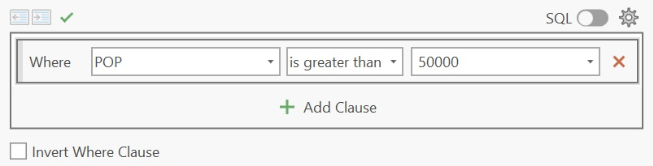
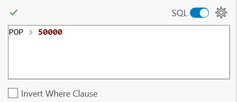
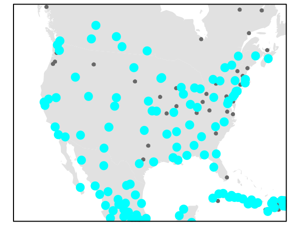
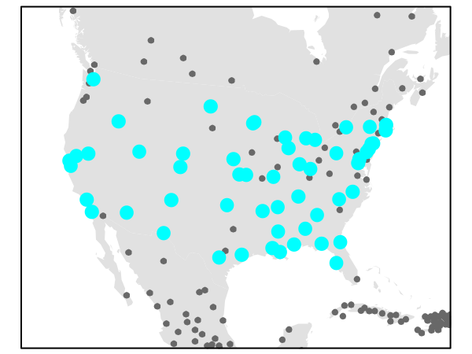
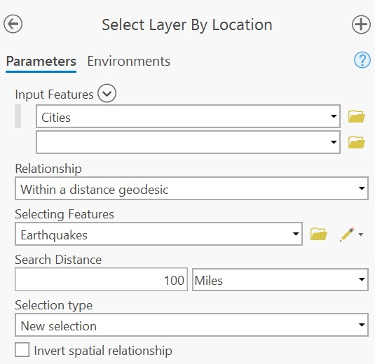
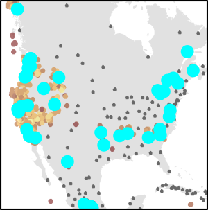
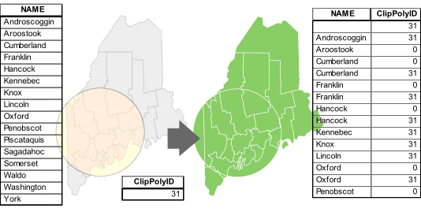
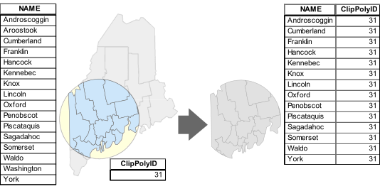
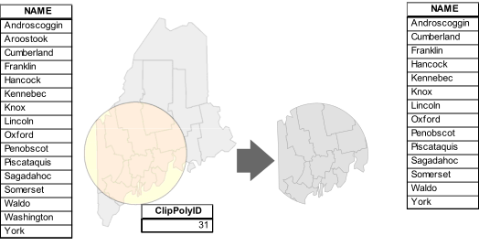

# Spatial Selection and Vector Overlays

```{r include=FALSE, cache=FALSE}
knitr::opts_chunk$set(
  comment = "",
  message = FALSE,
  tidy = FALSE,
  cache = TRUE,
  warning = FALSE,
  encoding = "UTF-8",
  fig.show='hold')

knitr::opts_knit$set(list(width = 80))

# Set margins
knitr::knit_hooks$set(small.mar = function(before, options, envir) {
  if (before) par(mar = c(4, 4, 1, 1))  # smaller margin on top and right
})

knitr::knit_hooks$set(no.mar = function(before, options, envir) {
  if (before) par(mar = c(0, 0, 0, 0))  # no margins
})

```


## Introduction

The previous chapters focused on how spatial data are represented, managed, symbolized, and mapped. We examined how geographic features are encoded in vector and raster formats, how spatial data are organized, and how maps can be designed to effectively communicate information. In this chapter, we shift our attention from representing spatial data to using it to answer questions.

One of the primary goals of a GIS is to identify, extract, and combine geographic features in ways that help answer spatial questions. Sometimes we are interested in features that possess particular attributes, such as cities with populations greater than 50,000. In other cases, the question is spatial in nature, such as identifying cities located within 100 miles of an earthquake event or parcels that fall within a flood zone. More complex analyses require combining information from multiple layers to create new geographic features and attribute relationships.

This chapter introduces three fundamental GIS operations that support these tasks. We begin with **attribute queries**, which identifies features based on information stored in their attribute tables. We then explore **spatial queries**, which selects features according to their spatial relationships with other features. Finally, we examine **vector overlay operations**, which combine multiple layers to generate new spatial and attribute information. 

Together, these operations form the foundation of many GIS workflows and illustrate how geographic data can be queried, filtered, and transformed to answer spatial questions.

## Attribute queries

GIS layers often contain rich attribute data that can be queried to identify features of interest. For example, if a layer represents land parcels, we might want to select all parcels larger than 2.0 acres or all parcels zoned for residential use. Such queries are built using **comparison operators** and **Boolean logic**, which allow us to define the conditions that features must satisfy to be selected.

### Comparison expressions

Attribute queries are built from **comparison expressions** that evaluate whether a condition is true or false. These expressions compare the value stored in an attribute field to a specified value using operators such as:

 * less than (`<`), 
 * greater than (`>`), 
 * equal to (`=`)
 * not equal to (`<>`).

> In some programming environments (such as R and Python), the equality condition is expressed using **two** equal signs, `==`, and not one. In such an environment `x = 3` is interpreted as "*pass the value 3 to x*" and `x == 3` is interpreted as *"is x equal to 3?"*.


For example, suppose we want to select all cities with a population greater than 50,000. Assuming the population field is named `POP`, the query expression would be:

```
"POP" > 50000
``` 

In ArcGIS Pro, one would use the **Select Layer by Attribute** tool.

```{r}
#| label: fig-sel1
#| fig.align: "center"
#| fig-cap: "Attribute queries can be constructed using a graphical query builder. In this example, comparison operators and attribute fields are selected from pull-down menus rather than typed directly as a SQL expression (@fig-sel2)."
#| echo: false
#| out.width: "358px"

```

```{r}
#| label: fig-sel2
#| fig.align: "center"
#| fig-cap: "Many GIS applications allow attribute queries to be written using SQL syntax. The expression `POP > 50000` evaluates each feature's population value and selects those exceeding the specified threshold."
#| echo: false
#| out.width: "358px"

```


```{r}
#| label: fig-sel1_result
#| fig.align: "center"
#| fig-cap: "Cities with populations greater than 50,000 are selected and highlighted."
#| echo: false
#| out.width: "300px"

```


### Boolean Logic

A single comparison expression can be used to select features that satisfy one condition. However, many GIS queries require multiple conditions. **Boolean logic** provides a framework for combining comparison expressions into more complex queries.

Boolean logic combines comparison expressions into statements that evaluate to either **TRUE** or **FALSE** for each feature. Features for which the statement evaluates to TRUE are selected.

The most common Boolean operators are:

 * `OR`: at least one condition must be true. 
 * `AND`: all conditions must be true.
 * `NOT`: reverses a condition, selecting features that do not meet it.

Suppose we want to select cities with a population greater than 50,000 that are located in the United States. If the country field is labeled `FIPS_CNTRY`, the expression would be:

``` 
`("POP" > 50000) AND ("FIPS_CNTRY" = US)`
```

Parentheses can be used to control the order in which conditions are evaluated, just as they are used in arithmetic expressions.

Only features satisfying both conditions would be selected.

```{r}
#| label: fig-sel3
#| fig.align: "center"
#| fig-cap: "Cities satisfying both query conditions (POP &gt; 50000  AND  FIPS_CNTRY == US) are highlighted. The Boolean operator AND requires that both conditions evaluate to TRUE before a feature is selected."
#| echo: false
#| out.width: "300px"


```

## Spatial queries

Whereas attribute queries select features based on information stored in an attribute table, ***spatial queries** select features based on their geographic relationship to other features. In ArcGIS Pro, these operations are implemented through the **Select Layer by Location** tool. GIS software evaluates these relationships using feature geometry rather than attribute values.

Spatial relationships can take many forms, including:

+ **Adjacency**: features that share a boundary
+ **Containment**: features that are entirely within another feature
+ **Intersection**:  features that overlap or touch one another
+ **Distance**: features within a specified distance of another feature


For example, suppose we want to identify cities located within 100 miles of recorded earthquake events. Because this relationship is not typically stored as an attribute in either layer, GIS evaluates the spatial relationship between the city and earthquake features to determine which cities satisfy the selection criterion.

```{r}
#| label: fig-loc1
#| fig.align: "center"
#| fig-cap: "A *Select Layer by Location* tool is used to identify features that satisfy a specified spatial relationship. In this example, cities are selected if they occur within a defined distance of earthquake events."
#| echo: false
#| out.width: "300px"

```

This generates the following selection:

```{r}
#| label: fig-loc1_map
#| fig.align: "center"
#| fig-cap: "Cities located within the specified distance of earthquake events are selected and highlighted. This illustrates the result of a spatial query based on proximity."
#| echo: false
#| out.width: "300px"

```


## Vector overlay operations

Vector overlay operations combine information from two or more layers to create a new output layer. Unlike query operations, which simply select existing features, overlay operations generate new geometries and attribute relationships based on spatial overlap. Three common polygon overlay operations are  **Union**, **Intersect** and **Clip**.

### Union

**Union** combines two polygon layers and retains all features from both input layers. Areas of overlap are split into new polygons defined by the boundaries of both layers. The output layer typically contains more polygons than either input layer alone and inherits attributes from both sources. 

```{r}
#| label: fig-union
#| fig.align: "center"
#| fig-cap: "A Union operation preserves the complete geometry of both input layers. Areas of overlap are subdivided into new polygons that inherit attributes from both layers (e.g., s1 and c1), while non-overlapping areas retain only the attributes of their original layer. The resulting output layer typically contains more polygons than either input layer."
#| echo: false
#| 

``` 

### Intersect

**Intersect** combines two polygon layers and outputs only the areas where features from both layers overlap. The resulting polygons inherit attributes from both input layers, while all non-overlapping areas are excluded.

```{r}
#| label: fig-intersect
#| fig.align: "center"
#| fig-cap: "An Intersect operation creates an output layer composed only of areas where the two input layers overlap. Each resulting polygon inherits attributes from both input layers. Features that do not participate in an overlap are omitted from the output."
#| echo: false
#| 

``` 

### Clip

**Clip**  uses one layer (the **clip layer**) to *cookie-cut* another layer (the **input layer**). The result is a subset of the input layer restricted to the area defined by the clip layer, and only the attributes of the input layer are retained. In many GIS applications, **Clip** is implemented as a dedicated tool. However, conceptually it can be viewed as a special type of overlay operation in which the clip layer contributes only its boundary geometry and not its attributes. Some software environments implement clipping through more general overlay operations like *Intersect* rather than as a separate tool.

```{r}
#| label: fig-clip
#| fig.align: "center"
#| fig-cap: "A Clip operation restricts the input layer to the area enclosed by the clip layer. The output retains only the geometry and attributes of the input layer; the clip layer serves solely as a spatial boundary and does not contribute attributes to the output."
#| echo: false

``` 

## Summary

This chapter introduced fundamental GIS operations used to query and combine vector data.

+ **Attribute** queries select features based on conditions applied to values stored in an attribute table. They are built using comparison expressions and Boolean logic. 
+ **Comparison expressions** evaluate whether a condition is true or false for each feature, while **Boolean operators** allow multiple conditions to be combined into more complex queries. 
+ **Spatial queries** select features based on their geographic relationship to other features, such as distance, containment, adjacency, or intersection. 
+ Unlike queries, which identify existing features, **vector overlay operations** create new datasets by combining information from multiple layers. 
+ A **Union** operation preserves all areas from both input layers and combines their attributes where overlaps occur. 
+ An **Intersect** operation retains only areas shared by both input layers and combines attributes from each layer. 
+ A **Clip** operation uses one layer as a spatial boundary to extract a subset of another layer while retaining only the attributes of the input layer. 

Attribute queries, spatial queries, and overlay operations form the foundation of many GIS workflows and provide a framework for extracting, filtering, and transforming geographic information.

