# Coordinate Systems {#chp09_0}

## Introduction

Every GIS dataset is tied to a spatial reference system, which defines how locations are represented and interpreted. This system may be arbitrary--such as a 10 m × 10 m sampling grid in a forest plot or the layout of a soccer field--or it may be geographic, linking spatial features to positions on the Earth’s surface. This chapter focuses on Earth-based reference systems.

At first glance, representing a location on Earth may seem straightforward. For example, we might describe Colby College as being located at a particular latitude and longitude. However, before coordinates can be assigned, we must first answer a more fundamental question:

> What model of the Earth are those coordinates based on?

The Earth is not a perfect sphere, nor is it perfectly smooth. Its shape, gravitational field, and curvature must all be approximated before locations can be measured and mapped. Different approximations can produce slightly different coordinate values for the same physical location. Understanding these approximations is essential when working with spatial data from different sources.

Earth-based coordinate systems generally fall into two broad categories: 

+ **Geographic Coordinate Systems (GCS)**, which locate positions on the curved surface of the Earth using latitude and longitude. 
+ **Projected Coordinate Systems (PCS)**, which transform the curved Earth onto a flat surface suitable for mapping and spatial analysis. 

In this chapter, we begin by examining how locations are defined on the Earth through geographic coordinate systems. We then explore projected coordinate systems and the distortions introduced when translating a curved surface onto a flat map. Finally, we examine how different coordinate systems affect spatial measurements such as area, distance, direction, and shape.

## Geographic Coordinate Systems

### Latitude and Longitude

A geographic coordinate system (GCS) identifies locations on the Earth's surface using two angular measurements: **latitude** and **longitude**. Unlike projected coordinate systems, which measure location using linear units such as meters or feet, a geographic coordinate system measures position using angles referenced to the Earth's center.

Latitude and longitude are defined relative to two reference planes:

- the **equatorial plane**, which divides Earth into Northern and Southern Hemispheres,
- the **prime meridian plane**, which passes through Greenwich, England and divides Earth into Eastern and Western Hemispheres.

A location on Earth can therefore be uniquely identified by a pair of values: latitude and longitude.

Latitude measures how far north or south a location lies relative to the equator. It ranges from 0&deg; at the equator to 90&deg; at the North Pole and -90&deg; at the South Pole.

Longitude measures how far east or west a location lies relative to the prime meridian. Longitude ranges from 0&deg; at the prime meridian to +180&deg; eastward and -180&deg; westward.


```{r}
#| label: fig-latlong
#| fig.align: "center"
#| fig-cap: "Latitude and longitude provide a geographic framework for locating positions on the Earth's surface. Latitude measures angular distance north or south of the equator (left), whereas longitude measures angular distance east or west of the prime meridian (right). The red lines indicate the 0&deg; reference locations from which each measurement is made."
#| echo: false
#| out.width: "358px"

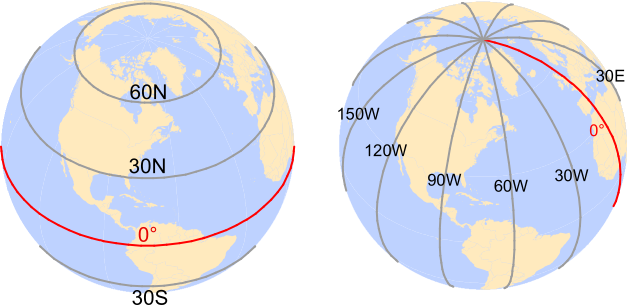
```

For example, Colby College is located at approximately 44.5&deg; North and 69.5&deg; West. In many GIS applications, north and east coordinates are assigned **positive values**, whereas south and west coordinates are assigned **negative values**. Thus, the same location can be represented as (+44.5&deg;, -69.5&deg;).

```{r}
#| label: fig-sphere_slice
#| fig.align: "center"
#| fig-cap: "Latitude and longitude are measured as angles from the Earth's center rather than as linear distances along its surface. Latitude is referenced to the equatorial plane, while longitude is referenced to the prime meridian plane."
#| echo: false
#| out.width: "350px"
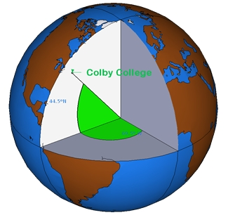
```

One consequence of using latitude and longitude is that the units are angular rather than linear. As a result, a one-degree change in longitude does not correspond to the same ground distance everywhere on Earth. This complicates distance and area measurements and motivates the use of projected coordinate systems introduced later in this chapter.

### Why Coordinate Systems Differ

At first glance, a geographic coordinate system appears straightforward: every location on Earth can be identified by a latitude and longitude value. It is therefore tempting to assume that a given location should always have the same coordinates. In practice, however, this is not the case. The same physical location can have different latitude and longitude values depending on the coordinate system used.

Why does this happen? The answer lies in how the Earth is represented mathematically. Latitude and longitude measurements are referenced to a model of the Earth, but the Earth is not a perfect sphere. It is slightly flattened at the poles, has an irregular gravitational field, and exhibits subtle variations in shape. To create coordinate systems that can be used consistently around the world, these complexities must be *approximated* using mathematical models. Different approximations lead to different coordinate systems. 

The next sections introduce the three key concepts that form the foundation of modern geographic coordinate systems: 

- the **ellipsoid**, a mathematical model used to approximate the Earth's shape; 
- the **geoid**, a model representing the Earth's gravitational surface; and 
- the **datum**, which defines how the ellipsoid is aligned with the Earth.

Understanding these concepts is essential because coordinate values are meaningful only when the underlying geographic coordinate system is known. Two datasets may describe the same location using slightly different coordinate values if they are referenced to different datums.

### Sphere and Ellipsoid

To assign coordinates to locations on Earth, we first need a mathematical model of the planet's shape. The simplest model treats the Earth as a perfect sphere. A sphere is attractive because its geometry is easy to work with mathematically and provides a reasonable approximation for many small-scale maps and global visualizations. However, the Earth is not perfectly spherical. Measurements made from satellites and geodetic surveys show that the Earth is slightly flattened at the poles and bulges outward at the equator.

To better represent the Earth's shape, geographic coordinate systems typically use an ellipsoid rather than a sphere. An ellipsoid can be thought of as a slightly compressed sphere whose shape is defined by two radii:

- The **semi-major axis**, which represents the equatorial radius, and 
- The **semi-minor axis**, which represents the polar radius. 

These dimensions provide a closer approximation of the Earth's shape and improve the accuracy of geographic coordinates and spatial measurements. @fig-ellipse_axes0 illustrates the two axes used to define an ellipsoid.

```{r}
#| label: fig-ellipse_axes0
#| fig.align: "center"
#| fig-cap: "An ellipsoid is defined by two radii: the semi-major axis, which measures the equatorial radius, and the semi-minor axis, which measures the polar radius. If the two radii are equal, the ellipsoid becomes a perfect sphere."
#| echo: false
#| out.width: "200px"
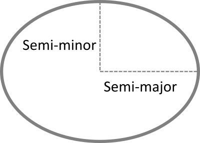
```

The Earth is not a perfect sphere. Its rotation produces a centrifugal effect that causes the planet to bulge slightly at the equator and flatten at the poles. As a result, the Earth's equatorial radius is approximately 21 km longer than its polar radius. While this difference is small relative to the Earth's overall size, it is large enough to affect spatial measurements and coordinate calculations. Consequently, modern geographic coordinate systems typically represent the Earth as an ellipsoid rather than a sphere.

```{r}
#| label: fig-sphere_ellipse
#| fig.align: "center"
#| fig-cap: 
#|       - "A spherical Earth model assumes that the Earth's radius is identical in all directions. Although convenient mathematically, it does not fully capture the Earth's true shape."
#|       - "An ellipsoidal Earth model accounts for the Earth's equatorial bulge and polar flattening, providing a more accurate representation than a sphere."
#| echo: false
#| layout-ncol: 2
#| fig.show: "hold"
#| out.width: 
#|        -  "150px"
#|        -  "185px"

knitr::include_graphics(c("img/globe_0_0_center.png","img/globe_0_0_center_wide.png" ))
```

For many applications, the difference between a sphere and an ellipsoid is small. However, when high positional accuracy is required, the ellipsoidal model provides more accurate coordinate and distance calculations.

Modern geodetic measurements derived from satellites and ground-based surveys have produced highly accurate estimates of the Earth's dimensions. For example, the WGS84 ellipsoid uses a semi-major axis of 6,378,137 meters and a semi-minor axis of 6,356,752 meters. Although the difference between these radii represents only a small fraction of the Earth's overall size, it is sufficient to affect coordinate calculations and distance measurements.

For many mapping applications these differences are negligible. However, when measurements span large distances, the choice of a spherical or ellipsoidal Earth model can produce measurable discrepancies. @fig-dist_diff illustrates these differences by comparing distances computed on a sphere with those computed on an ellipsoid. In some cases, the discrepancy approaches 20 km.

```{r}
#| label: fig-dist_diff
#| fig.align: "center"
#| fig-cap: "Differences in distance measurements computed on a sphere versus an ellipsoid. The discrepancies vary with latitude and direction and can approach 20 km for some long-distance measurements. These results illustrate why modern geographic coordinate systems typically adopt an ellipsoidal Earth model."
#| echo: false
#| out.width: "600px"
knitr::include_graphics(c("img/Ellipsoid_vs_sphere_distances.png"))
```

Although the ellipsoid provides a much better approximation of the Earth's shape than a sphere, it remains a mathematical simplification. The Earth is not a perfectly smooth surface and its mass is not distributed uniformly. Variations in the Earth's density create small differences in its gravitational field, causing the Earth's true shape to deviate from a simple ellipsoid. To account for these variations, geodesists introduce another model of the Earth known as the **geoid**.

### Geoid

The **geoid** is a model of the Earth's gravitational surface. Unlike the smooth and mathematically defined ellipsoid, the geoid contains subtle undulations caused by variations in the Earth's gravity field. These variations arise because the Earth's mass is not distributed uniformly throughout the planet. Although the deviations are small relative to the Earth's overall size, they can be measured and are important in high-accuracy positioning and surveying applications.

It is important to distinguish the geoid from the Earth's topography. In this context, we are not concerned with mountains, valleys, or ocean trenches. Instead, we can imagine the Earth completely covered by a motionless ocean. The resulting surface, shaped only by gravity, approximates the geoid. Differences between the geoid and ellipsoid are therefore caused by variations in the Earth's gravity field rather than by surface terrain.

```{r}
#| label: fig-geoid
#| fig.align: "center"
#| fig-cap: "The geoid is a gravity-based reference surface that approximates mean sea level worldwide. Its undulations reflect variations in the Earth's gravitational field caused by non-uniform mass distribution within the planet. The vertical variations are greatly exaggerated (4000×) to make them visible."
#| echo: false
#| out.width: "200px"
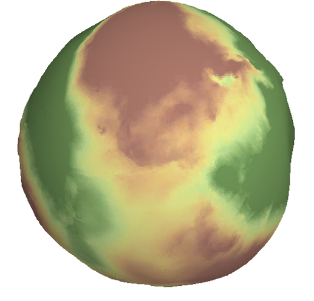
```

The Earth is not a static body. Tectonic plate motion, changes in the distribution of water and ice, and variations within the Earth's interior can cause small changes in the Earth's shape and gravitational field over time. As a result, geodetic reference systems are periodically updated to maintain positional accuracy. The science of measuring and modeling the Earth's shape, orientation, and gravity field is known as **geodesy**.

### Datum

We now have two different models of the Earth. The **ellipsoid** provides a mathematically convenient representation of the Earth's shape, whereas the **geoid** provides a more realistic representation of the Earth's gravitational surface. Because geographic coordinates are computed on an ellipsoid, we must specify how that ellipsoid is positioned relative to the geoid. This alignment defines a **datum**. A datum therefore serves as a bridge between the mathematical model used for calculations and the physical Earth it is intended to represent 

The alignment can be:

+  **Local**, where the ellipsoid is closely fitted to the geoid at a specific location (e.g., Kansas), or
+  **Geocentric**, where the ellipsoid is aligned with the Earth’s center of mass.

```{r}
#| label: fig-datum
#| fig.align: "center"
#| fig-cap: "A datum is created by defining how an ellipsoid is aligned relative to the geoid. Different alignments produce different coordinate systems and can yield different coordinate values for the same physical location."
#| echo: false
#| out.width: "550px"
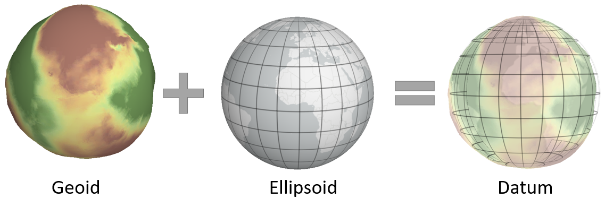
```

Historically, many datums were designed to provide the best possible fit for a particular region rather than for the entire Earth. These are known as **local datums**.

#### Local Datum

```{r}
#| label: fig-datum_local
#| fig.align: "center"
#| fig-cap: "A local datum aligns the ellipsoid to provide the best fit within a specific region. Positional accuracy is maximized near the point of alignment but may decrease farther away."
#| echo: false
#| out.width: "200px"
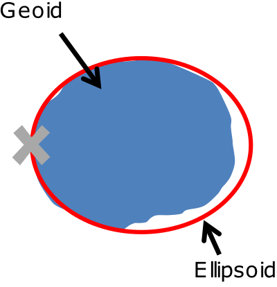
```

There are many local datums, both historical and modern. The choice of datum is typically driven by geographic context. For example:

+  **NAD27** (North American Datum of 1927) is widely used in the U.S., especially in older maps.
+  **ED50** (European Datum of 1950) is common in Western Europe.
+  **WGS72** (World Geodetic System 1972) was developed for global use by the U.S. Department of Defense.

Advances in satellite technology made it possible to construct datums centered on the Earth's center of mass rather than optimized for a particular region. These are known as **geocentric datums**.

#### Geocentric Datum

```{r}
#| label: fig-datum_geocentric
#| fig.align: "center"
#| fig-cap: "A geocentric datum aligns the ellipsoid with the Earth's center of mass. This produces a coordinate system suitable for global positioning and satellite navigation."
#| echo: false
#| out.width: "200px"
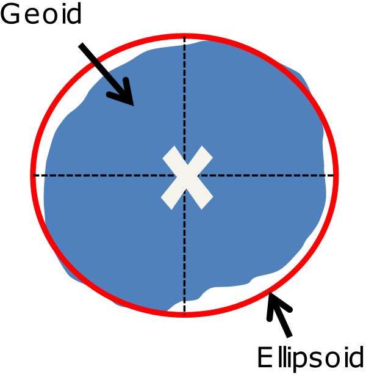
```

Modern datums typically use a geocentric alignment. Examples include:

+ **NAD83** (North American Datum of 1983)
+ **ETRS89** (European Terrestrial Reference System 1989)
+ **WGS84** (World Geodetic System 1984)

Most modern datums use either the WGS84 or GRS80 ellipsoid, which have nearly identical dimensions: a semi-major axis of 6,378,137 meters and a semi-minor axis of 6,356,752 meters.

We can now assemble the components of a geographic coordinate system: an ellipsoid provides the mathematical model of the Earth, and a datum specifies how that model is aligned with the Earth.

### Building the Geographic Coordinate System

We can now assemble the components of a **Geographic Coordinate System (GCS)**. A GCS is created by combining:

1. an **ellipsoid**, which provides a mathematical model of the Earth's shape, and
2. a **datum**, which defines how that ellipsoid is aligned with the Earth.

Together, these components provide the reference framework used to assign latitude and longitude coordinates to locations on the Earth's surface.

Because different ellipsoids and datums may be used, the same physical location can have different latitude and longitude coordinates under different geographic coordinate systems. For this reason, it is essential to know the coordinate system associated with a dataset before combining it with other spatial data.

For example, a point recorded in NAD27 will typically have slightly different latitude and longitude values when expressed in NAD83, even though the physical location has not changed. The difference arises because the two coordinate systems use different datum definitions. @fig-GCS_offsets illustrates this effect using the location of the Colby College flagpole.

```{r}
#| label: fig-GCS_offsets
#| fig.align: "center"
#| fig-cap: "The same physical location represented in two different geographic coordinate systems (NAD83 on the left and NAD27 on the right). Although the flagpole has not moved, differences in datum definitions cause its coordinates to shift slightly between reference systems."
#| echo: false
#| out.width: "540px"
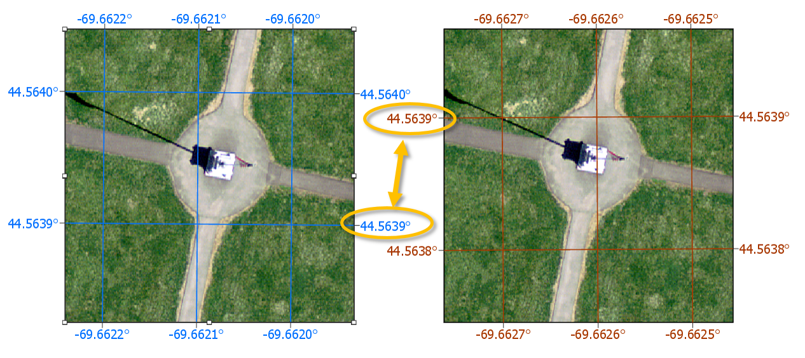
```

For example, a point recorded as 44.56698&deg; N, 69.65939&deg; W in NAD27 may appear as 44.56704&deg; N, 69.65888&deg; W in NAD83. Although the coordinate values differ, both refer to the same physical location. Without proper metadata, these differences can lead to misaligned features when datasets from multiple coordinate systems are combined.

A useful analogy is temperature measurement. Water freezes at 0&deg;C, 32&deg;F, and 273.15 K. The numeric values differ, but the physical phenomenon is identical. Likewise, the same location can have different coordinate values under different geographic coordinate systems even though the location itself has not changed.

Modern GIS software stores coordinate system information as metadata and can automatically transform data between many common geographic coordinate systems. Nevertheless, identifying the correct coordinate system remains an essential first step in any GIS workflow.

## Projected Coordinate Systems

### What is a Projected Coordinate System?

A **Projected Coordinate System (PCS)** provides a framework for identifying locations on a **flat** surface. Unlike a Geographic Coordinate System, which uses angular coordinates (latitude and longitude), a PCS uses **Cartesian coordinates** measured in linear units such as meters or feet. A projected coordinate system consists of an origin, an x-axis, a y-axis, and a coordinate grid formed by lines that intersect at right angles. 

> FYI: A projected coordinate system is always built upon an underlying Geographic Coordinate System (GCS). The projection defines how coordinates are transformed from the curved Earth to a flat surface, but the ellipsoid and datum used by the PCS are inherited from its parent GCS. As a result, the same projection method can produce slightly different coordinate values and spatial measurements when paired with different geographic coordinate systems. For example, a UTM projection based on NAD83 will not produce exactly the same coordinates as a UTM projection based on WGS84, even though both use the same projection method.

### Why Do We Need Projections? 

Latitude and longitude provide a convenient way to locate positions on the Earth's surface, but they are less well suited for measuring spatial properties such as distance, area, and direction. Because the Earth is curved, angular coordinate systems do not naturally provide the planar framework needed for mapping and analytical tasks.

Projected coordinate systems became widely adopted because many surveying and engineering measurements were traditionally performed on a plane. Even after the introduction of digital computers, projected coordinate systems remained important because measurements of distance, area, and direction could often be computed more efficiently on a plane than on a curved Earth model. As a result, projected coordinate systems became the standard framework for many GIS operations and mapping applications.

However, transforming locations from a curved Earth to a flat map cannot be done without introducing some form of **distortion**. A map projection provides the mathematical transformation needed to convert locations from a Geographic Coordinate System (GCS) to a Projected Coordinate System (PCS). Every projection introduces distortions that affect one or more spatial properties, including **shape**, **area**, **distance**, and **direction**.

> Modern GIS software is capable of performing measurements directly on an ellipsoid using geodesic methods. These approaches often provide more accurate results over large distances and geographic extents. Nevertheless, projected coordinate systems remain widely used because of their computational efficiency. Geodesic measurements are discussed later in this chapter (@sec-geodesic).

## Spatial Properties

All map projections introduce distortion because a curved Earth cannot be represented on a flat surface without alteration. The four spatial properties most affected by projection are: **shape**, **area**, **distance** and **direction**. Different projections are designed to preserve one or more of these properties while accepting distortions in others.

A projection that preserves shape is called **conformal**. A projection that preserves area is called **equal-area**. A projection that preserves distance is called **equidistant**. A projection that preserves direction is called **azimuthal**.

> Many GIS applications include these properties directly in the projection name. For example, *Albers Equal Area* prioritizes area preservation, whereas *Lambert Conformal Conic* prioritizes shape preservation.

### Shape

A map projection preserves shape when local angles and geometric forms remain unchanged. Such projections are called conformal projections. While small features maintain their appearance, the preservation of shape often comes at the expense of area, distance, or both.

### Area

A map projection preserves area when the relative size of mapped features remains proportional to their true size on the Earth. Such projections are called equal-area projections. Equal-area projections are commonly used for statistical mapping because they prevent regions from appearing larger or smaller than they actually are. 

### Distance

A map projection preserves distance when distances measured on the map correspond to true distances on the Earth. Such projections are called equidistant projections. However, distance preservation is usually limited to specific directions, locations, or reference lines rather than across the entire map.

### Direction

A projection preserves direction when bearings measured from a specified location correspond to true directions on the Earth. Such projections are often referred to as azimuthal projections. Direction-preserving projections are commonly used in navigation and aviation applications.

### Measuring Projection Distortion

Because every projection represents a compromise among shape, area, distance, and direction, it is useful to have a way to visualize distortion. One common approach uses **Tissot indicatrices (TI)**, which show how a small circle on the Earth is transformed by a map projection. 

The idea is to project a small circle--small enough that distortion remains nearly uniform across its extent--and examine its transformed shape on the map.

For example, to evaluate distortion in a Mollweide projection across the continental U.S., a grid of circles can be generated at regular latitudinal and longitudinal intervals.

```{r}
#| label: fig-moll_tissot
#| fig-cap: "Tissot indicatrices generated for a Mollweide projection across the continental United States. Variations in the size and shape of the indicatrices reveal how projection distortion changes across geographic space."
#| echo: false
#| out-width: "600px"
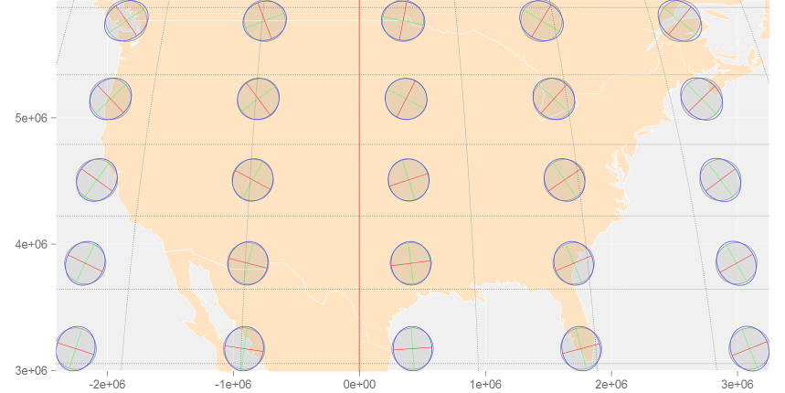
```

Note the varying levels of distortion type and magnitude across the region. To better understand how a Tissot indicatrix captures these distortions, let’s zoom in on a circle centered at 44.5&deg;N and 69.5&deg;W (near Waterville Maine):

```{r}
#| label: fig-moll_tissot_zoom
#| fig-cap: "A Tissot indicatrix centered near Waterville, Maine. The bisque circle represents the undistorted geometry, whereas the blue ellipse shows the distortion introduced by the Mollweide projection. The major and minor axes define the principal directions of scale distortion."
#| echo: false
#| out-width: "400px"
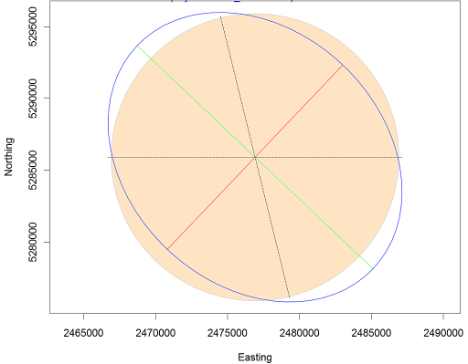
```

The plot shows a perfect circle (filled in bisque) that would be expected if no distortion were present. The blue ellipse (the indicatrix) represents the transformed circle for this particular projection and location. The green and red lines indicate the magnitude and orientation of the ellipse’s major and minor axes, respectively. These lines can also be used to assess **scale distortion**, which may vary depending on direction (bearing).

+  The green line shows the direction of **maximum scale distortion**.
+  The red line shows the direction of **minimum scale distortion**.


These directions are sometimes referred to as the **principal directions**. In this example, the principal scale values are 1.1293 and 0.8856. A scale value of 1 indicates no distortion; values less than 1 indicate a smaller-than-true scale, and values greater than 1 indicate a larger-than-true scale.

It’s important to note that scale distortion does not necessarily imply area distortion. In fact, for this projection, area is relatively well preserved despite directional scale distortion. An estimate of local area distortion can be obtained by multiplying the two principal scale values. In this example, the area distortion is 1.0001--effectively negligible.

The dashed north-south line in the graphic shows the orientation of the meridian, while the dotted east-west line shows the orientation of the parallel.

> It’s important to remember that these distortions occur at the center of the TI and may not reflect distortion across the entire region covered by the TI circle.

Tissot indicatrices provide a compact way to visualize how a projection alters shape, area, distance, and direction, making them a valuable tool for evaluating projection performance.

No map projection can perfectly preserve shape, area, distance, and direction simultaneously. Instead, different projections are designed to minimize or distribute distortion in different ways. The next section introduces three broad families of map projections--planar, cylindrical, and conical--and examines how each attempts to manage distortion across the Earth's surface.

## Projection Families

Different projection families contact the Earth in different ways and therefore distribute distortion differently across a map. Three common projection families are **planar**, **cylindrical**, and **conical**.

### Planar Projections

A **planar projection** maps the Earth's surface onto a flat plane. The plane may touch the globe at a single point (**tangent** case) or intersect the globe along a circle (**secant** case). Planar projections are also commonly referred to as **azimuthal projections**.

Distortion is generally smallest near the point or line of contact and increases with distance from it.

```{r}
#| label: fig-tangent
#| fig-cap: "A tangent planar projection. The projection surface touches the globe at a single point, where distortion is minimized."
#| echo: false
#| out-width: "600px"
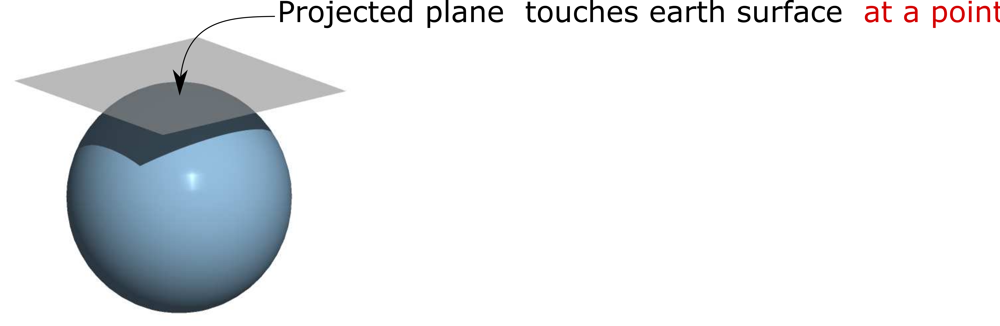
```

```{r}
#| label: fig-secant
#| fig-cap: "A secant planar projection. The projection surface intersects the globe along a circle, reducing distortion over a larger region than the tangent case."
#| echo: false
#| out-width: "600px"
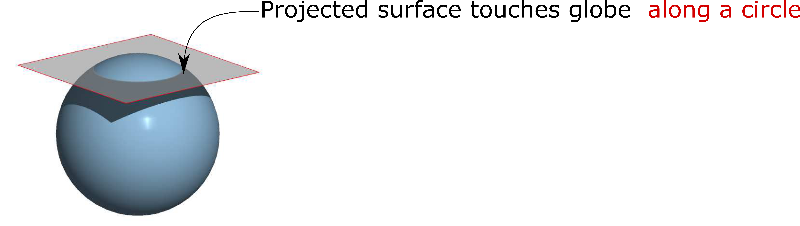
```

Although planar projections are often used for polar regions, the point of contact can be placed anywhere on the globe. When the projection is centered on a location other than a pole, it is referred to as an **oblique** planar projection.

```{r}
#| label: fig-planar_examples
#| fig.align: "center"
#| fig-cap: "Examples of three planar projections: orthographic (left), gnomonic (center) and equidistant (right). Different planar projections preserve different spatial properties and vary in the geographic extent they can represent effectively."
#| echo: false
#| out.width: "500px"
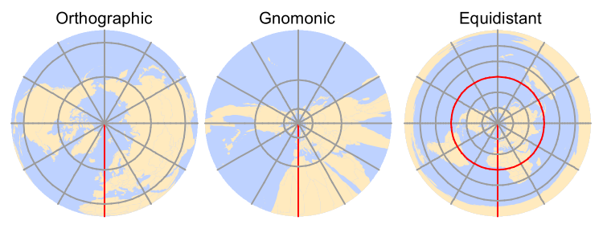
```


### Cylindrical Projection

A cylindrical projection maps Earth’s surface onto a cylinder, which is then unrolled into a flat map. The cylinder may touch the globe along a single line of tangency  (a **tangent** case) or intersect the globe along two lines (a **secant** case). 

```{r}
#| label: fig-tangent2
#| fig-cap: "A tangent cylindrical projection. The projection surface touches the globe along a single line, where distortion is minimized."
#| echo: false
#| out-width: "575px"
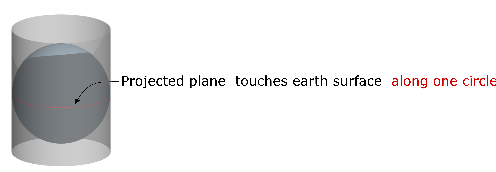
```

 
```{r}
#| label: fig-secant2
#| fig-cap: "A secant cylindrical projection. The projection surface intersects the globe along two lines, reducing distortion over a larger region than the tangent case."
#| echo: false
#| out-width: "575px"
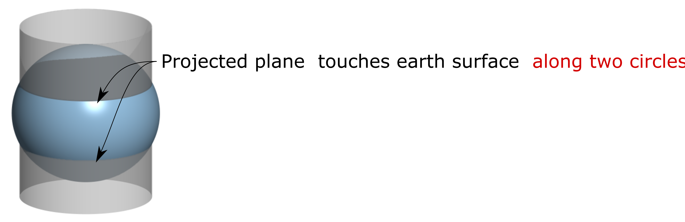
```

Distortion is minimized along the tangent or secant lines and generally increases with distance from them.

The cylinder is typically tangent to the equator, but it can also be oblique. A special case is the **transverse aspect**in which the cylinder is tangent to a meridian rather than the equator. This approach forms the basis of the **Universal Transverse Mercator (UTM)** system and many **State Plane  coordinate systems**. 

The UTM system divides the globe into 60 zones, each 6&deg; wide. Because each zone covers a relatively small geographic extent, distortion remains low. For example, Maine is commonly mapped using **UTM Zone 19 North**. UTM coordinates may be referenced to different datums, including NAD27, NAD83, and WGS84.

```{r}
#| label: fig-cylindrical_examples
#| fig.align: "center"
#| fig-cap: "Examples of two cylindrical projections: Mercator (preserves shape) and equa-area (preserves area)."
#| echo: false
#| out.width: "600px"
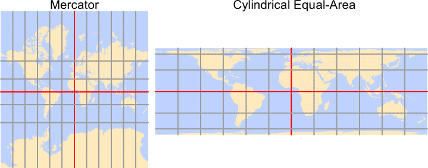
```

### Conical Projection

A conical projection maps Earth’s surface onto a cone. Like cylindrical projections, the cone may touch the globe along a single line of tangency (a **tangent** case) or intersect the globe along two lines (a **secant** case).

```{r}
#| label: fig-tangent3
#| fig-cap: "A tangent conical projection. The projection surface touches the globe along a single line, where distortion is minimized."
#| echo: false
#| out-width: "575px"
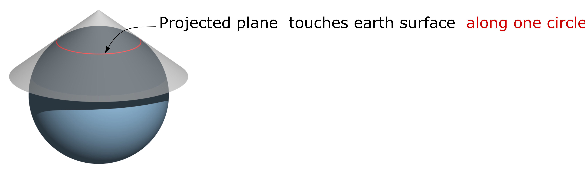
```


```{r}
#| label: fig-secant3
#| fig-cap: "A secant conical projection. The projection surface intersects the globe along two lines, reducing distortion over a larger region than the tangent case."
#| echo: false
#| out-width: "575px"
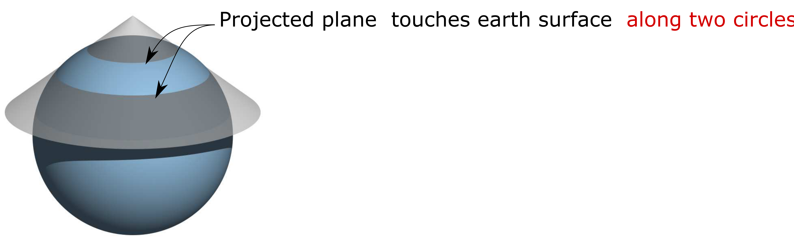
```

Distortion is minimized along the tangent or secant lines and generally increases with distance from them.

Conical projections are particularly well suited for regions that extend primarily east-west through the mid-latitudes. Because the lines of contact can be positioned to span the study region, distortion remains relatively low throughout much of the map. 

For this reason, conical projections are commonly used for mapping the contiguous United States and much of Europe. Common examples include the **Equidistant Conic** projection, which preserves distance, the **Albers Equal Area Conic** projection, which preserves area, and the **Lambert Conformal Conic** projection, which preserves local shape.

```{r}
#| label: fig-conical_examples
#| fig.align: "center"
#| fig-cap: "Examples of three conical projections: Albers equal area (preserves area), equidistant (preserves distance) and conformal (preserves shape)."
#| echo: false
#| out.width: "500px"
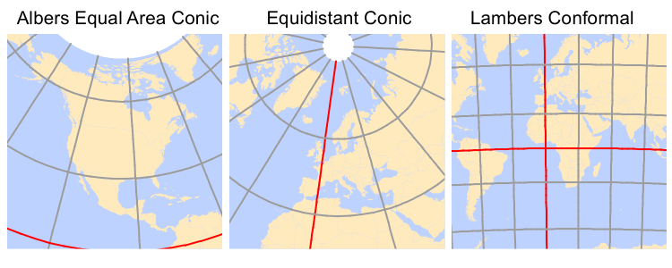
```

## Geodesic Measurements {#sec-geodesic}

Projected coordinate systems provide a convenient framework for mapping and spatial analysis, but they inevitably introduce distortion because the Earth's curved surface must be represented on a flat plane. As discussed in the previous sections, the magnitude of this distortion depends on the projection and the geographic extent of the study area. For many applications, the resulting errors are small and well within acceptable limits. However, when measurements span large geographic areas (such as continents or oceans) projection induced distortions can become substantial.

One way to reduce these errors is to perform measurements directly on the ellipsoid rather than on a projected surface. Such measurements are referred to as **geodesic measurements**.

A **geodesic distance** is the shortest distance between two points on an ellipsoid (or spheroid). Likewise, a **geodesic area** is an area measured directly on the ellipsoid. Because these measurements are computed on the Earth's curved surface, they are independent of any projected coordinate system. In fact, the Tissot indicatrices introduced in the previous section were generated using geodesic measurements.

To illustrate the difference between planar and geodesic measurements, consider the following example. The map below compares the shortest path between two locations on opposite sides of the Atlantic Ocean. The blue solid line represents the shortest path measured in a projected coordinate system (a planar measurement), whereas the red dashed line represents the geodesic path measured directly on the spheroid.


```{r}
#| label: fig-dist_comparison
#| fig.align: "center"
#| fig.cap: "Comparison of planar and geodesic shortest paths between two locations. The blue line shows the shortest path measured in a projected coordinate system, whereas the red dashed line shows the geodesic path measured directly on the spheroid. Although the geodesic path appears curved on the map, it represents the shortest route on the Earth's surface."
#| echo: false
#| fig.width: 5
#| fig.height: 3
library(sf)
library(dplyr)

# Define a few CS'
w.from.s <- "+proj=ortho +lat_0=60 +lon_0=-28 +x_0=0 +y_0=0 +a=6370997 +b=6370997 +units=m +no_defs"
latlon   <- "+proj=longlat +datum=WGS84"

# Create land polygon
land <- st_as_sf(s2::s2_data_countries()) %>% st_union()
circle <- st_buffer(st_as_sfc("POINT(-28 60)", crs = st_crs(land)), 9800000) # visible half
land.circ <- st_intersection(circle, land)
land.ortho <- st_transform(land.circ, crs = w.from.s)

# Define point locations
Waterville <- c(-69.66, 44.56)
Paris <- c(2.35, 48.86)
pt <- st_as_sf(data.frame(rbind(Waterville, Paris)), coords=c("X1", "X2"), crs = 4326)
pt.ortho <- st_transform(pt, crs = w.from.s)

# Compute great circle line segment
pt.m <- matrix(c(Waterville, Paris), ncol = 2, byrow = TRUE)
dist.wgs <- st_linestring(pt.m) %>% st_sfc() %>% st_sf() %>% 
        st_segmentize(dfMaxLength = 0.2)
st_crs(dist.wgs) <- st_crs(latlon)
dist.wgs.ortho <- st_transform(dist.wgs, crs = w.from.s)
dist.gc <- st_linestring(pt.m) %>% st_sfc(crs = latlon) %>% st_sf() %>% 
           st_segmentize(dfMaxLength = 100000)
dist.gc.ortho <- st_transform(dist.gc, crs = w.from.s)

# Plot pseudo GCS
OP <- par(mar = c(0,0,0,0))
 plot(land, col = "grey", border = "grey")
 plot(dist.wgs, col = "blue", add = TRUE)
 plot(dist.gc, col = "red", lty=2, add = TRUE)
 plot(pt, add = TRUE, pch = 16)
par(OP)
```

At first glance, the geodesic path may appear counterintuitive because it is not represented as a straight line on the projected map. However, this apparent curvature is a consequence of projecting a curved Earth onto a flat surface. Although the geodesic path appears curved in the map view, it represents the shortest route along the Earth's surface. To better visualize this relationship, we can display both the geodesic and planar paths on a 3D globe--or on a projection that mimics the Earth as viewed from space and is centered on the midpoint of the route.


```{r}
#| label: fig-geod_vs_plan
#| fig.cap: "Geodesic (red dashed) and planar (blue) paths displayed on a globe-centered view. When viewed on a representation of the Earth's surface rather than a conventional map projection, the geodesic path more clearly reveals its role as the shortest route between the two locations."
#| fig.align: "center"
#| echo: false
#| fig.width: 2.5
#| fig.height: 2.5

# Plot pseudo ortho
OP <- par(mar = c(0,0,0,0))
 plot(land.ortho, col = "grey", border = "grey")
 plot(dist.wgs.ortho, col = "blue", add = TRUE)
 plot(dist.gc.ortho, col = "red", lty=2, add = TRUE)
 plot(pt.ortho, add = TRUE, pch = 16)
par(OP)
```

So, if geodesic measurements are often more accurate than planar ones, why not use them for all spatial operations?

In many cases, geodesic methods are perfectly acceptable--and often preferred. However, they come with a computational cost. Computing distances and areas on a plane is generally more efficient than performing the equivalent calculations on an ellipsoid. Whereas planar measurements often rely on relatively simple geometric formulas, geodesic calculations typically require more complex mathematical procedures and, in some cases, iterative approximations. These additional computations can become significant when processing millions of vertices or large spatial datasets.

It is also important to note that not all geodesic implementations are created equal. Different software packages and algorithms make different tradeoffs between speed and precision. Some methods prioritize computational efficiency and may sacrifice a small amount of accuracy, whereas others prioritize accuracy at the expense of processing time.

In R, several packages support geodesic measurements:

+ `geosphere` (based on the authoritative   [GeographicLib](https://geographiclib.sourceforge.io/) libraries), 
+ `lwgeom` (an R binding to the [liblwgeom](https://github.com/postgis/postgis/tree/master/liblwgeom) libraries), 
+ `s2` is an implementation of Google's spherical measurement library.

## Summary

This chapter introduced the coordinate systems used to represent locations on the Earth and examined how different reference systems influence spatial measurements and mapping.

- A **spatial reference system** provides the framework used to assign coordinates to geographic locations.

- Earth-based coordinate systems can be divided into two broad categories: **Geographic Coordinate Systems (GCS)** and **Projected Coordinate Systems (PCS)**.

- A **Geographic Coordinate System** uses **latitude** and **longitude** to identify locations on the Earth's surface. These coordinates are angular measurements referenced to the Earth's center.

- The same physical location can have different coordinate values depending on the geographic coordinate system used.

- A **sphere** provides a simple approximation of the Earth, but modern geographic coordinate systems typically use an **ellipsoid**, which more accurately reflects the Earth's shape.

- The **geoid** represents the Earth's gravitational reference surface and differs slightly from a smooth ellipsoid because of variations in the Earth's gravity field.

- A **datum** defines how an ellipsoid is aligned relative to the Earth. Different datum definitions can produce different coordinate values for the same location.

- A **Geographic Coordinate System** is created by combining an ellipsoid with a datum.

- A **Projected Coordinate System** is created by applying a map projection to a Geographic Coordinate System (GCS). Because of this dependency, coordinate values may differ even when the same projection method is used with different datums.

- Map projections are necessary because latitude and longitude do not provide a naturally planar framework for measuring distance, area, and direction.

- Every map projection introduces **distortion**. The four spatial properties most commonly affected are **shape**, **area**, **distance**, and **direction**.

- Projections that preserve shape are called **conformal**, those that preserve area are **equal-area**, those that preserve distance are **equidistant**, and those that preserve direction are **azimuthal**.

- **Tissot indicatrices** provide a useful way to visualize and evaluate projection distortion across a map.

- Three common projection families are **planar**, **cylindrical**, and **conical projections**. Each distributes distortion differently and is suited to different mapping applications.

- **Geodesic measurements** compute distances and areas directly on the ellipsoid and are independent of the projected coordinate system used to display the data. Geodesic methods generally provide more accurate measurements over large geographic extents, whereas planar measurements are often computationally simpler and sufficiently accurate for many local and regional applications.

- Selecting an appropriate coordinate system is an essential step in any GIS workflow because coordinate systems influence positional accuracy, measurement accuracy, and the interpretation of spatial patterns.