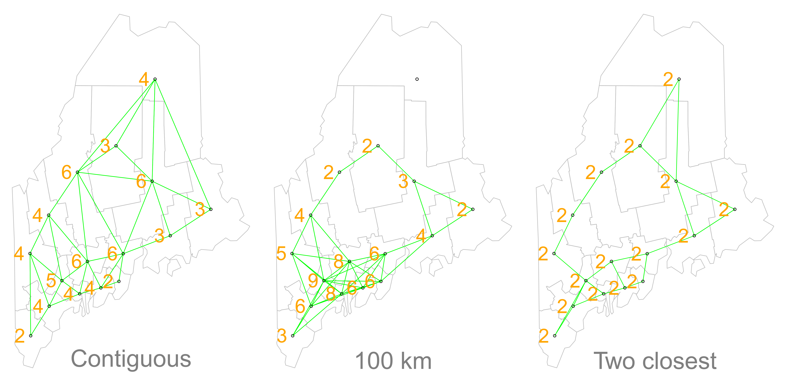
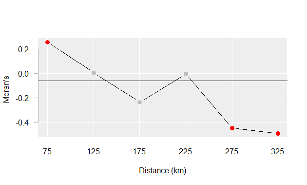

# Spatial Autocorrelation

## Introduction

In the previous chapter, we explored how polynomial functions can be used to model spatial trends that capture broad, location-driven variation in continuous spatial fields. By fitting and removing global trends, we revealed residuals that may still exhibit spatial structure. This chapter builds on that foundation by introducing **spatial autocorrelation**, a second-order property that describes how values at one location relate to values at nearby locations.

This concept is rooted in **Tobler’s First Law of Geography** which states:  

> _"The first law of geography: Everything is related to everything else, but near things are more related than distant things."_ Waldo R. Tobler [@Tobler1970] 

This principle raises an important question: *How can we determine whether nearby locations are actually more similar than we would expect under a random spatial arrangement?* Spatial autocorrelation provides a statistical framework for quantifying and testing such spatial dependence. In this chapter, we focus on Moran's I, one of the most widely used measures of spatial autocorrelation.

```{r}
#| label: fig-rand_maps
#| fig-cap: "Conceptual illustration of spatial autocorrelation. Geographic variables such as population density and elevation typically exhibit spatial structure (left). Randomly rearranging the same values across space removes that structure (right)."
#| fig-align: "center"
#| echo: false
#| out-width: "600px"
knitr::include_graphics("img/Random_maps.png")
```

As illustrated in @fig-rand_maps, many geographic variables exhibit broad areas of similar values. If the same values were distributed independently across space, the resulting maps would appear much more fragmented.

To make the mathematical foundations of autocorrelation more accessible, we shift from the raster-based data used in the previous chapter to a simpler dataset composed of **polygonal areal units** (e.g., counties). This allows us to clearly illustrate how spatial relationships are defined, how spatial weights are constructed, and how measures like **Moran’s I** are computed.

This chapter focuses on: 

- Defining spatial autocorrelation and its role in spatial statistics.
- Constructing spatial weights to represent neighborhood relationships.
- Computing and interpreting **global** and **local Moran’s I** statistics.
- Using permutation-based hypothesis testing to assess significance.

## Global Moran's *I*

While maps can sometimes reveal clusters of similar values, visual interpretation alone cannot tell us how strong those patterns are or whether they are stronger than we might expect by chance. To move beyond subjective impressions, we need a quantitative measure of spatial association. Specifically, we want to quantify the degree to which similar attribute values are clustered or dispersed across space.

One widely used statistic for this purpose is **Moran’s I** , a measure of **global spatial autocorrelation**. It quantifies the overall tendency for features with similar values to occur near one another, given a specified definition of neighborhood (e.g., contiguity or distance). Conceptually, Moran's I measures the relationship between a variable and a spatially lagged version of that same variable.

### Computing the Moran's *I*

Let's start with a working example: 2020 median per capita income for the state of Maine.

```{r}
#| label: fig-map03
#| fig-cap: "Map of 2020 median per capita income for Maine counties (USA)."
#| fig-align: "center"
#| echo: false
#| fig-height: 3
library(sf)
library(ggplot2)
library(classInt)
library(tukeyedar)
library(spdep)
options(scipen = 9999)

z <- readRDS("./Data/Income_schooling_sf.rds")
#s <- terra::unwrap(readRDS(z))
s <- z

clint <- classIntervals(s$Income, style = "pretty", n = 5)$brks
ggplot(s, aes(fill=Income)) + geom_sf() +
  theme_void() +
    scale_fill_stepsn(colors = c("#D9EF8B",  "darkgreen") ,
                     
                    breaks = clint[2:(length(clint)-1) ],
                    values = scales::rescale(clint[2:(length(clint)-1) ], c(0,1)),
                    guide = guide_coloursteps(even.steps = FALSE,
                                              show.limits = FALSE,
                                              title = "Income ($)",
                                              barheight = unit(2.0, "in"),
                                              barwidth = unit(0.15, "in"),
                                              label.position = "left")) 
```

At first glance, the county-level income distribution appears clustered, with high-income counties tending to occur near other high-income counties and low-income counties tending to occur near other low-income counties. However, visual inspection alone cannot tell us how strong this apparent clustering is, nor whether it reflects a meaningful spatial process. To move beyond a qualitative assessment, we need a quantitative measure of the degree to which similar (or dissimilar) values occur near one another. One of the most widely used measures for this purpose is the **Moran's I statistic**.

> **Trend versus Autocorrelation**  
The pattern shown in @fig-map03 may reflect a broad spatial trend (a first-order effect), local spatial dependence (a second-order effect), or both. In practice, analysts often assess spatial autocorrelation using the residuals remaining after a first-order trend has been modeled and removed. For pedagogical simplicity, we set that complication aside here and apply Moran's I directly to the observed income values.

The Moran’s *I* statistic is a measure of spatial autocorrelation that quantifies the degree to which similar values (like income) cluster together in space. It is computed as the correlation between a variable and its spatially lagged counterpart, based on a defined spatial weights matrix.

But before we go about computing this correlation, we need to come up with a way to define a neighbor. One approach is to define a neighbor as being any contiguous polygon. For example, the northernmost county (Aroostook), has four contiguous neighbors while the southern most county (York) has just two contiguous counties. Other neighborhood definitions can include distance bands (e.g. counties within 100 km) and k nearest neighbors (e.g. the 2 closest neighbors). Note that distance bands and k nearest neighbors are usually measured using the polygon's centroids and not their boundaries.

```{r}
#| label: fig-map04
#| fig-cap: "Three alternative ways of defining neighbors: contiguity, distance bands, and k nearest neighbors. The choice of neighborhood definition determines which features interact in the autocorrelation analysis and can influence the resulting Moran's I statistic. Orange numbers indicate the number of neighbors associated with each county."
#| fig-align: "center"
#| echo: false
#| out-width: "600px"


```

Once we've defined a neighborhood structure, we can summarize the attribute values surrounding each polygon. For example, we might compute the average income of a polygon's neighbors. This neighborhood summary is called a **spatial lag** because it represents the value of the variable in the surrounding area rather than at the focal polygon itself. In our working example, we compute the average neighboring income value (*Income~lag~*) for each county. 

If nearby counties tend to have similar incomes, then counties with high income values should be associated with high lagged-income values, while counties with low income values should be associated with low lagged-income values.

We then plot *Income~lag~* against *Income* for each county. When both variables are standardized (converted to z-scores), the slope of the fitted regression line is equal to the Moran's I statistic.

```{r}
#| label: fig-map05
#| fig-cap: "Scatter plot of spatially lagged income (neighboring income) versus county income. The positive relationship suggests that counties with similar income values tend to occur near one another. When both axes are standardized (converted to z-scores), the slope of the fitted line equals the Moran's *I* statistic."
#| fig-align: "center"
#| echo: false
#| fig-height: 4
#| fig-width: 3.5
#| results: hide

nb <- poly2nb(s, queen=TRUE)
lw <- nb2listw(nb, style="W", zero.policy=TRUE)
I <- round(moran(s$Income, lw, length(nb), Szero(lw))$I,2)

inc.lag <- lag.listw(lw, s$Income)
dat1 <- data.frame(lag = inc.lag, income = s$Income)


OP <- par( cex = 0.75, tck = -0.01)
 eda_lm(dat1, income, lag, sd= FALSE, xlab = "Income", ylab=" Lagged income", show.par = FALSE)
par(OP)
```

If there is no degree of association between *Income* and *Income~lag~*, the slope will be close to flat (resulting in a Moran's *I* value near 0). In our working example, the slope is far from flat with a Moran's *I* value of 0.28. Positive values indicate clustering of similar values, negative values indicate neighboring dissimilarity, and values near zero suggest little spatial association. The observed Moran's I value is positive, suggesting that similar income values tend to occur near one another. The next question is whether this level of clustering is stronger than we would expect under a random spatial arrangement. There are two approaches to estimating the significance: an analytical solution and a Monte Carlo solution. The analytical solution makes some restrictive assumptions about the data and thus cannot always be reliable. The other approach (and the one favored here) is a Monte Carlo test. This approach avoids parametric assumptions about the data distribution or spatial layout, relying instead on the assumption that values are exchangeable under the null hypothesis.

### Monte Carlo approach to estimating significance

In a Monte Carlo permutation test, we assess the significance of an observed Moran's *I* statistic by comparing it to a distribution of values generated under the null hypothesis of spatial randomness. This is done by **permuting** the attribute values across spatial units while keeping the spatial structure (e.g., neighborhood relationships) fixed. 

For each permutation, the attribute values are shuffled among the polygons and a new Moran's *I* value is computed. 

If the observed clustering is no stronger than expected under randomness, the Moran's I values computed from the permutations should resemble the observed value. Conversely, if the observed pattern is unusually clustered, the observed statistic should stand apart from most of the randomized outcomes.

```{r}
#| label: fig-map06
#| fig-cap: "Results from 199 permutations. Plot shows Moran's *I* lines (in gray) computed from each random permutation of income values. The observed Moran's *I* line for the original dataset is shown in red."
#| fig-align: "center"
#| echo: false
#| fig-height: 3
#| fig-width: 3
#| results: hide

OP <- par( cex = 1, tck = -0.01)
sim <- vector()
 eda_lm(dat1, income, lag, sd= FALSE, xlab = "Income", ylab=" Lagged income", size = 0, show.par = FALSE, mean.l = FALSE)
 set.seed(323)
 for (i in 1:199){
   s$rand <- sample(s$Income)
   s$rand.lag <- lag.listw(lw, s$rand)
   M <- lm(rand.lag ~ rand,s)
   abline( M , col=rgb(0,0,0,0.1))
   sim[i] <- coef(M)[2]
 }
par(OP)
```

Repeating this process many times yields a **sampling distribution** of Moran's *I* values that would be expected if the observed values were randomly distributed across space.

```{r}
#| label: fig-map07
#| fig-cap: "Histogram of Moran's I values generated under the null hypothesis of spatial randomness. The red line marks the observed Moran's *I* value (0.28), which lies in the upper tail of the null distribution."
#| fig-align: "center"
#| echo: false
#| fig-height: 3
#| fig-width: 3
#| results: hide

OP <- par( cex = 0.75, tck = -0.01, mgp=c(1.7,0.8,0))
 hist(sim, main = NULL, xlab=("Simulated I"),  breaks = 10)
 abline(v=I, col = "red")
par(OP)
```

Notice that most randomized Moran's I values are centered near zero, which is what we would expect under spatial randomness.

In our working example, the 199 simulations suggest that our observed Moran's *I* value of `r I` would be unlikely if the income values were randomly distributed across counties. A pseudo *p-value* can be computed as the proportion of simulated Moran's I values that are at least as extreme as the observed statistic:

$$
\dfrac{N_{extreme}+1}{N+1}
$$

where $N_{extreme}$ is the number of simulated Moran's *I* values at least as extreme as the observed statistic and $N$ is the total number of simulations. The addition of 1 to both the numerator and denominator ensures that the observed statistic is included as one of the possible outcomes and prevents a p-value of exactly zero.  

Here, out of 199 simulations, just three simulated *I* values were more extreme than our observed statistic, $N_{extreme}$ = 3, so $p$ is equal to (3 + 1) / (199 + 1) = 0.02. Because only four of the 200 outcomes (the observed statistic plus three simulated values) were at least as extreme as the observed Moran's I, the observed pattern would be unlikely if the income values were randomly distributed across counties. We therefore have evidence against the null hypothesis of spatial randomness.

It is important to distinguish permutation tests from other simulation approaches commonly used in statistics. In this permutation example, we shuffled the observed income values among polygons without replacement--this is referred to as a **permutation-based randomization**. This should not be confused with a **distribution-based simulation** where new values are randomly generated from a theoretical distribution and assigned to features. In such a scenario, one chooses to randomly assign a set of values to each feature in a data layer from a *theorized distribution* (for example, a *Normal* distribution). This may result in a completely different set of values for each permutation outcome. Note that you would only adopt this approach if the theorized distribution underpinning the value of interest is known *a priori*.

Another important consideration when computing a permutation-based p-value from a permutation test is the number of simulations to perform. In the above example we ran 199 permutations, thus, the smallest p-value we could possibly come up with is 1 / (199 + 1) or a p-value of 0.005. You should  therefore choose a number of permutations, $N$, large enough to allow for finer resolution of p-values and more robust inference.

## Moran's *I* at different distance bands

So far we have defined neighbors using polygon contiguity. While this approach is common, it implicitly assumes that spatial relationships operate only among immediately adjacent polygons. In practice, spatial processes often operate across a range of distances. This raises an important question: at what spatial scale is autocorrelation strongest? One way to explore this question is to compute Moran's I repeatedly using different distance-based neighborhood definitions. 

The procedure is conceptually identical to the one used earlier, except that the neighborhood definition changes from one analysis to the next. The steps for this type of analysis are straightforward:

1.  Define a neighborhood structure based on a specific distance band. 
2.  Compute lagged values for the defined set of neighbors. 
3.  Calculate the Moran's *I* value for the defined neighborhood. 
4.  Repeat for additional distance bands to observe how autocorrelation changes with spatial scale. 


For example, the Moran's *I* values for income distribution in the state of Maine at distances of 75, 125, up to 325 km are presented in the following plot:

```{r}
#| label: fig-mc_distance
#| fig-cap: "Moran's *I* computed at increasing distance bands. Positive values indicate that counties separated by those distances tend to have similar incomes, while negative values indicate dissimilarity. Red points mark statistically significant Moran *I* values (p ≤ 0.05)."
#| fig-align: "center"
#| echo: false
#| out-width: "500px"


```

The plot suggests that there is significant spatial autocorrelation between counties within 75 km of one another, but as the distances between counties increase, autocorrelation shifts from positive to negative, indicating that nearby counties tend to have similar income levels, while counties farther apart tend to be more dissimilar. This pattern is consistent with Tobler's First Law: nearby counties tend to be more similar than distant counties. Beyond a certain distance, however, income values become increasingly dissimilar, leading to negative autocorrelation.

## Local Moran's *I*

The global Moran's I statistic summarizes spatial autocorrelation across the entire study area. While useful, it does not tell us *where* clusters of similar or dissimilar values occur. To identify these local patterns, we can decompose the global statistic into a set of localized measures of autocorrelation. This is commonly referred to as **Local Moran's I**. 

A local Moran's *I* analysis is best suited for relatively large datasets, particularly when hypothesis testing is of interest. We therefore switch to a different dataset: household income data for Massachusetts (USA), aggregated to U.S. Census county subdivisions. As with the Maine example, we temporarily ignore potential first-order trends for pedagogical simplicity and apply the analysis directly to the observed values. 

```{r}
#| label: fig-dataset
#| fig-cap: "Median household income for Massachusetts county subdivisions in 2020. The large number of spatial units makes this dataset well suited for exploring localized patterns of spatial autocorrelation."
#| fig-align: "center"
#| echo: false
#| fig-height: 2.5
#| fig-width: 5
#| results: hide

library(sf)
library(ggplot2)
library(classInt)
library(tukeyedar)
library(spdep)

#z <- gzcon(url("https://github.com/mgimond/Spatial/raw/main/Data//ma2.rds"))
#ma <- terra::unwrap(readRDS(z))
ma <- readRDS("Data/ma2.rds")


clint <- classIntervals(ma$house_inc, style = "pretty", n = 6)$brks
ggplot(ma, aes(fill=house_inc)) + geom_sf(col = NA) +
  theme_void() +
    scale_fill_stepsn(colors = c("#D9EF8B",  "darkgreen") ,
                     
                    breaks = clint[2:(length(clint)-1) ],
                    values = scales::rescale(clint[2:(length(clint)-1) ], c(0,1)),
                    guide = guide_coloursteps(even.steps = FALSE,
                                              show.limits = FALSE,
                                              title = "Income ($)",
                                              barheight = unit(1.5, "in"),
                                              barwidth = unit(0.15, "in"),
                                              label.position = "left")) 
  

```

Applying a contiguity-based neighborhood definition, we compute the average neighboring income value (*Income lag*) for each county subdivision and plot it against the subdivision's own income value. As with the Global Moran's I analysis, this scatterplot compares each observation to its surrounding neighborhood. However, rather than focusing on the overall slope of the point cloud, we are now interested in the position of individual points because they help reveal localized patterns of spatial association.

```{r}
#| label: fig-chunk10
#| fig-cap: "Moran scatterplot of median household income versus spatially lagged income for Massachusetts county subdivisions."
#| fig-align: "center"
#| echo: false
#| fig-height: 3
#| fig-width: 3
#| results: hide


nb <- poly2nb(ma, queen=TRUE)
lw <- nb2listw(nb, style="W", zero.policy=TRUE)

inc.lag <- lag.listw(lw, ma$house_inc)
dat1 <- data.frame(lag = inc.lag, income = ma$house_inc)


M <- localmoran(ma$house_inc, lw)
M.df <- data.frame(attr(M, "quadr"))

OP <- par( cex = 0.85, tck = -0.01)
 eda_lm(dat1, income, lag, sd = FALSE, show.par = FALSE)
 palette(c("blue", "lightblue", "darkgoldenrod2", "red"))
 points(ma$house_inc, inc.lag, pch = 16, col = M.df$mean)
par(OP)

```

The vertical and horizontal reference lines mark the mean values for income and lagged income, respectively, dividing the scatterplot into four quadrants. Observations in the upper-right quadrant represent high values surrounded by high values (**high-high**) and are shown in red. Observations in the lower-left quadrant represent low values surrounded by low values (**low-low**) and are shown in dark blue. The remaining quadrants identify spatial outliers: high values surrounded by low values (**high-low**, light blue) and low values surrounded by high values (**low-high**, orange).

The quadrant classifications shown in the Moran scatterplot (@fig-chunk10) can be mapped back to their corresponding county subdivisions. This allows us to identify where high-high, low-low, high-low, and low-high spatial relationships occur across the study area.

```{r}
#| label: fig-map10
#| fig-cap: "Spatial distribution of the four Moran scatterplot quadrants. High-high and low-low polygons indicate local similarity, while high-low and low-high polygons indicate local spatial outliers."
#| fig-align: "center"
#| echo: false
#| fig-height: 2.5
#| fig-width: 5
#| results: hide

OP <- par(mar=c(0,0,0,0))
plot(st_geometry(ma), col = M.df$mean, border="white", pal = palette(c("blue", "lightblue", "darkgoldenrod2", "red")))
par(OP)
```

The Moran scatterplot and corresponding map help identify *potential* local clusters and spatial outliers. However, visual classification alone does not tell us whether these local patterns are stronger than we might expect under a random spatial arrangement. Each spatial unit therefore has its own Local Moran's I statistic, denoted $I_i$, which quantifies the degree of spatial autocorrelation around that unit. The calculation of $I_i$ is shown later in the chapter.

### Significance Testing for Local Moran's I

While the scatterplot helps visually identify potential clusters, statistical significance must be assessed to determine whether these patterns are likely to have occurred by chance.

As with the global Moran's *I*, there is both an analytical and a Monte Carlo approach to assessing the significance of $I_i$. In a Monte Carlo approach, the value of the focal feature remains fixed while the values of all other features are repeatedly shuffled among locations. After each permutation, a new $I_i$ is computed using the randomized neighborhood values.  Repeating this process many times generates a reference distribution of $I_i$ values that we would expect if the observed values were randomly distributed across the study area.

To illustrate, consider a polygon in eastern Massachusetts with a high observed $I_i$ value. We assess its significance by comparing it to a distribution of $I_i$ values generated through permutation.

```{r}
#| label: fig-map11
#| fig-cap: "County subdivision used to illustrate the assessment of Local Moran's I significance. The observed Local Moran's I statistic for this polygon is 0.85 and will be compared to values generated from repeated permutations."
#| fig-align: "center"
#| echo: false
#| fig-height: 2
#| fig-width: 3.5
#| results: hide

col1 <- M.df$mean
levels(col1) <-  c("blue", "lightblue", "darkgoldenrod2", "red")
ext1 <- st_bbox( st_buffer(ma[1,], 20000))
OP <- par(mar= c(0,0,0,0))
plot(st_geometry(ma), col = adjustcolor(col1, alpha.f = 0.1), border="white",  extent = ext1)
plot(st_geometry(ma[1,]), col = col1[1], add = TRUE)
par(OP)
I_i <- M[[1]]
```

Its Local Moran's *I* statistic is `r round(I_i,2)`. To assess its significance, we perform a permutation test in which the income value of the focal polygon is held constant while the income values of all other polygons are randomly reassigned. Each permutation generates a new $I_i$ value based on a different neighborhood configuration. A few example permutations are shown below.

```{r}
#| label: fig-map12
#| fig-cap: "Examples of Local Moran's I values generated during the permutation procedure. The income value of the focal polygon remains fixed while lagged income values are randomly reassigned, producing different realizations of $I_i$ under the null hypothesis of spatial randomness."
#| fig-align: "center"
#| echo: false
#| fig-height: 2
#| fig-width: 8
#| results: hide

fun1 <- function(){
  Msim <- localmoran(c(ma$house_inc[1], sample(ma$house_inc[-1])), lw)
  Isim <- attr(Msim, "quadr")$mean
  levels(Isim) <-  c("blue", "lightblue", "darkgoldenrod2", "red")
  Isim }

fun2 <- function(){
  col1 <- fun1()
  plot(st_geometry(ma), col = adjustcolor(col1, alpha.f = 0.1), border="white",  extent = ext1)
  plot(st_geometry(ma[1,]), col = col1[1], add = TRUE)
}

set.seed(319)
OP <- par(mar= c(0,0,0,0), mfrow=c(1,5))
 sapply(1:5, FUN = \(x)fun2())
par(OP)
```

You'll note that even though the income value of the focal polygon remains unchanged, its Local Moran's *I* statistic varies because the income values assigned to neighboring polygons change from one permutation to the next.

Repeating this process many times generates a reference distribution of $I_i$ values under the null hypothesis that income values are randomly distributed across Massachusetts. The observed $I_i$ can then be compared to this distribution to assess whether the local pattern is more extreme than would be expected by chance. The resulting distribution of $I_i$ values for our example polygon is shown in the following histogram.

```{r}
#| label: fig-map13
#| fig-cap: "Reference distribution of Local Moran's *I* values generated from repeated permutations. The red vertical line marks the observed $I_i$ value; its position relative to the simulated distribution is used to assess statistical significance."
#| fig-align: "center"
#| echo: false
#| fig-height: 3
#| fig-width: 2.5
#| results: hide

n <- 999
fun3 <- function(){localmoran(c(ma$house_inc[1], sample(ma$house_inc[-1])), lw)[1,1]}
I_null <- sapply(1:n, FUN = \(x) fun3() )
OP <- par(mar=c(4,3,0,0))
 hist(I_null, breaks = 20, xlab="I(i)", main=NULL)
 abline(v = I_i, col = "red", lw=2, xlab = "I(i)")
par(OP)
N.greater <- sum(I_null > I_i)
p <- min(N.greater + 1, n + 1 - N.greater) / (n + 1)
```

About `r round(p * 100, 1)`% of the simulated values are more extreme than our observed $I_i$ giving us a permutation-based p-value of `r round(p,2)`.

If we repeat this permutation test for every polygon in the dataset, we can compute a permutation-based *p*-value for each Local Moran's *I* statistic and map the results. These *p*-values indicate how unusual the observed local patterns are relative to what would be expected under spatial randomness. Note that the mapped *p*-values represent the probability of obtaining an $I_i$ value at least as extreme as the observed value (equivalent to a **one-tailed test**).

In the following map, lower *p*-values identify locations where the observed $I_i$ values are less likely to have arisen by chance.

```{r}
#| label: fig-map14
#| fig-cap: "Map of permutation-based *p*-values for Local Moran's *I*. These values can be used to identify statistically significant local clusters and spatial outliers by applying a chosen significance threshold."
#| fig-align: "center"
#| echo: false
#| fig-height: 2.5
#| fig-width: 5

M <- localmoran_perm(ma$house_inc, lw, nsim = 29999)
ma$p <- data.frame(M)$Pr.folded..Sim

clint <- classIntervals(ma$p, style = "fixed", n = 7, 
                        fixedBreaks = c(0,0.01, 0.05, 0.1, 0.2, 0.3, 0.4, 0.5))$brks
ggplot(ma, aes(fill=p)) + geom_sf() +
  theme_void() +
   # scale_fill_stepsn(colors = c("#555555", "#DDDDDD" ) ,
     scale_fill_stepsn(colors = c("#882020", "#ffdddd" ) ,                
                    breaks = clint[2:(length(clint)-1) ],
                    values = scales::rescale(clint[2:(length(clint)-1) ], c(0,1)),
                    guide = guide_coloursteps(even.steps = FALSE,
                                              show.limits = FALSE,
                                              title = "P-value",
                                              barheight = unit(1.7, "in"),
                                              barwidth = unit(0.15, "in"),
                                              label.position = "left")) 

```

The permutation-based *p*-values can be used to filter the Local Moran's *I* classifications based on a chosen significance level. For example, the following scatterplot and map show only those high-high, low-low, high-low, and low-high relationships whose permutation-based *p*-value is 0.05 or less.


```{r}
#| label: fig-map15
#| fig-cap: "Moran scatterplot classifications filtered using a permutation-based significance threshold of *p* $\\le$ 0.05. Only high-high, low-low, high-low, and low-high relationships deemed statistically significant are shown."
#| fig-align: "center"
#| echo: false
#| fig-height: 4
#| fig-width: 9
#| results: hide

sig <- ma$p <= 0.05

OP2 <- par(mfrow = c(1,2), cex = 0.75, tck = -0.01)
 eda_lm(dat1, income, lag, sd = FALSE, show.par = FALSE)
 palette(c("blue", "lightblue", "darkgoldenrod2", "red"))
 points(ma$house_inc[sig], inc.lag[sig], pch = 16, col = M.df$mean[sig])

 OP <- par(mar = c(0,0,0,0))
  plot(st_geometry(ma), col = "#EDEDED", border = "white")
  plot(st_geometry(ma[sig,]), col = M.df$mean[sig], border = "white", add = TRUE)
 par(OP)
par(OP2)
```

Note that statistical significance is not limited to high-high and low-low clusters. High-low and low-high relationships can also be statistically significant. 

@fig-map15 used a significance threshold of 0.05. Applying a more stringent threshold of 0.01 retains only the strongest evidence of local spatial association, as shown in the following figure.

```{r}
#| label: fig-map16
#| fig-cap: "Moran scatterplot classifications filtered using a permutation-based significance threshold of *p* $\\le$ 0.01. Only high-high, low-low, high-low, and low-high relationships deemed statistically significant are shown."
#| fig-align: "center"
#| echo: false
#| fig-height: 4
#| fig-width: 9
#| results: hide

sig <- ma$p <= 0.01
OP2 <- par(mfrow = c(1,2), cex = 0.75, tck = -0.01)
 eda_lm(dat1, income, lag, sd = FALSE, show.par = FALSE)
 palette(c("blue", "lightblue", "darkgoldenrod2", "red"))
 points(ma$house_inc[sig], inc.lag[sig], pch = 16, col = M.df$mean[sig])

 OP <- par(mar = c(0,0,0,0))
  plot(st_geometry(ma), col = "#EDEDED", border = "white")
  plot(st_geometry(ma[sig,]), col = M.df$mean[sig], border = "white", add = TRUE)
 par(OP)
par(OP2)
```

### Multiple Comparisons and False Discovery Rate

While permutation tests are less sensitive to issues such as non-normality and irregular spatial arrangements than many parametric approaches, they are not immune to interpretational challenges. In particular, when significance is assessed for every feature in a dataset, some polygons may appear significant purely by chance. To illustrate, suppose the income values were generated by a completely random process. One possible realization might look like the following:

```{r}
#| label: fig-map17
#| fig-cap: "Example realization of a random spatial process. Although the income values were assigned randomly, several polygons are associated with low permutation-based *p*-values, illustrating how statistically significant Local Moran's *I* values can arise by chance when many tests are performed."
#| fig-align: "center"
#| echo: false
#| fig-height: 3
#| fig-width: 8

# Here I use rgeoda which is faster than spdep for permutations
library(rgeoda)
# P values used in custom function
p.breaks <- c(0, 0.001,0.01,0.05, 0.1, 0.51)
p.labels <-  c(0.001,0.01,0.05, 0.1,">0.1")

# Custom function
plot_clust <- function(poly, rnd, cluster, lisa, p = FALSE){
  
  clint <- classIntervals(ma[[rnd]], style = "equal", n = 6)$brks
  rnd.col <- as.character(cut(ma[[rnd]], breaks = clint, labels=pal.inc))
  poly$cluster <- factor(lisa$labels[lisa$c_vals+1], levels = lisa$labels)
  pval <- cut(lisa$p_vals , breaks = p.breaks,labels = p.labels )
  pval.col <- c( "#CB181D", "#FCAE91", "#FEE5D9" , "#FFF8DC", "#FFFFFF")
  p.col <- pval.col[pval]
  poly.col <- lisa$colors[lisa$c_vals+1]
  #  psub <- poly[rnd]
  
  # Plot clusters
  OP<- par(no.readonly = TRUE, mar=c(0,0,0,0))
  m <- matrix(c(1,3,2,4),nrow = 2, ncol = 2, byrow = TRUE)
  layout(mat = m, heights  = c(0.80,0.2,0.8,0.2))
  #  layout.show(4)

  # Plot values 
  OP2 <- par(mar=c(0,0,0,0))
  plot(st_geometry(poly), col = rnd.col, reset = TRUE, 
       border = "#bbbbbb")
  mtext("Random process", padj=3, adj=0.3, col = "#707070")
  par(OP2)
  
  OP2 <- par(mgp = c(0.5,0.5,0) )
.image_scale(3, breaks = clint, col =  pal.inc,
             key.length = 0.7, key.pos = 1, key.width = lcm(1),
             at = round(clint,0))
  par(OP2)
  
  if(p == FALSE){
    # Plot clusters
    OP2 <- par(mar=c(0,0,0,0))
    plot(st_geometry(poly), col = poly.col,  reset = TRUE,
         border = "#bbbbbb")
    mtext("Clusters", padj=3, adj=0.3, col = "#707070")
    par(OP2)
    
    # Plot legend
    OP2 <- par(mar=c(0,0,0,0))
    plot(1, type = "n", axes=FALSE, xlab="", ylab="")
    legend('top', legend = lisa$labels[-length(lisa$labels)], horiz = FALSE, ncol = 3,
           text.width = sapply( lisa$labels[-length(lisa$labels)], strwidth), bty = "n",
           fill = lisa$colors, border = "#eeeeee", cex = 0.9)
    par(OP2)
  } else {
    OP2 <- par(mar=c(0,0,0,0))
    plot(st_geometry(poly), col = p.col,  reset = TRUE,
         border = "#bbbbbb")
    mtext("permutation-based p-values", padj=3, adj=0.3, col = "#707070")
    par(OP2)
    
    #Plot legend
    OP2 <- par(mar=c(0,0,0,0))
    plot(1, type = "n", axes=FALSE, xlab="", ylab="")
    legend('top', legend = p.labels, horiz = FALSE, ncol = 5,
           text.width = sapply( p.labels, strwidth), bty = "n",
           fill = pval.col, border = "#eeeeee", cex = 1)
    par(OP2)
  }

  par(OP)
}

# Create palettes
pal.inc <- RColorBrewer::brewer.pal(6, "Greens")
clint <- classIntervals(ma$house_inc, style = "quantile", n = 6)$brks

# Get neighbors
queen_w <- queen_weights(ma)

# A random process
set.seed(307)
ma$rnd <- sample(ma$house_inc)
lisar <- local_moran(queen_w, ma["rnd"], permutations = 9999)
plot_clust(poly=ma, rnd = "rnd",lisa=lisar,  p= TRUE)
```

Notice that several polygons are associated with low permutation-based p-values even though the underlying process is completely random. In fact, one polygon has a permutation-based p-value of 0.001 or less. This is not necessarily evidence of a meaningful spatial pattern. When significance is assessed for many features simultaneously, some low p-values are expected to occur by chance alone. In our example, 343 polygons result in 343 separate significance tests. This is analogous to repeatedly drawing cards from a deck: the more opportunities you have to draw the ace of spades, the greater the chance that you will eventually draw one.

Another realization of a random spatial process is shown in the following figure.

```{r}
#| label: fig-map18
#| fig-cap: "A second realization of a random spatial process. As in @fig-map17, several polygons exhibit low permutation-based p-values despite the absence of true spatial autocorrelation."
#| fig-align: "center"
#| echo: false
#| fig-height: 3
#| fig-width: 8
#| 
set.seed(521)
ma$rnd <- sample(ma$house_inc)
lisar <- local_moran(queen_w, ma["rnd"],permutations = 9999)
plot_clust(poly=ma, rnd = "rnd",lisa=lisar, p= TRUE)
```

Several polygons are associated with very low permutation-based p-values (the smallest *p*-value in this example is `r sprintf("%5.4f", min(lisar$p_vals))`). If these results were viewed in isolation, one might conclude that several polygons exhibit significant local spatial autocorrelation. However, because the underlying process is completely random, these apparent discoveries are false positives arising purely by chance, a classic example of a *Type I* error caused by multiple comparisons.

To further illustrate this issue, consider generating 200 independent realizations of a random spatial process. For each realization, we compute a permutation-based *p*-value for every polygon, resulting in a large number of simultaneous hypothesis tests and, consequently, many opportunities for false positives. This generates 200×343 local hypothesis tests and their associated *p*-values. Even though all realizations are random, approximately 10% of the resulting *p*-values are 0.05 or less. This value should be interpreted as an empirical outcome of this simulation rather than a theoretical expectation, since Local Moran's *I* tests are not independent and neighboring polygons often share information through their spatial relationships. The distribution of *p*-values across all simulations is shown in the following figure.

```{r}
#| label: fig-map19
#| fig-cap: "Distribution of permutation-based *p*-values from 200 realizations of a random spatial process. Blue labels denote the *p*-value classes and red labels show the percentage of observations in each class. Even under complete spatial randomness, a substantial number of tests produce low p-values, highlighting the accumulation of false positives when many hypothesis tests are performed simultaneously."
#| fig-align: "center"
#| echo: false
#| fig-height: 2
#| fig-width: 8
#| results: hide
#| 

p.dist <- vector()
for (i in 1:200){
  ma$rnd <- sample(ma$house_inc)
  lisa2   <- local_moran(queen_w, ma["rnd"], permutations = 9999)
  p.dist <- rbind(p.dist, lisa2$p_vals)
}
#hist(p.dist)
p.sum <- cut(p.dist , breaks = p.breaks,labels = p.labels ) |> table()
p.tab <- p.sum  / sum(p.sum ) * 100
p.tab.names <- names(p.tab)
names(p.tab) <- rep(" ",5)
OP <- par(col.main = "#707070", oma = c(0,0,0,0), ylbias=2) 
mosaicplot(p.tab, main="permutation-based p-values distribution", cex.axis = 0.8, off = 4,
           las=1)
mtext( p.tab.names, side = 3, adj = c(0.01, 0.065, 0.12, 0.21, 0.6) , 
       cex=0.8, col = "blue")
mtext( as.character(round(p.tab, 2)), side = 1, adj = c(0.01, 0.061, 0.12, 0.21, 0.6) , 
       cex=0.8, col = "red")
par(OP)
```

This problem is known in statistics as the **multiple comparison problem**. Several approaches have been proposed to address it, each with its own strengths and limitations. One of the most widely used solutions is the *False Discovery Rate* correction (FDR). Rather than attempting to eliminate all false positives, the FDR approach seeks to control the expected proportion of false positives among the set of features declared significant.

There are several implementations of the FDR procedure. One common approach begins by ranking the permutation-based *p*-values, $p$, from smallest to largest and assigning a rank, $i$, to each value. Next, a reference value is computed for each rank as $i(\alpha/n)$ where $\alpha$ is the desired significance level (0.05, for example) and $n$ is the total number of observations (e.g. polygons) for which a permutation-based *p*-value has been computed (343 in our working example). All *p*-values that satisfy $p_i \le i(\alpha/n)$ are considered significant at the chosen $\alpha$ level.

Applying the FDR correction to the permutation-based significance threshold of 0.05 produces a more conservative cluster map than the one shown in @fig-map15, reducing the likelihood of false positives arising from multiple comparisons.

```{r}
#| label: fig-map20
#| fig-cap: "Local Moran's I classifications deemed significant at $\\alpha = 0.05$ after applying the False Discovery Rate (FDR) correction. Compared to the uncorrected results, fewer polygons are identified as significant, reducing the likelihood of false positives."
#| fig-align: "center"
#| echo: false
#| fig-height: 4
#| fig-width: 9
#| results: hide

ord <- order(ma$p)
ma <- ma[ord, ]
inc.lag <- inc.lag[ord]
M.df <- M.df[ord, ]
ma$fdr <- 1:nrow(ma) /nrow(ma) * 0.05
sig <- ma$p < ma$fdr

OP2 <- par(mfrow = c(1,2), cex = 0.75, tck = -0.01)
 eda_lm(dat1, income, lag, sd = FALSE, show.par = FALSE)
 palette(c("blue", "lightblue", "darkgoldenrod2", "red"))
 points(ma$house_inc[sig], inc.lag[sig], pch = 16, col = M.df$mean[sig])

 OP <- par(mar = c(0,0,0,0))
  plot(st_geometry(ma), col = "#EDEDED", border = "white")
  plot(st_geometry(ma[sig,]), col = M.df$mean[sig], border = "white", add = TRUE)
 par(OP)
par(OP2)
```

Applying the FDR correction to a significance threshold of 0.01 yields an even more conservative set of clusters than those shown in @fig-map16. By accounting for the large number of simultaneous hypothesis tests, the correction retains only the strongest evidence of local spatial association, as shown in the following figure.


```{r}
#| label: fig-map21
#| fig-cap: "Local Moran's I classifications deemed significant at $\\alpha = 0.01$ after applying the False Discovery Rate (FDR) correction. The more stringent significance threshold retains only the strongest local spatial relationships."
#| fig-align: "center"
#| echo: false
#| fig-height: 4
#| fig-width: 9
#| results: hide

ord <- order(ma$p)
ma <- ma[ord, ]
inc.lag <- inc.lag[ord]
M.df <- M.df[ord, ]
ma$fdr <- 1:nrow(ma) /nrow(ma) * 0.01
sig <- ma$p < ma$fdr

OP2 <- par(mfrow = c(1,2), cex = 0.75, tck = -0.01)
 eda_lm(dat1, income, lag, sd = FALSE, show.par = FALSE)
 palette(c("blue", "lightblue", "darkgoldenrod2", "red"))
 points(ma$house_inc[sig], inc.lag[sig], pch = 16, col = M.df$mean[sig])

 OP <- par(mar = c(0,0,0,0))
  plot(st_geometry(ma), col = "#EDEDED", border = "white")
  plot(st_geometry(ma[sig,]), col = M.df$mean[sig], border = "white", add = TRUE)
 par(OP)
par(OP2)
```

It is important to recognize that there is no universally accepted solution to the multiple-comparison problem. Spatial data introduce additional complications because neighboring features often share information. For example, the same polygon may contribute to the Local Moran's I calculations of several neighboring polygons, violating the assumption that individual tests are independent. These and other sources of dependence make inferential interpretation in a spatial context particularly challenging. As a result, significance maps derived from Local Moran's I analyses should be interpreted with caution.

## Moran's I equation explained

The Moran's *I* statistic can be expressed in several mathematically equivalent forms, each offering different insights into its structure and interpretation. One commonly used formulation is:

$$
I = \frac{N}{\sum\limits_i (X_i-\bar X)^2} 
    \frac{\sum\limits_i \sum\limits_j w_{ij}(X_i-\bar X)(X_j-\bar X)}{\sum\limits_i \sum\limits_j w_{ij}} \tag{1}
$$
 
Here, $N$ is the total number of spatial units, $X_i$ and $X_j$ are the attribute values at locations $i$ and $j$, $\bar{X}$ is the mean of $X$, and $w_{ij}$ is the spatial weight between locations $i$ and $j$--typically defined by contiguity, distance, or other spatial relationships.

There are a few key components of Equation (1) worth highlighting. First, you'll note the standardization of both sets of values by the subtraction of each value in $X_i$ or $X_j$ by the mean of $X$. This highlights the fact that we are seeking to compare the deviation of each value from an overall mean and not the deviation of their absolute values. 

Second, you'll note an inverted variance term on the left-hand side of equation (1): this is a measure of spread. You might recall from an introductory statistics course that the variance can be computed as:

$$
s^2 = \frac{\sum\limits_i (X_i-\bar X)^2}{N}\tag{2}
$$
Note that a more common measure of variance, the sample variance, where one divides the above numerator by $(n-1)$ can also be adopted in the Moran's *I* calculation.

Equation (1) is thus dividing the large fraction on the right-hand side by the variance. Standardization causes Moran's I to behave similarly to a correlation coefficient with values typically falling near the range [-1,1]. However, the exact bounds depend on the spatial weights matrix and may extend beyond this interval. We can re-write the Moran's I equation by plugging in $s^2$ as follows:

$$
I = \frac{\sum\limits_i \sum\limits_j w_{ij}\frac{(X_i-\bar X)}{s}\frac{(X_j-\bar X)}{s}}{\sum\limits_i \sum\limits_j w_{ij}} \tag{3}
$$
Note that here $s\times s = s^2$. You might recognize the numerator as a sum of the product of standardized *z*-values between neighboring features. If we let $z_i = \frac{(X_i-\bar X)}{s}$ and $z_j = \frac{(X_j-\bar X)}{s}$, The Moran's I equation can be reduced to:

$$
I = \frac{\sum\limits_i \sum\limits_j w_{ij}(z_i\ z_j)}{\sum\limits_i \sum\limits_j w_{ij}} \tag{4}
$$

Recall that we are comparing a variable $X$ at location $i$ to the values observed at neighboring locations $j$. If we define,

$$
y_i = \sum\limits_j w_{ij} z_j
$$
then $y_i$ represents a spatially lagged value. When the weights matrix is *row-standardized*, the weights associated with each feature sum to one and $y_i$ becomes the weighted average of the neighboring standardized values.

the Moran's I coefficient can be rewritten as:

$$
I = \frac{\sum\limits_i z_i y_i}{\sum\limits_i \sum\limits_j w_{ij}}  \tag{5}
$$

Under row-standardized weights, $y_i$ is the average z-value making the product $z_i y_i$ a local measure of  *spatial association*.

The product $z_iy_i$ is a local measure of spatial autocorrelation, $I_i$. If we *don't* summarize across all locations $i$, under row-standardized weights, Local Moran's I can be expressed as:

$$
I_i = z_iy_i  \tag{6}
$$
The global Moran's *I* statistic, $I$, is thus the average of all $I_i$ values.

$$
I = \frac{\sum\limits_i I_i}{\sum\limits_i \sum\limits_j w_{ij}}  \tag{5}
$$

Let's explore elements of the Moran's *I* equation using the following sample dataset.

```{r}
#| label: fig-map22
#| fig-cap: "Simulated spatial dataset used to demonstrate the components of the Moran's I equation. The left panel displays cell identifiers, the middle panel shows the observed values, and the right panel shows the standardized (*z*) values derived from those observations."
#| fig-align: "center"
#| echo: false
#| fig-height: 2.5
#| fig-width: 7
#| results: hide

# Custom functions
gridcells <- function(df, col = "A1", breaks = 7, color = "Reds"){
  
  if(breaks > 1){
    brks <- with(df, seq(min(df[[col]]), max(df[[col]]), length.out = breaks + 1))
    col1 <- RColorBrewer::brewer.pal(color, n =breaks)
  } else {
    col1 <- "grey80"
    brks <- c(min(df[[col]]), max(df[[col]]))
  }
  col <- ensym(col)
  ggplot(df, aes(fill = !!col)) + geom_sf() +
  geom_text(aes(x= st_coordinates(ctr)[,1],
                y= st_coordinates(ctr)[,2],
                label = !!col)) +
  scale_fill_stepsn( 
    colors = col1,
    breaks = brks,
    guide = guide_coloursteps(even.steps = FALSE,
                                              show.limits = FALSE,
                                              barheight = unit(2.2, "in"),
                                              barwidth = unit(0.15, "in"))) +
  theme_void() +
  guides(fill="none")
}

sd2 <- function(x){
  sqrt(sum( (x - mean(x))^2 ) / length(x))
}

# Synthetic data
library(gridExtra)
m <- matrix(c(25, 37, 41, 33, 31, 34, 18, 38, 12, 20, 11, 31, 5, 4, 6, 13),
            byrow = FALSE, ncol = 4)
r <- stars::st_as_stars(m)
poly <- st_as_sf(r, as_points=FALSE )
poly$id <- 1:length(m)
ctr <- st_centroid(poly)

poly$z <- with(poly, (A1 - mean(A1)) / sd2(A1))
poly$z_disp <- round(poly$z, 2) # Rounded values used for display purposes only

# Plot the layer(s)
grid.arrange(gridcells(poly, "id", breaks = 1, color = "Reds") , gridcells(poly), gridcells(poly, "z_disp"), ncol = 3)
```

The first step in the computation of a Moran's *I* index is the generation of a spatial weights matrix. The weights can take on many different values. For example, one could assign a value of `1` to a neighboring cell as shown in the following matrix. 


```{r}
#| label: tbl-map23
#| tbl-cap: "Binary spatial weights matrix used in the calculation of Moran's I. Rows correspond to focal locations ($i$) and columns correspond to neighboring locations ($j$). Neighbor pairs are assigned a weight of 1, while non-neighbor pairs are assigned a weight of 0."
#| fig-align: "center"
#| echo: false
#| fig-height: 3
#| fig-width: 6
#| results: hide


library(dplyr)
library(tidyr)

nb <- poly2nb(poly, queen=TRUE)
nb.df <- nb2mat(nb, style = "B") |> as.data.frame()
colnames(nb.df) <- 1:length(m)

nb.long <- nb.df |>
  mutate(row = row_number()) |>
  pivot_longer(-row,
               names_to = "col",
               values_to = "value") |>
  mutate(
    col = as.numeric(col),
    txt_col = ifelse(value == 1, "red", "grey")
  )

ggplot(nb.long,
       aes(col, row, fill = factor(value))) +
  geom_tile(color = "grey") +
  geom_text(aes(label = value, color = txt_col),
            show.legend = FALSE,
            size = 3) +
  scale_color_identity() +
  scale_fill_manual(
    values = c(
      "0" = "white",
      "1" = "bisque"
    )
  ) +
  scale_x_continuous(
    breaks = 1:ncol(nb.df),
    position = "top"
  ) +
  scale_y_continuous(
    breaks = 1:nrow(nb.df), transform = "reverse"
  ) +
#  coord_equal() +
  guides(fill = "none") +
  theme_minimal() +
  theme(
    panel.grid = element_blank(),
    axis.title = element_blank()
  )


``` 
 

For example, cell ID `1` (whose value is `r poly$A1[1]` and whose standardized value, $z_1$, is `r poly$z_disp[1]`) has for neighbors cells `2`, `5` and `6`. Computationally (working with the standardized values), this gives us a summarized lagged value, $y_1(lag)$ of:

$$
\begin{align*}
y_1 =  \sum\limits_j w_{1j} z_j {}={} & (0)(0.21)+(1)(1.17)+(0)(1.5)+ ... + \\
                                      & (1)(0.69)+(1)(0.93)+(0)(-0.36)+...+ \\
                                      & (0)(-0.76) = 2.79
\end{align*}                                  
$$ 


Computing the spatially lagged values for the other 15 cells generates the following scatterplot: 


```{r}
#| label: fig-map24
#| fig-cap: "Moran scatterplot based on binary spatial weights. The red point identifies cell 1. Note that the lagged values ($y_i$) span a much larger range than the original standardized values ($z_i$) because each neighboring value contributes equally and the weights are not standardized."
#| fig-align: "center"
#| echo: false
#| fig-height: 3
#| fig-width: 3
#| results: hide


lw <- nb2listw(nb, style = "B")

poly$z_lag <- lag.listw(lw, poly$z)

OP <- par(cex.axis=0.85)
 eda_lm(poly, z, z_lag, sd = FALSE, reg=FALSE, xlab = expression(z[i]), 
         ylab =  expression(y[i]), show.par = FALSE)
 points(poly$z[1], poly$z_lag[1], pch =16, col="red")
par(OP)
```

You'll note that the range of lagged values along the $y$-axis is much greater than that of the original standardized values along the $x$-axis. This is not necessarily problematic because Moran's I is computed from standardized values. However, the differing scales reveal a limitation of binary weights: features with many neighbors tend to have larger lagged values than features with fewer neighbors simply because more neighboring values contribute to the sum. For example, feature ID 12, which has five neighbors, will tend to have a larger lagged value than feature ID 1, which has only three neighbors. This motivates the use of row-standardized weights where the weights associated with each feature sum to one.

A more natural weight is one where the values are standardized across each row of the weights matrix such that the weights across each row sum to one. For example:

```{r}
#| label: tbl-map25
#| tbl-cap: "Row-standardized spatial weights matrix used in the computation of Moran's I. Standardizing each row removes the influence of differing numbers of neighbors by ensuring that all rows sum to one."
#| fig-align: "center"
#| echo: false
#| fig-height: 3
#| fig-width: 6
#| results: hide


nb.df <- nb2mat(nb, style = "W") |> round(digits = 3) |> as.data.frame()

colnames(nb.df) <- 1:length(m)

nb.long <- nb.df |>
  mutate(row = row_number()) |>
  pivot_longer(-row,
               names_to = "col",
               values_to = "value") |>
  mutate(
    col = as.numeric(col),
    txt_col = ifelse(value > 0 , "red", "grey") )

ggplot(nb.long,
       aes(col, row, fill = txt_col)) +
  geom_tile(color = "grey") +
  geom_text(aes(label = ifelse(value == 0, "0", sprintf("%.2f", value)), color = txt_col),
            show.legend = FALSE,
            size = 3) +
  scale_color_identity() +
  scale_fill_manual(
    values = c(
      "grey" = "white",
      "red" = "bisque"
    )
  ) +
  scale_x_continuous(
    breaks = 1:ncol(nb.df),
    position = "top"
  ) +
  scale_y_continuous(
    breaks = 1:nrow(nb.df), trans = "reverse"
  ) +
#  coord_equal() +
  guides(fill = "none") +
  theme_minimal() +
  theme(
    panel.grid = element_blank(),
    axis.title = element_blank()
  )


```

The spatially lagged value for cell ID `1` is thus computed as:

$$
\begin{align*}
y_1 =  \sum\limits_j w_{1j} z_j {}={} & (0)(0.21)+(0.333)(1.17)+(0)(1.5)+...+ \\
                                      & (0.333)(0.69)+(0.333)(0.93)+(0)(-0.36)+...+ \\
                                      & (0)(-0.76) = 0.93
\end{align*}
$$

Multiplying each neighbor by the standardized weight, then summing these values, is simply computing the neighbor's mean value. 

Using the standardized weights generates the following scatter plot. Plot on the left shows the raw values on the *x* and *y* axes; plot on the right shows the standardized values $z_i$ and $y_i = \sum\limits_j w_{ij} z_j$. You'll note that the shape of the point cloud is the same in both plots given that the axes on the left plot are scaled such as to match the standardized scales in both axes.


```{r}
#| label: fig-map26
#| fig-cap: "Moran scatterplots generated using row-standardized weights. The left plot uses the original values and their lagged counterparts, while the right plot uses standardized values ($z_i$ and $y_i$). Row standardization causes each lagged value to represent a weighted average of neighboring values."
#| fig-align: "center"
#| echo: false
#| fig-height: 3
#| fig-width: 6
#| results: hide

lw <- nb2listw(nb, style = "W")

poly$val_lag <- lag.listw(lw, poly$A1)
poly$z_lag <- lag.listw(lw, poly$z)

OP <- par(cex.axis=0.85, mfrow = c(1,2))
  eda_lm(poly, A1, val_lag, sd = FALSE, reg=FALSE, xlab = expression(x[i]),
         ylab = expression( x[i(lag)]), show.par = FALSE)
  eda_lm(poly, z, z_lag, sd = FALSE, reg=FALSE, xlab = expression(z[i]), 
         ylab =  expression(y[i]), show.par = FALSE )
par(OP)
```

Note the difference in the point cloud pattern from that generated using the binary weights (@fig-map24). Under row-standardization, the lagged values represent weighted averages of neighboring values rather than simple sums, reducing the influence of varying neighbor counts on the calculation of $y_i$. Other weighting schemes can also be used, including inverse-distance and *k*-nearest-neighbor weights. However, most software implementations of Moran's I adopt row-standardized weights because they facilitate interpretation and reduce the influence of differing numbers of neighbors.

### Local Moran's I

Once a spatial weight is chosen, and both $z_i$ and $y_i$ are computed, we can compute the $z_iy_i$ product for all locations of $i$ thus giving us a measure of the local Moran's I statistic. Taking feature ID of `1` in our example, we compute $I_1(lag) = 0.21 \times 0.93 = 0.19$. Computing $I_i$ for all cells gives us the following plot. 

```{r}
#| label: fig-map27
#| fig-cap: "Local Moran's *I* values for the simulated dataset. Positive values indicate locations surrounded by neighbors with similar standardized values, whereas negative values indicate locations surrounded by dissimilar neighboring values. The scatterplot (left) and map (right) show the same $I_i$ values."
#| fig-align: "center"
#| echo: false
#| fig-height: 3
#| fig-width: 6
#| results: hide


poly$Istar <- with(poly, z * z_lag)

ii <- cut(poly$Istar, breaks = c(-1.5,-1,-.5,-.25,0,.25,.5,1, 1.5), 
          include.lowest = TRUE)
col2 <- colorRampPalette(c( "red", "white", "#00CD00"))(8)[ii]

OP <- par(mfrow=c(1,2))
 eda_lm(poly, z, z_lag, sd = FALSE, reg=FALSE, ylab = expression( z[i(lag)] ),
        xlab = expression( z[i] ) , show.par = FALSE )
  points(poly$z, poly$z_lag, bg = col2, col=col2, pch=21) 
  OP2 <- par(mar = c(2,2,2,2))
    plot(st_geometry(poly), main = NULL, col=col2, reset=FALSE)
    text(st_coordinates(st_centroid(poly)), labels=round(poly$Istar,2), offset=0, cex=0.8)
  par(OP2)
par(OP)
```

Here, we are adopting a different color scheme from that used earlier. Green colors highlight features whose values are surrounded by similar values. These can be either positive values surrounded by standardized values that tend to be positive or negative values surrounded by values that tend to be negative. In both cases, the calculated $I_i$ will be positive. Red colors highlight features whose values are surrounded by dissimilar values. These can be either negative values surrounded by values that tend to be positive or positive values surrounded by values that tend to be negative. In both cases, the calculated $I_i$ will be negative. In our example, two features have a negative Moran's *I* coefficient: cell IDs `7` and `12`.


### Global Moran's I

The Global Moran's *I* coefficient, $I$ can be viewed as a summary of the local Moran's *I* coefficients. Using row-standardized weights, the global Moran's I statistic can be expressed as a weighted average of the local Moran's I statistics.

$$
\begin{pmatrix}
\frac{`r  paste(round(poly$Istar,2), collapse = "+")`}{\sum\limits_i\sum\limits_j w_{ij}} = 0.446
\end{pmatrix}
$$
In this example, $\sum\limits_i \sum\limits_j w_{ij}$ is the sum of all 256 values in @tbl-map25 which, using standardized weights, sums to 16. 

$I$ is thus the slope that best fits the data in the Moran scatterplot. This can be plotted using either the standardized values or the raw values.

```{r}
#| label: fig-map28
#| fig-cap: "Moran scatterplot showing the fitted Global Moran's *I* slope (red line). A positive slope indicates that locations with above-average values tend to be surrounded by neighbors whose values are also above average, while locations with below-average values tend to be surrounded by neighbors whose values are also below average."
#| fig-align: "center"
#| echo: false
#| fig-height: 3
#| fig-width: 6
#| results: hide

OP <- par(mfrow = c(1,2))
  eda_lm(poly, A1, val_lag, sd= FALSE, xlab = expression(x[i]),
         ylab = expression( x[i(lag)]), show.par = FALSE)
  eda_lm(poly, z, z_lag, sd= FALSE, xlab = expression(z[i]),
         ylab = expression( y[i]), show.par = FALSE)

par(OP)
```

## Summary

This chapter introduced spatial autocorrelation as a second-order property describing how values at one location relate to values at nearby locations. Using Moran's *I* as a central measure, we explored how spatial relationships can be quantified, tested, and interpreted across different spatial scales.

- **Spatial autocorrelation** measures the degree to which nearby locations have similar or dissimilar attribute values.
- **Global Moran's *I*** provides a summary measure of spatial autocorrelation for an entire study area and can be interpreted as the relationship between a variable and its spatially lagged counterpart.
- The computation of Moran's *I* depends on a **spatial weights matrix**, which defines neighborhood relationships based on contiguity, distance, nearest neighbors, or other criteria.
- **Permutation tests** provide a flexible, non-parametric approach for assessing whether observed Moran's *I* values are more extreme than would be expected under spatial randomness.
- Spatial autocorrelation can vary with **distance**, making it possible to explore how spatial relationships strengthen, weaken, or change sign across spatial scales.
- **Local Moran's *I*** decomposes the global statistic into feature-level measures, allowing local clusters and spatial outliers to be identified.
- Permutation-based significance tests can be applied to Local Moran's *I* statistics to assess whether local patterns are unlikely to have occurred by chance.
- Because Local Moran's *I* involves many simultaneous hypothesis tests, results are susceptible to the **multiple-comparison problem**, increasing the likelihood of false positives.
- Procedures such as the **False Discovery Rate (FDR)** correction can help control the expected proportion of false discoveries, although no single correction completely resolves the challenges of spatial inference.
- Moran's *I* can be viewed as a spatially weighted measure of association, providing a bridge between descriptive analysis of spatial patterns and formal statistical inference.