# Second-Order Point Pattern Analysis

## Introduction

An alternative to the *density-based methods* explored in Chapter 14 are **distance-based methods** for analyzing spatial point patterns. Whereas Chapter 14 focused on **first-order effects** by modeling how point intensity varies across space, distance-based methods focus on **second-order effects** by examining how points are distributed **relative to one another**. This shift enables us to explore whether events exhibit spatial interaction, such as **clustering** or **dispersion**, across various spatial scales.

Distance-based methods are particularly useful when the goal is to assess whether the observed pattern deviates from what would be expected under complete spatial randomness (CSR), a benchmark model in spatial statistics. Rather than estimating intensity across space, these methods examine the spatial arrangement of points directly through inter-point distances. Importantly, because first-order effects can create the appearance of clustering, the methods introduced in this chapter are often applied only after considering whether spatial variation in intensity may be present.

In this chapter, we begin with the **Average Nearest Neighbor (ANN)** statistic, a simple distance-based measure that provides an intuitive introduction to second-order point pattern analysis. We then explore the **hypothesis-testing** framework used to assess second-order effects, including Monte Carlo simulation and methods for controlling underlying first-order variation. Finally, we introduce additional distance-based statistics, including Ripley's K and L functions and the Pair Correlation Function (PCF), which provide alternative ways of summarizing spatial interaction across multiple scales.

## Average Nearest Neighbor

**Average Nearest Neighbor (ANN)** analysis measures the average distance from each point in a study area to its nearest neighboring point. Because it focuses on distances between points, ANN provides a simple and intuitive way to quantify spatial interaction. The statistic summarizes the spatial arrangement of points and can help distinguish between clustered, random, or regularly spaced patterns.

In the example below, the average nearest neighbor distance for all points is 13,295 meters.

```{r}
#| label: fig-ppp_dist
#| fig-cap: "The table shows a subset of nearest-neighbor distances used to compute the Average Nearest Neighbor (ANN) statistic. For example, the point closest to point 3 is point 4, which is 16,616 meters away."
#| fig-align: "center"
#| echo: false
#| fig-height: 3.5
#| results: asis

library(ggplot2)
library(sf)
library(spatstat)
library(gridExtra)

# Load Starbucks point locations
S  <- readRDS("./Data/Walmarts.rds")
P <- as.ppp(S)
marks(P) <- NULL

mytheme <- gridExtra::ttheme_default(
    core = list(fg_params=list(vjust=0, x=0.4, cex=0.5,lineheight = 5)),
  #  gpar.coretext = gpar(fontsize = 1, lineheight = 0.1, cex = 0.1),
    colhead = list(fg_params=list(cex = 0.4)),
    rowhead = list(fg_params=list(cex = 0.4)))

ANN <- nndist(P, k=1)
NN <- nnwhich(P, k =1)
ddf <- data.frame(From = 1:length(NN),  To = NN, Distance = round(ANN,2))
ddf.split <- cbind(ddf[1:10,], ddf[11:20,])
d <- tableGrob(ddf.split,theme = mytheme, rows=NULL)

PP <- ggplot(aes(x = x, y = y), data = as.data.frame(P)) + theme(legend.position = "none") +
  geom_point(data = as.data.frame(P), mapping=aes(x=x, y=y), size=1.5, shape=16, colour="grey30") +
  coord_equal() + labs(x="",y="") +
  geom_text(aes(label=1:P$n),hjust=-0.4, vjust=-0.4, size=2) +
  theme(plot.margin = unit(c(0, 0, 0, 0), "cm"), axis.text=element_text(size = 4) ) +
          scale_x_continuous(breaks=seq(0,10,2)) + scale_y_continuous(breaks=seq(0,10,2))

grid.arrange(PP,d, ncol=2)

```

While ANN is traditionally defined using only the nearest neighbor, the same concept can be extended to second, third, and higher-order neighbors. Doing so reveals how inter-point distances change as progressively farther neighbors are considered. This produces a curve that reflects how the spatial structure of the pattern changes with neighbor order.

```{r f11-ANN-plot,fig.cap="ANN values for different neighbor order numbers. For example, the ANN for the first closest neighbor for all points is 13,295 meters; the ANN for the 2nd closest neighbor for all points is 18850 meters, and the ANN for the 43rd closest neighbor (the furthest neighbor) for all points is 182,818 meters.", fig.height=2, fig.width=3.5, echo=FALSE, message=FALSE, warning=FALSE}
#| label: fig-ann_plot
#| fig-cap: "ANN values for different neighbor order numbers. For example, the ANN for the first closest neighbor for all points is 13,295 meters; the ANN for the 2nd closest neighbor for all points is 18850 meters, and the ANN for the 43rd closest neighbor (the furthest neighbor) for all points is 182,818 meters."
#| fig-align: "center"
#| echo: false
#| fig-height: 2
#| fig-width: 3.5

ANN <- apply(nndist(P, k=1:(P$n-1)),2,FUN=mean) # Compute ANN for each order
d.f <- data.frame(Order=1:(P$n-1), ANN=ANN)
ggplot( aes(x=Order, y=ANN), data=d.f) +geom_line() + geom_point(size=1.5, shape=16)+
  theme(plot.margin = unit(c(0, 0, 0, 0), "cm"), axis.text=element_text(size = 8),
        axis.title = element_text(size=8 ) )

```

The shape of the ANN curve provides insight into the spatial structure of the pattern. A steep initial slope followed by a gradual increase may indicate tight clustering, whereas a more linear increase suggests a more regularly spaced arrangement.

To illustrate how ANN curves vary with different spatial arrangements, consider three point patterns of 20 points each:

- A single cluster
- A dual cluster
- A random scatter

```{r}
#| label: fig-diff_patterns
#| fig-cap: "Three hypothetical point patterns used to illustrate how ANN responds to different spatial structures: a single cluster, a dual cluster, and a randomly scattered pattern."
#| fig-align: "center"
#| echo: false
#| fig-height: 2
#| fig-width: 4.5
#| 
library(spatstat)
win <- owin(c(0,10),c(0,10))

set.seed(12)
x <- rnorm(20, 5,0.3)
set.seed(14)
y <- rnorm(20,5,0.3)
P.cl <- ppp(x,y,window=win)

set.seed(6)
x <- c(rnorm(10, 3,0.5), rnorm(10,6,0.5))
set.seed(34)
y <- c(rnorm(10, 3,0.5), rnorm(10,6,0.5))
P.cl2 <- ppp(x,y,window=win)

set.seed(673)
P.rnd <- rpoint(20, win=win)

ann.cl <- apply(nndist(P.cl, k=1:(P.cl$n-1)),2,FUN=mean)
ann.cl2 <- apply(nndist(P.cl2, k=1:(P.cl2$n-1)),2,FUN=mean)
ann.rnd <- apply(nndist(P.rnd, k=1:(P.rnd$n-1)),2,FUN=mean)

OP <- par(mfrow=c(1,3), mar=c(1,1,1,0))
 plot(P.cl, pch=20, main="",cols=rgb(0,0,0,.5))
 plot(P.cl2, pch=20, main="",cols=rgb(0,0,0,.5))
 plot(P.rnd, pch=20, main="",cols=rgb(0,0,0,.5))
par(OP)

```

The following figure illustrates how the ANN curve varies across three spatial arrangements, highlighting the sensitivity of ANN to clustering structure.

```{r}
#| label: fig-diff_ann_plots
#| fig-cap: "Three different ANN vs. neighbor order plots. The black ANN line is for the first point pattern (single cluster); the blue line is for the second point pattern (double cluster) and the red line is for the third point pattern."
#| fig-align: "center"
#| echo: false
#| fig-height: 2
#| fig-width: 4.0

OP <- par(mar=c(1.4,1.2,1,0) )
plot(1:19, ann.cl, type="b", ylim=c(0, max(ann.cl,ann.rnd, ann.cl2)), cex=.5, pch=16,xaxt="n",yaxt="n",
     xlab="", ylab="")
axis(1, seq(0,20,5),cex.axis=.5,xlab="Neighbor order", cex.lab=.5,padj=-3,tck=-0.02)
mtext("Neighbor order", 1, cex=.7, line=0.5)
axis(2, seq(0,round(max(ann.cl,ann.rnd)), length.out=4),cex.axis=.5,xlab="Neighbor order", cex.lab=.5,las=2,
     hadj=-1.6, ,tck=-0.02)
mtext("ANN", 3, cex=.7, line=0, at=0)
 lines(1:19, ann.rnd, type="b", col="red", cex=.5, pch=16)
 lines(1:19, ann.cl2, type="b", col="blue", cex=.5, pch=16)
par(OP)

```

- The black line (single cluster) shows short distances across all neighbor orders, indicating tight clustering.
- The blue line (dual cluster) shows intermediate distances, reflecting the presence of two separate clusters.
- The red line (random scatter) shows longer distances overall, consistent with a more dispersed arrangement.

The perceived spatial structure of a point pattern is highly sensitive to the definition of the study area. In the example below, the same clustered pattern is shown within two different bounding boxes:

```{r}
#| label: fig-diff_ppp02
#| fig-cap: "The same point pattern shown within two different study extents. Differences in perceived clustering illustrate the sensitivity of point pattern analysis to study area definition and the influence of the modifiable areal unit problem (MAUP)."
#| fig-align: "center"
#| echo: false
#| fig-height: 2
#| fig-width: 4.0

set.seed(12)
x <- rnorm(20, 5,0.3)
set.seed(14)
y <- rnorm(20,5,0.3)
P.cl <- ppp(x,y,window=win)
win2 <- owin(range(x), range(y))
P2.cl <- ppp(x,y, window=win2)
OP <- par(mfrow=c(1,2), mar=c(1,1,1,0))
 plot(P.cl, pch=20, main="",cols=rgb(0,0,0,.5), cex=0.8)
 plot(P2.cl, pch=20, main="",cols=rgb(0,0,0,.5), cex=0.8)
par(OP)
```

When the study area is tightly fitted around the cluster, the pattern appears more dispersed than when the same points are viewed within a larger study extent. This example highlights the importance of study area definition and serves as another illustration of the modifiable areal unit problem (MAUP).

Like most distance-based point pattern statistics, ANN assumes that the underlying point process is stationary, meaning that the intensity of the process does not vary across space. If the process is non-stationary (or inhomogeneous), apparent clustering may simply reflect underlying environmental or socioeconomic gradients rather than true interaction among points.

This distinction is important because the goal of second-order analysis is to detect interactions among points after accounting for any large-scale variation in intensity. In the next section, we introduce hypothesis-testing approaches that allow us to assess whether an observed pattern is consistent with complete spatial randomness and how those tests can be adapted when first-order effects are present.

## Hypothesis Testing for Second-Order Effects

### Analytical Tests

A fundamental question in second-order point pattern analysis is whether the observed arrangement of points differs from what would be expected under **Complete Spatial Randomness (CSR)**. CSR serves as a benchmark model in which points are assumed to occur independently and with constant intensity across the study area. If the observed pattern departs from CSR, then there may be evidence of clustering, dispersion, or some underlying spatial process.

Several approaches can be used to test for departures from CSR. We begin with an analytical test based on the **Average Nearest Neighbor (ANN)** statistic and then proceed to a more flexible Monte Carlo framework.

The analytical approach compares the observed mean nearest neighbor distance to the distance expected under a CSR process. The null hypothesis assumes that the observed point pattern is a realization of a spatially uniform and independent process.

Under CSR, the expected mean nearest neighbor distance is:

$$
ANN_{expected}=\dfrac{1}{2\sqrt{n/A}}
$$

where:

- $n$ is the number of points;
- $A$ is the area of the study region.

The analytical test compares the observed ANN value to the ANN value expected under CSR. If the observed value is substantially smaller than expected, the points may be clustered. If it is substantially larger, the points may be dispersed.

The test statistic is the ratio:

$$
R = \frac{ANN_{observed}}{ANN_{expected}}
$$

Interpretation:

- $R < 1$: suggests clustering
- $R > 1$: suggests dispersion
- $R \approx 1$ suggests a pattern consistent with Complete Spatial Randomness (CSR)

To assess statistical significance, a z-score is computed:

$$
z = \frac{ANN_observed - ANN_expected}{SE}
$$
where the standard error (SE) of the expected distance under CSR is:

$$
SE = \frac{0.26136}{\sqrt{n\lambda}}
$$
This z-score is then compared to a standard normal distribution to determine whether the observed pattern deviates significantly from CSR.

While analytically elegant, the ANN hypothesis test has several limitations that constrain its interpretive power:

- **Sensitivity to Study Area Definition:** 
   The expected distance depends on the area $A$, which must be defined explicitly. 

- **Shape Effects:** 
   The formula assumes a regularly shaped study region. Irregular boundaries distort the expected distance and introduce edge effects, where points near the boundary have artificially inflated nearest-neighbor distances.

- **Stationarity Assumption:**
   The test assumes a stationary process, meaning that intensity is constant across space. If the underlying process is inhomogeneous, with point density varying due to environmental or socioeconomic factors, apparent clustering may reflect first-order effects rather than true inter-point interaction.
   
### Monte Carlo Tests

While the analytical approach to ANN hypothesis testing offers a convenient benchmark for assessing spatial randomness, its reliance on idealized assumptions, such as a regularly shaped study area, can limit its applicability in real-world settings. When these assumptions are violated, the analytical test may yield misleading results. To address these limitations, spatial analysts often turn to simulation-based methods such as **Monte Carlo techniques**, which provide a more flexible and empirically grounded framework for hypothesis testing.

The key idea behind Monte Carlo testing is simple: if we can simulate many realizations of a hypothesized process, we can compare our observed pattern to the patterns generated under that hypothesis. This allows us to assess whether the observed pattern is unusual or whether it could plausibly have arisen from the hypothesized process.

The Monte Carlo technique involves three steps:

- First, we specify a **null hypothesis**, $H_0$. For example, we might hypothesize that the distribution of Walmart stores is consistent with **Complete Spatial Randomness (CSR)**.

 * Next, we generate many realizations of the hypothesized process and compute a statistic (e.g., ANN) for each realization.
 
 * Finally, we compare the observed statistic to the distribution of simulated statistics and assess whether the observed pattern is consistent with the hypothesized process.
 
Using the Walmart store distribution as an example, we randomly reposition the Walmart locations 1,000 times (or as many times as computationally practical) according to a CSR process, our hypothesized process $H_0$, while ensuring that all simulated locations remain within the study area (the state of Massachusetts).

```{r}
#| label: fig-sim_points_example
#| fig-cap: "Three realizations of a Complete Spatial Randomness (CSR) process. Each simulation represents one possible point pattern that could arise if Walmart locations were distributed independently and with constant intensity throughout the study area.*"
#| fig-align: "center"
#| echo: false
#| fig-height: 2
#| out-width: "300px"
#| 
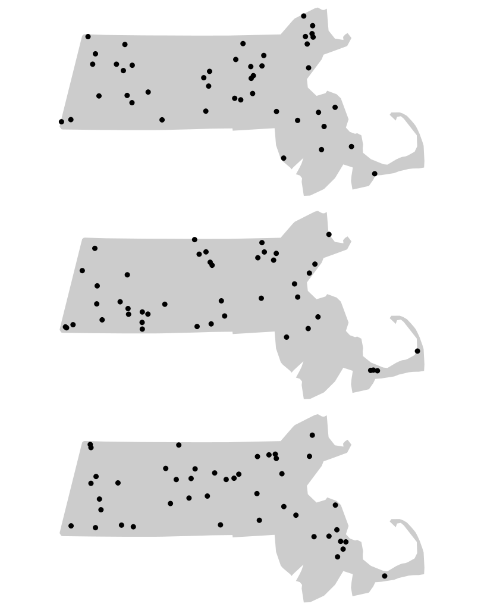
```

For each realization of our hypothesized process, we compute an ANN value. Because each simulated pattern is different, the resulting ANN values also differ. Collectively, these values form an **empirical sampling distribution** under the null hypothesis of Complete Spatial Randomness (CSR). In other words, the distribution shows the range of ANN values we would expect to observe if CSR were the process generating the point pattern. We can summarize this distribution with a histogram and compare our observed ANN value of 13,294 m to the simulated values.

```{r}
#| label: fig-walmart_MC_hist
#| fig-cap: "Histogram of simulated ANN values (from 1000 simulations). This is the sample distribution of the null hypothesis, ANN~simulated~ (under CSR). The red line shows our observed (Walmart) ANN value. About 32% of the simulated values are greater (more extreme) than our observed ANN value."
#| fig-align: "center"
#| echo: false
#| fig-height: 2
#| out-width: "400px"

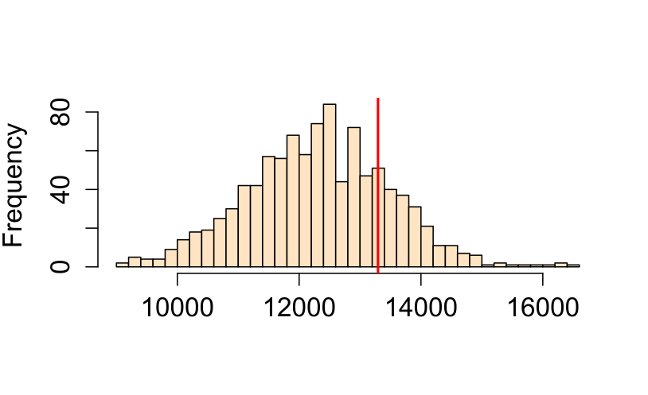
```

The histogram allows us to evaluate how unusual the observed ANN value is relative to the values generated under CSR. If the observed value falls near the center of the simulated distribution, the pattern may be consistent with CSR. If it falls in one of the tails, then the observed pattern may be inconsistent with the hypothesized process.

By using the same study region in each simulation, Monte Carlo methods automatically account for edge effects and irregular study area shapes (issues that are difficult to correct analytically).

### Estimating p-values

The histogram in @fig-walmart_MC_hist provides a visual indication of how unusual the observed ANN value is relative to the values generated under the null hypothesis. To quantify this comparison, we compute a **Monte Carlo p-value**, which measures how often simulated patterns produce a test statistic as extreme as the observed one.

The **Monte Carlo p-value** represents the proportion of simulated patterns that yield a test statistic more extreme than the observed one under the null hypothesis. Specifically, we count how many simulated values are **more extreme** than the observed statistic, either greater or smaller, depending on the direction of the test. 

For a **one-sided** test, the empirical p-value is calculated as:

$$
p = \dfrac{N_{extreme}+1}{N+1}
$$

where *N~extreme~* is the number of simulated values more extreme than our observed statistic, and $N$ is the total number of simulations. The $+1$ is added to ensure that the p-value can never be exactly 0.

In practice, a more general form of the equation is often used:

$$
p = \dfrac{min(N_{greater}+1 , N + 1 - N_{greater})}{N+1}
$$

where $min(N_{greater}+1 , N + 1 - N_{greater})$ is the smallest of the two values $N_{greater}+1$ and $N + 1 - N_{greater}$, and $N_{greater}$ is the number of simulated values greater than the observed value. This formulation automatically determines which tail of the simulated distribution is closer to the observed value. Because the calculation can be cumbersome to perform manually, it is usually implemented in software.

For example, suppose we ran 1,000 simulations in our ANN analysis and found that 319 produced values more extreme than the observed ANN statistic. The Monte Carlo p-value would then be

$$
p = \frac{319 + 1}{1000 + 1} = 0.32. 
$$

This can be interpreted as meaning that, if the null hypothesis of *Complete Spatial Randomness* (CSR) were true, there would be approximately a **32% chance of observing an ANN statistic at least as extreme as the one obtained from the Walmart point pattern**. Because this probability is relatively large, there is insufficient evidence to reject the null hypothesis.

Importantly, this does not imply that Walmart stores were actually located randomly across Massachusetts. Rather, it indicates that a CSR process is one of many plausible processes that could have generated the observed point pattern. In other words, the hypothesis test does not identify the true process; it only assesses whether the observed pattern is consistent with the hypothesized process.

If a two-sided test is desired, the p-value becomes:

$$
2 \times \dfrac{min(N_{greater}+1 , N + 1 - N_{greater})}{N+1}
$$
 
which is simply twice the smaller of the two tail probabilities.

Monte Carlo tests provide a robust alternative to analytical methods, particularly when assumptions about study area shape or boundary effects are difficult to satisfy. More importantly, they allow us to evaluate a wide range of hypothesized processes, not just Complete Spatial Randomness, making them one of the most versatile tools in spatial point pattern analysis.

### Controlling for First-Order Effects

The assumption of CSR provides a useful baseline for spatial analysis, but it is often unrealistic in real-world settings. Many spatial processes exhibit both *first-order effects* and *second-order effects*. When first-order effects are present, the underlying point process is *non-stationary* or **inhomogeneous**. In such cases, hypothesis tests should account for this spatial heterogeneity.

```{r}
#| label: fig-walmart_pop
#| fig-cap: "Walmart store locations and population density in Massachusetts. This figure motivates an alternative null model in which point intensity varies as a function of population density rather than remaining constant across the study area."
#| fig-align: "center"
#| echo: false
#| fig-height: 2
#| out-width: "500px"

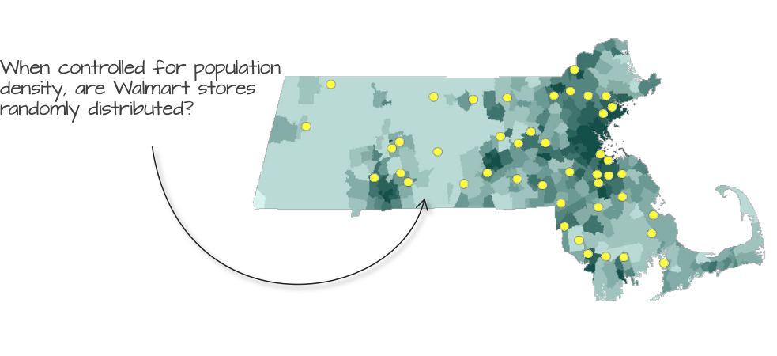
```

For example, suppose we believe that the placement of Walmart stores is influenced by population density. If so, then population density represents a first-order effect that may explain part of the observed spatial pattern. Under these circumstances, comparing the observed pattern to a CSR process would be inappropriate because CSR assumes a constant intensity across the study area.

Instead, we construct a more realistic null model in which point intensity varies according to population density. We then use Monte Carlo techniques to generate simulated point patterns from this inhomogeneous process and compare the observed pattern to these simulations.

```{r}
#| label: fig-walmart_pop_sim
#| fig-cap: "Simulated realizations of an inhomogeneous null model in which population density governs spatial intensity. These patterns represent possible Walmart distributions if population density were the sole factor influencing store intensity."
#| fig-align: "center"
#| echo: false
#| fig-height: 2
#| out-width: "350px"
#| 
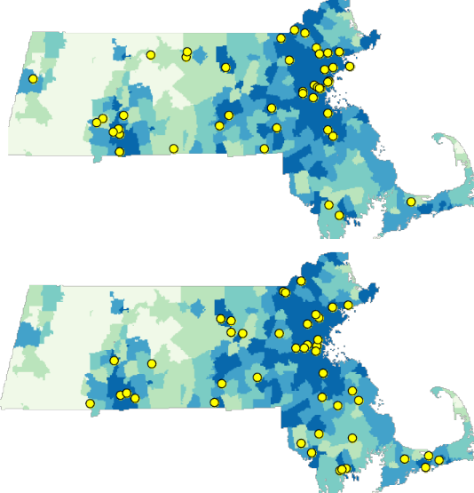
```

Although we are no longer simulating a CSR process, the simulated patterns are still random. The difference is that points are now placed randomly *according to* the underlying population density distribution. Locations with higher population density therefore have a greater chance of receiving simulated points than locations with lower population density.

Using Monte Carlo techniques, we can generate thousands of such point patterns and compare the observed ANN value to the ANN values computed from the simulated patterns.

```{r}
#| label: fig-ann_hetero_hist
#| fig-cap: "Distribution of ANN values under a null model where population density governs point intensity."
#| fig-align: "center"
#| echo: false
#| fig-height: 2
#| out-width: "300px"

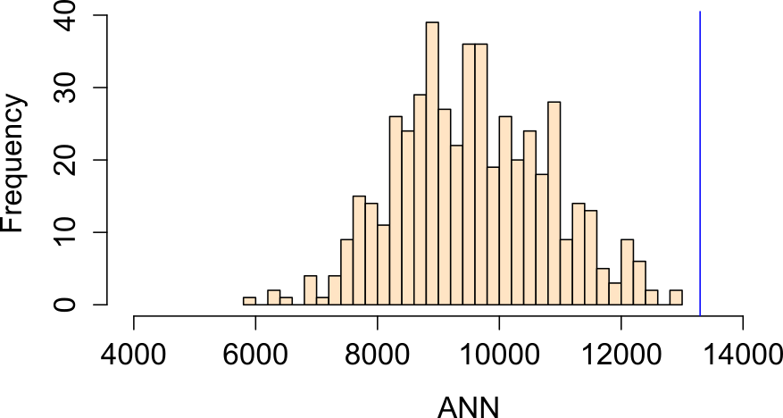
```

In this example, the observed ANN value falls far to the right of the simulated distribution, indicating that Walmart stores are more dispersed than would be expected if population density were the sole factor governing store placement. The proportion of simulated values more extreme than the observed ANN value is approximately 0% (i.e. a one-sided p-value $\backsimeq$ 0.0), providing strong evidence against this null model. 

Another plausible hypothesis is that median household income influenced the placement of Walmart stores.

```{r}
#| label: fig-ann_income
#| fig-cap: "Edge-corrected and uncorrected Pair Correlation Function estimates for Walmart locations in Massachusetts. Unlike the cumulative K and L functions, the PCF isolates spatial interaction occurring at specific distances. The corrected PCF suggests greater clustering than expected under CSR at distances exceeding approximately 5 km."
#| fig-align: "center"
#| echo: false
#| fig-height: 2
#| out-width: "500px"

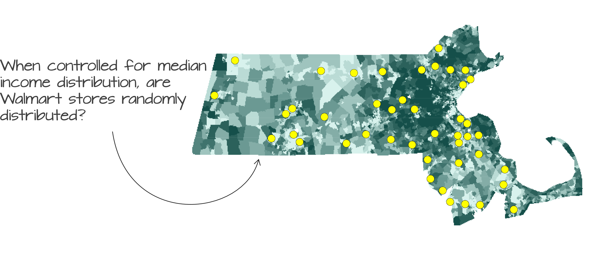
```

Running a Monte Carlo simulation using median household income as the underlying intensity process yields an ANN distribution in which approximately 16% of the simulated values are more extreme than the observed ANN value (i.e., a one-sided p-value of 0.16).

```{r}
#| label: fig-ann_income_hist
#| fig-cap: "Histogram of ANN values from simulated point patterns generated under a median income-based intensity model."
#| fig-align: "center"
#| echo: false
#| fig-height: 2
#| out-width: "350px"

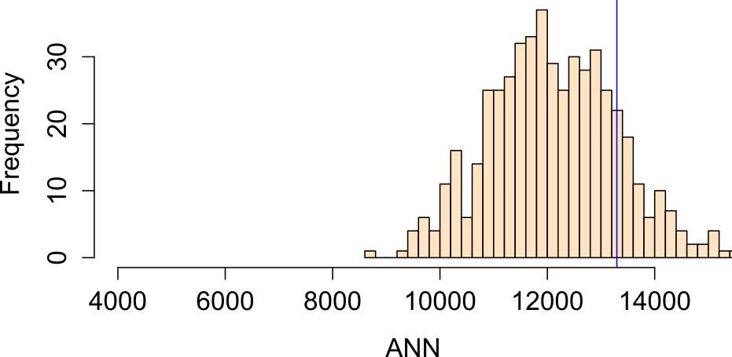
```

We now have multiple competing null models. One assumes Complete Spatial Randomness (CSR), while another assumes that point intensity varies with median household income. Neither model can be rejected based on the observed ANN statistic.

This serves as an important reminder that a hypothesis test cannot tell us whether a *particular* process is *the* process responsible for generating the observed point pattern. Instead, it tells us whether the observed pattern is consistent with the hypothesized process. Consequently, several different hypotheses may remain plausible explanations for the same observed pattern.

It is also important to remember that ANN is fundamentally a *distance-based* measure of spatial interaction. Even though points are simulated from an underlying intensity surface, our primary interest remains the spacing of points *relative to one another*. In other words, we are not asking whether population density or income explains the geographic locations of Walmart stores. That first-order question was the focus of Chapter 14. Instead, we are asking whether evidence of clustering or dispersion remains after accounting for a hypothesized first-order effect. By controlling for covariates such as population density or median household income, we can better isolate the second-order interactions among points.

### Controlling for Second-Order Effects 

While it is common practice to control for first-order effects when testing for second-order spatial interaction, the reverse problem, testing for first-order effects while accounting for second-order interactions, is considerably more difficult.

The reason is that first-order effects can often be represented by an intensity surface, $\lambda(x)$, describing how the expected density of points varies across space. Once this intensity surface has been specified, it can be incorporated into Monte Carlo simulations and used as a null model. In contrast, second-order effects arise from interactions among points themselves. These interactions do not generally have a simple spatial representation and instead depend on the relationships among all point locations in the pattern.

As a result, most methods for modeling first-order effects assume that points are independently distributed, an assumption that is violated when second-order effects such as clustering or inhibition are present. Ignoring these interactions can lead to biased estimates of first-order relationships and, consequently, misleading statistical inferences.

In such situations, model-based approaches provide a more appropriate framework. These methods jointly estimate both the intensity structure (first-order effects) and the interaction structure (second-order effects). One example is a cluster process model in which "parent" points are first generated, often following a homogeneous or inhomogeneous Poisson process, and "child" points are then distributed around the parents according to a specified interaction process.

These models allow first-order and second-order effects to be analyzed simultaneously, but they are considerably more complex than the methods introduced in this chapter and fall beyond the scope of this course. For now, it is sufficient to recognize that second-order effects can confound first-order inference, just as first-order effects can confound second-order inference. Careful model specification is therefore essential whenever both forms of spatial structure are present.

## Other Point Pattern Statistics

The ANN statistic provides a useful introduction to second-order point pattern analysis, but it is only one of many distance-based measures used to characterize spatial interaction. The inferential framework introduced in the previous section applies equally well to more sophisticated statistics. The primary difference lies in how each statistic summarizes inter-point distances.

While ANN focuses on nearest-neighbor distances (and their higher-order extensions), the **K and L functions** provide a more comprehensive view by considering **all inter-point distances** up to a given threshold. This makes them particularly useful for detecting clustering or regularity across multiple spatial scales.

In the sections that follow, we introduce the K function, its variance-stabilized counterpart the L function, and the Pair Correlation Function (PCF). Although these statistics differ in how they summarize point interactions, they rely on the same inferential framework introduced earlier, including Monte Carlo simulation, null models, and hypothesis testing.

### K function

The **K function** summarizes spatial interaction by measuring the expected number of neighboring points within a specified distance $d$ of a reference point, after accounting for the overall density of points in the study area.

The K function is a theoretical property of the underlying point process. Because we observe only a single realization of that process, we use the observed point pattern to estimate the K function.

```{r}
#| label: fig-K0
#| fig-cap: "Illustration of how the K function summarizes the number of points within a specified distance: Three concentric circles are drawn around point $i$, and the number of neighboring points within each radius is tallied. In this example, no points fall within 10 km of $i$, three points fall within 30 km, and seven points fall within 50 km."
#| fig-align: "center"
#| echo: false
#| fig-height: 2
#| out-width: "450px"

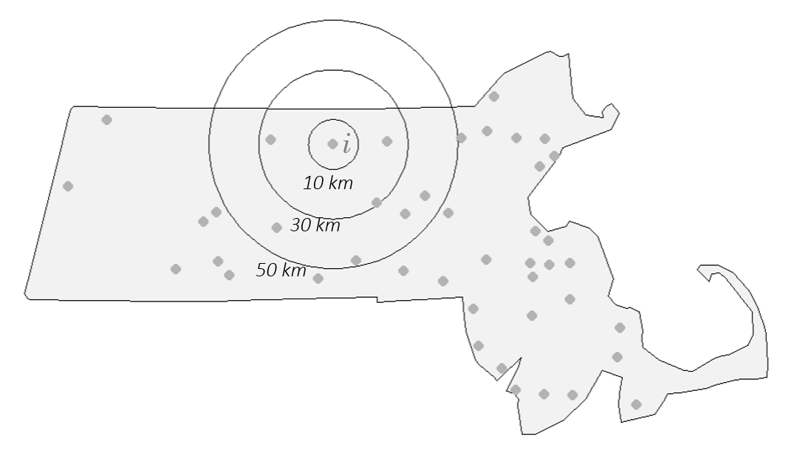
```

Conceptually, the K function counts how many neighboring points fall within a distance $d$ of each point, averages this quantity over all points in the pattern, and then adjusts the result for the overall point density.

The estimator takes the form:

$$
\hat{K}(d) = \frac{A}{n(n-1)} \sum_{i=1}^{n} \sum_{j \neq i}^n I(d_{ij} \leq d)
$$

where:

- $i$ refers to the reference point from which distances $d$ are measured.
- $j$ refers to the other points in the pattern that are being evaluated to see whether they fall within a circle of radius $d$ centered on $i$.
- $d$ is the search distance for which we are counting neighboring points.
- $d_{ij}$ is the distance between point $i$ and point $j$.
- $I(d_{ij} \le d)$ is an indicator function that equals 1 if $d_{ij} \le d$ and 0 otherwise.
- $\sum_{i=1}^{n}$ is the outer summation It means "for each point $i$ from the first point to the $n$^th point, do the following ..."
- $\sum_{j \neq i}$ is the inner summation. For the current point $i$ selected by the outer summation, sum the results of the indicator function over all points $j$ in the dataset, excluding the case where $j$ is the same as $i$.
- $n(n-1)$ in the denominator is a normalizing factor. It represents the total number of ordered pairs of distinct points in the dataset. Dividing the total count from the double summation by $n(n-1)$ gives the observed fraction of pairs separated by a distance less than or equal to $d$.
- $A$ is the area of the study region. Multiplying the proportion by $A$ scales the result into units of area, which makes comparison of the K function between datasets and theoretical K functions possible.

The units of the K function are units of area, typically defined by the coordinate system of the point layer.

An equivalent and commonly encountered form of the estimator is:


$$ \widehat{K}(d) = \frac{1}{\widehat\lambda n} \sum_{i=1}^{n} \sum_{j \neq i} I(d_{ij} \leq d) $$
Although the notation appears more complicated than that of ANN, the underlying idea is similar: the K function measures how many neighbors occur within a given distance. The key difference is that K considers **all neighbors within distance $d$**, whereas ANN focuses only on the nearest (or n^th^-nearest) neighbor.

Note that the intensity estimator used here, 

$$
\hat{\lambda} = (n-1) / A
$$

is slightly different from the more intuitive "natural" estimator, 

$$\hat{\lambda} = n/A$$
that we used in Chapter 14. This difference is a deliberate statistical adjustment related to the goal of the K function. The K function characterizes a point pattern **from the perspective of the events themselves**, focusing on the distances among points. Think of it this way: when we stand at a particular event $i$ and count its neighbors, we are observing the density of the other $(n-1)$ events within the study area $A$.

```{r}
#| label: fig-K1
#| fig-cap: "The K function estimated from the Walmart stores point distribution in MA for 512 distinct distances $d$ ranging from 0 km to 50 km."
#| fig-align: "center"
#| echo: false
#| fig-height: 2
#| out-width: "350px"

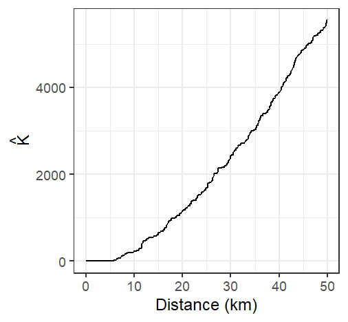
```


A few important assumptions underlie the K function:

- The K function, as presented here, assumes a homogeneous first-order process because $\hat{\lambda}$ is assumed to be constant throughout the study area.
- The underlying process is assumed to be **isotropic**, meaning that spatial interaction depends on distance but not direction.
- Because distances are central to the analysis, the coordinate system used with the point pattern should preserve distance unless geodesic distances are computed.

Like ANN, the K function can be sensitive to edge effects. Points near the study area's boundary have fewer neighboring points available to be counted, which can bias the K-function downward. 

To reduce this bias, an edge correction is often applied to $\hat{K}$. A standard and widely used method applies an **isotropic correction** weight that is the proportion of the **circumference** of the circle centered on reference point $i$ with radius $d$ that lies within the study area (e.g. the state of Massachusetts in our working example). The corrected K function estimator takes the form:

$$
\hat{K}(d) = \frac{A}{n(n-1)} \sum_{i=1}^{n} \sum_{j \neq i} \frac{I(d_{ij} \leq d)}{w_{ij}}
$$


where $w_{ij}$ is the isotropic edge-correction weight, equal to the proportion of the circumference of a circle centered on point $i$ with radius $d$ that lies within the study area. 

```{r}
#| label: fig-K2
#| fig-cap: "The K-function estimated from the Walmart stores point distribution in MA (shown in black), and the isotropic edge corrected K function for the same point layer (shown in red)."
#| fig-align: "center"
#| echo: false
#| fig-height: 2
#| out-width: "350px"

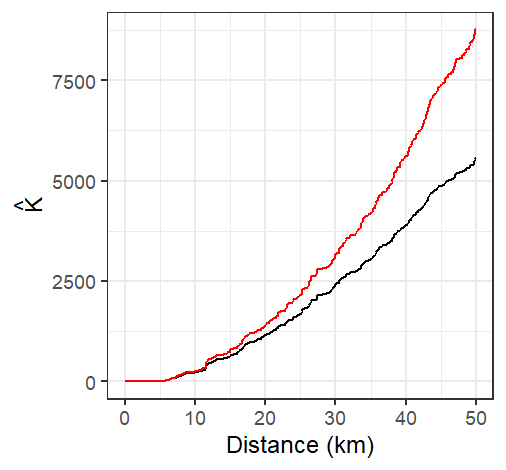
```

Edge correction can substantially alter the interpretation of the K function, particularly at larger distances where boundary effects become more pronounced.

Under the assumption of **Complete Spatial Randomness (CSR)**, the expected value of the K function is:

$$
K_{expected}(d) = \pi d^2
$$

This theoretical curve provides a benchmark against which the observed K function can be compared. 

- If the observed K function exceeds the CSR expectation, it suggests **clustering** at distance $d$.
- If the observed K function falls below the CSR expectation, it suggests **dispersion** at distance $d$.
- If the two functions are similar, the pattern is broadly consistent with CSR at that distance.

Conceptually, this comparison plays the same role as comparing an observed ANN value to the ANN value expected under CSR.

```{r}
#| label: fig-K3
#| fig-cap: "The K-function estimated from the Walmart stores point distribution in MA (shown in black), and the isotropic edge corrected K function for the same point layer (shown in red). The thick grey line represents the theoretical K function under the assumption of Complete Spatial Randomness (CSR). Note how not correcting for edge effect can mis-characterize the nature of the point pattern. The uncorrected K function suggests a pattern more dispersed than expected under CSR assumption for all distance values while the isotropic weighted K function suggests clustering."
#| fig-align: "center"
#| echo: false
#| fig-height: 2
#| out-width: "350px"

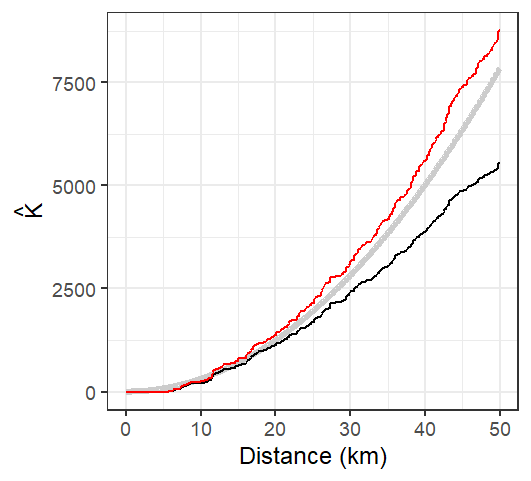
```

### L function

One limitation of the K function is that it increases quadratically with distance, making it difficult to visually assess small differences between the observed K function and its expected value under Complete Spatial Randomness (CSR). To address this issue, the **L function** is often used as a variance-stabilizing transformation.

A common form of the L function is:

$$
L=\sqrt{\dfrac{K(d)}{\pi}}-d
$$
Technically, the fundamental L function is written as

$$
L=\sqrt{\dfrac{K(d)}{\pi}}
$$

however, the **centered** form presented above has the advantage of transforming the CSR expectation into a horizontal reference line at zero. This makes departures from CSR easier to see across the full range of distances.

Under CSR,  

$$
L_{expected}(d) \approx 0
$$

Departures from zero indicate departures from randomness:

- $L(d) > 0$: clustering at distance $d$ 
- $L(d) < 0$: dispersion at distance $d$

Conceptually, the L function contains the same information as the K function but presents it in a form that is often easier to interpret graphically.

```{r}
#| label: fig-L
#| fig-cap: "L function rendering of the K function. Both the edge corrected (red line) and standard L functions (black line) are shown. The theoretical L function under CSR is shown as a horizontal line centered on 0."
#| fig-align: "center"
#| echo: false
#| fig-height: 2
#| out-width: "350px"

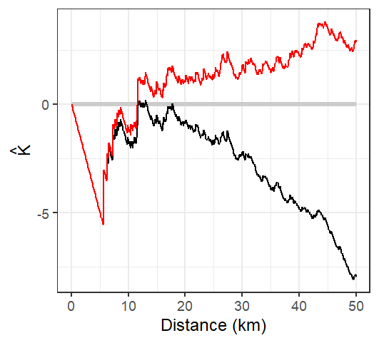 
```

The L-function plot suggests that Walmart locations are more dispersed than expected under CSR at distances up to approximately 12 km and more clustered than expected at distances greater than 12 km.

### The Pair Correlation Function

While Ripley's K and L functions provide cumulative measures of spatial dependence, the **Pair Correlation Function (PCF)** offers a more localized, non-cumulative view of spatial structure. It is particularly useful for identifying the specific distances at which clustering or regularity occurs in a point pattern.

Recall that the K function counts all neighboring points up to a distance $d$. As a result, the influence of interactions occurring at shorter distances carries forward into all larger distances. The Pair Correlation Function avoids this accumulation and instead focuses on interactions occurring at a specific distance.

The PCF, denoted $g(d)$, describes the density of point pairs separated by a distance $d$, relative to what would be expected under CSR. It is derived from the K function as:

$$
g(d) = \frac{1}{2\pi d}\frac{dK(d)}{dd}
$$

Here, $\frac{dK(d)}{dd}$ denotes the first derivative of the K function with respect to the distance $d$, representing its instantaneous rate of change. The notation $dd$ in the denominator is a single, indivisible symbol indicating differentiation with respect to $d$, and *not* a product.

This formulation normalizes the rate of change in the cumulative K function by the circumference of a ring at distance $d$, yielding a measure of point interaction at that specific scale.

- $g(d) = 1$: The number of point pairs at distance $d$ matches CSR expectations.
- $g(d) > 1$: More point pairs than expected at distance $d$, suggesting **clustering**.
- $g(d) < 1$: Fewer point pairs than expected at distance $d$, suggesting **dispersion**.

```{r}
#| label: fig-k_g
#| fig-cap: "Difference in how the $K$ and $g$ functions aggregate points at distance $d$ ($d$ = 30 km in this example). *All* points *up to* $d$ contribute to $K$ whereas just the points in the *annulus band* at $d$ contribute to $g$."
#| fig-align: "center"
#| echo: false
#| fig-height: 2
#| out-width: "650px"
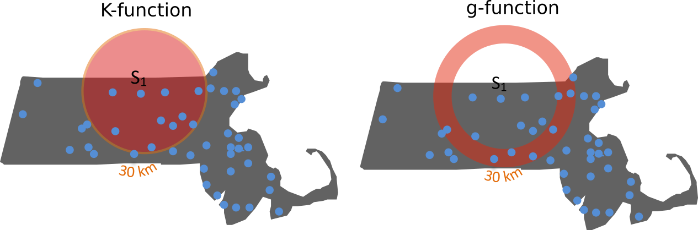
```

Like the K function from which it is derived, the pair correlation function is susceptible to edge effects. Points located near the study area's boundary have incomplete neighborhoods, leading to an underestimation of point interactions at some distances. Because $g(d)$ is derived from the K function, any edge-related bias in the K function will propagate to the PCF. Consequently, edge-correction methods or guard areas are often used to obtain more reliable estimates, particularly at larger distances.

Conceptually, the PCF plays a role similar to that of the L function, but it focuses on interactions occurring at specific distances rather than cumulative interactions across all shorter distances.

The plot of the pair correlation function for the Walmart store locations is shown below. Both the edge-corrected and uncorrected estimates are displayed for comparison.

```{r}
#| label: fig-g
#| fig-cap: "Estimated $g$ function of the Massachusetts Walmart point data. Its interpretation is  similar to that of the $K$ function. Here, we observe distances between stores greater than expected under CSR up to about 5 km. Note that this cutoff is shorter than the 12 km threshold observed with the $K$ function. The edge uncorrected $g$ function is depicted by a black line, while the corrected $g$ function is shown in a red line."
#| fig-align: "center"
#| echo: false
#| fig-height: 2
#| out-width: "300px"

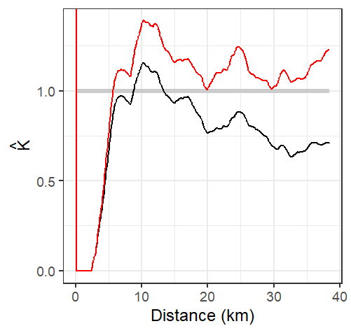
```

The analysis of the $g$ function suggests that Walmart stores exhibit greater clustering than expected at distances exceeding approximately 5 kilometers. Recall that this threshold is shorter than the 12-kilometer transition identified by the L function. This difference reflects the localized nature of the pair correlation function: whereas the K and L functions summarize interactions cumulatively across distances, the PCF isolates interactions occurring at specific distances.

Like its $K$, $L$ and ANN counterparts, the $g$-function assumes *stationarity* and *isotropy* in the underlying point process.


### Monte Carlo Tests for the K and L Functions

The Monte Carlo framework introduced earlier is not unique to Average Nearest Neighbor analysis. It can be applied to many point pattern statistics, including the K and L functions. The underlying logic remains unchanged: a null model is specified, many realizations of that model are simulated, and the observed statistic is compared to the distribution of simulated statistics.

Unlike ANN, however, the K and L functions are evaluated at many distance values $d$. As a result, the Monte Carlo procedure generates not a single sampling distribution, but a separate distribution for every distance considered. Because displaying all of these distributions simultaneously is impractical, the results are usually summarized using simulation *envelopes* superimposed on the observed K or L function.

To construct a 95% simulation envelope, the smallest and largest 2.5% of simulated values are removed for each distance $d$. The remaining values define the upper and lower bounds of the envelope. Because this procedure is performed independently at each distance, such envelopes are often referred to as **pointwise envelopes**.

The resulting envelope often exhibits a "saw-tooth" appearance because the upper and lower limits are derived from a finite number of simulated realizations at each distance.

```{r}
#| label: fig-k_l_mc_irp
#| fig-cap: "Simulation results for the CSR hypothesized process. The yellow line shows the edge corrected L function. The gray envelope in the plot covers the 95% significance level. If the observed L lies outside of this envelope at distance $d$, then there is less than a 5% chance that our observed point pattern resulted from the simulated process at that distance."
#| fig-align: "center"
#| echo: false
#| fig-height: 2
#| out-width: "650px"

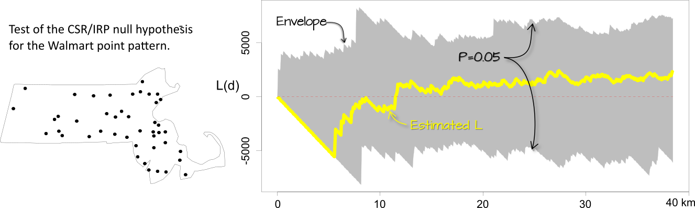
```

The interpretation of these plots follows the same logic as the ANN Monte Carlo test. If $\hat K$ or $\hat L$ lies outside the simulation envelope at distance $d$, then the observed pattern may not be consistent with the hypothesized process $H_o$ at that distance. In this example, the envelope represents a 95% acceptance interval, meaning that departures beyond the envelope are unlikely to occur if the null model were true.

As with ANN analysis, the K and L functions assume a homogeneous underlying process. If there is reason to believe that intensity varies across space, then the analysis should be adjusted to account for this inhomogeneity. For example, we might hypothesize that population density influences the distribution of Walmart stores. In that case, Monte Carlo simulations can be generated using the population density surface as the underlying intensity function, producing an inhomogeneous null model.

```{r}
#| label: fig-k_l_mc_inhom
#| fig-cap: "The L-function plot and simulation results for an inhomogeneous hypothesized process. When controlled for population density, the significance test suggests that the inter-distance of Walmarts is more dispersed than expected under the null up to a distance of 30 km."
#| fig-align: "center"
#| echo: false
#| fig-height: 2
#| out-width: "650px"

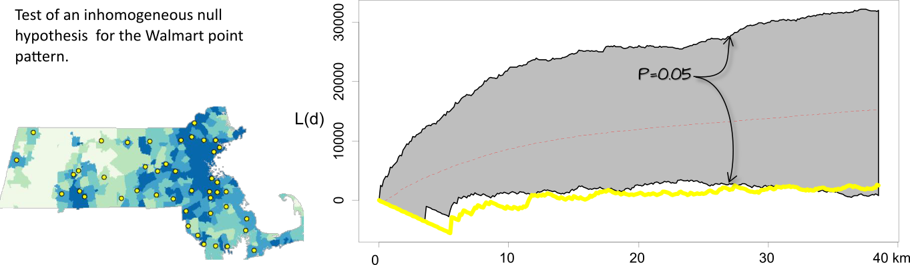
```

It may be tempting to scan a K- or L-function plot with pointwise envelopes, identify distances where the observed function falls outside the envelope, and report those distances as statistically significant. However, this approach can be misleading. For example, based on the results in the previous figure, we might be inclined to conclude that the pattern is more dispersed than expected between distances of 5 and 30 kilometers at the *5% significance level*. In reality, this interpretation can be misleading because many significance tests are being performed simultaneously, one for each distance value. This issue, known as the [multiple comparison problem](https://en.wikipedia.org/wiki/Multiple_comparisons_problem), is a statistical concern that arises when testing many hypotheses simultaneously. 

Global envelopes address this issue by providing a single significance test across the entire range of distances, allowing departures from the null model to be evaluated without inflating the probability of false positives.


### Hypothesis Tests for the Pair Correlation Function

Monte Carlo simulation techniques can be applied to the Pair Correlation Function $g(d)$ in exactly the same way they are applied to ANN, K, and L functions. A hypothesized process is specified, many realizations of that process are simulated, and a $g(d)$ function is computed for each realization.

Because $g(d)$ is evaluated across many distance values $d$, the simulation results are typically summarized using simulation envelopes. These envelopes represent the range of $g(d)$ values expected under the hypothesized process at each distance. If the observed $g(d)$ curve falls outside the envelope at some distance, this suggests that the observed pattern may not be consistent with the hypothesized process at that spatial scale.

As with the K and L functions, pointwise envelopes should be interpreted cautiously because multiple distance values are being evaluated simultaneously. This multiple-comparison problem can inflate the probability of false positives. Global envelopes provide a more rigorous alternative by offering a single significance assessment across the entire range of distances.


## Summary

This chapter introduced methods for analyzing second-order effects in spatial point patterns. Whereas the previous chapter focused on how point intensity varies across space (first-order effects), this chapter examined how points are arranged relative to one another.

+ **Second-order effects** describe how points are positioned relative to one another and whether they exhibit clustering or dispersion. 

+ **Average Nearest Neighbor (ANN)** provides a simple measure of spatial interaction based on distances between neighboring points.

+ **Complete Spatial Randomness (CSR)** serves as a common null model against which observed point patterns can be compared.

+ **Monte Carlo tests** assess whether an observed pattern is consistent with a hypothesized process by comparing the observed statistic to simulated realizations of that process.

+ A hypothesis test does not identify the true generating process; it only evaluates whether the observed pattern is consistent with a specified hypothesis. Multiple competing hypotheses may therefore remain plausible.

+ Because first-order effects can create the appearance of clustering or dispersion, second-order analyses often require controlling for spatial variation in intensity.

+ **Ripley's K function**, **L function**, and the **Pair Correlation Function (PCF)** provide alternative summaries of spatial interaction across multiple spatial scales.

+ The same inferential framework used for ANN applies to K, L, and PCF analyses through Monte Carlo simulation and hypothesis testing.

+ No single statistic fully characterizes a point pattern. ANN, K, L, and PCF should be viewed as complementary tools for investigating spatial interaction.

+ Together with the first-order methods introduced in Chapter 14, these techniques provide a framework for understanding both the intensity of a point process and the interactions among its events
