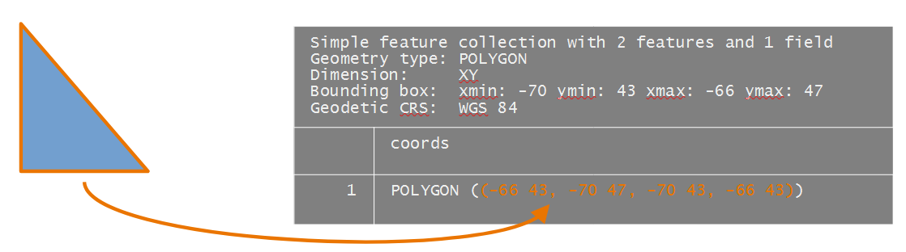
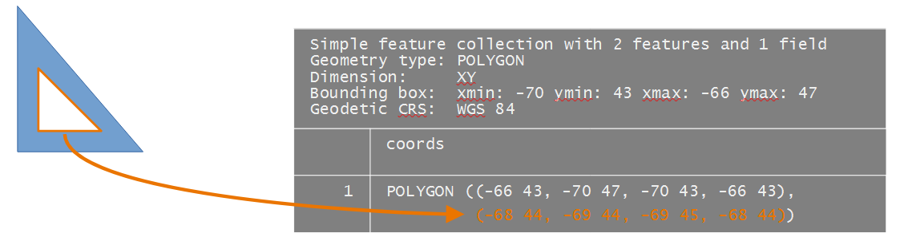
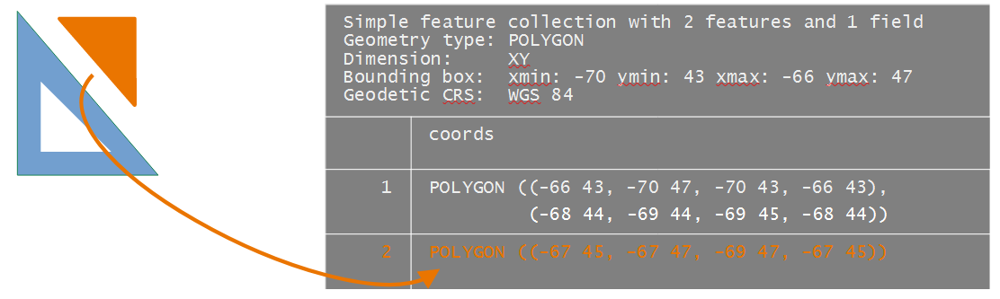
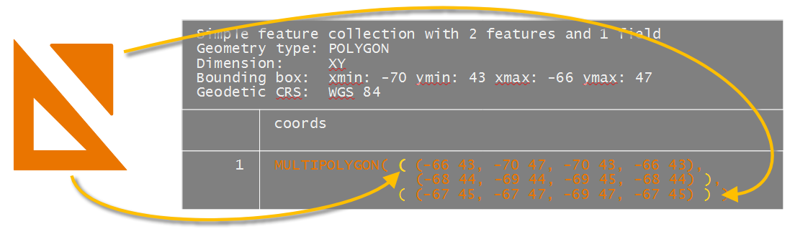
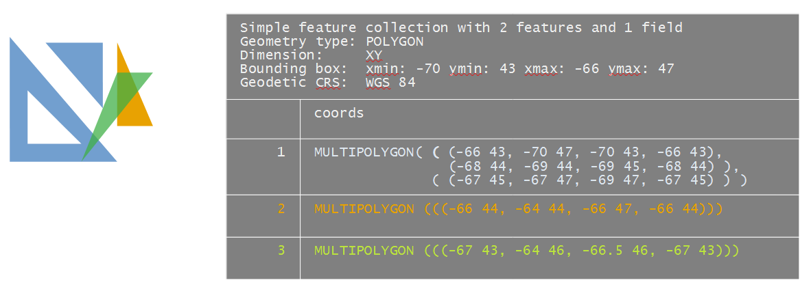

# Anatomy of simple feature objects

```{r, echo = FALSE}
source("package_list.R")
get.pckg.info("A03-sf-objects.Rmd")
```

This tutorial exposes you to the building blocks of simple feature objects via the the creation of point, polyline and polygon features from scratch. 

## Creating point 'sf' objects {-}

We will start off by exploring the creation of a singlepart point feature object. There are three phases in creating a point simple feature (`sf`) object:

-   Defining the coordinate pairs via a point geometry object, `sfg`;
-   Creating a simple feature column object, `sfc`, from the point geometries;
-   Creating the simple feature object, `sf`.

### Step 1: Create the point geometry: `sfg` {-}

Here, we'll create three separate point objects. We'll adopt a geographic coordinate system, but note that we do not specify the coordinate system just yet.

```{r}
library(sf)
p1.sfg <- st_point(c(-70, 45)) 
p2.sfg <- st_point(c(-69, 44)) 
p3.sfg <- st_point(c(-69, 45)) 
```

Let's check the class of one of these point geometries.

```{r}
class(p1.sfg)
```

What we are looking for is a `sfg` class. You'll note other classes associated with this object such as `POINT` which defines the geometric primitive. You'll see examples of other geometric primitives later in this tutorial.

Note that if a multipart point feature object is desired, the `st_multipoint()` function needs to be used instead of `st_point()` with the coordinate pairs defined in matrix as in `st_multipoint(matrix( c(-70, 45, -69, 44, -69, 45), ncol = 2, byrow = TRUE  ) )`.

### Step 2: Create a column of simple feature geometries: `sfc` {-}

Next, we'll combine the point geometries into a single object.

Note that if you are to define a coordinate system for the features, you can do so here via the `crs=` parameter. We use the WGS 1984 reference system (EPSG code of `4326`).

```{r}
p.sfc <- st_sfc( list(p1.sfg, p2.sfg, p3.sfg), crs = 4326 )
class(p.sfc)
```

The object is a simple feature column, `sfc`. More specifically, we've combined the point geometries into a single object whereby each geometry is assigned its own row or, to be technical, each point was assigned its own component via the `list` function. You can can confirm that each point geometry is assigned its own row in the following output.

```{r}
p.sfc
```

You can access each point using `list` operations. For example, to access the second point, type:

```{r}
p.sfc[[2]]

```

### Step 3: Create the simple feature object `sf` {-}

The final step is to create the simple feature object.

```{r}
p.sf <- st_sf(p.sfc)
p.sf
```

### Renaming the geometry column {-}

The above step generated a geometry column named after the input `sfc` object name (`p.sfc` in our example). This is perfectly functional since the `sf` object knows that this is the geometry column. We can confirm this by checking out `p.sf`'s attributes.

```{r}
attributes(p.sf)
```

What we are looking for is the `$sf_column` attribute which is , in our example, pointing to the `p.sfc` column. This attribute is critical in a spatial operation that makes use of the dataframe's spatial objects. Functions that recognize `sf` objects will look for this attribute to identify the geometry column.

You might chose to rename the column to something more meaningful such as `coords` (note that some spatially enabled databases adopt the name `geom`). You can use the `names()` function to rename that column, but note that you will need to re-define the geometry column in the attributes using the `st_geometry()` function.

```{r}
names(p.sf) <- "coords"
st_geometry(p.sf) <- "coords"
p.sf
```

### Adding attributes to an `sf` object {-}

The `p.sf` object is nothing more than a dataframe with a geometry column of `list` data type.

```{r}
typeof(p.sf$geom)
```

Storing spatial features in a dataframe has many benefits, one of which is operating on the features' attribute values. For example, we can add a new column with attribute values for each geometry entry. Here, we'll assign letters to each point. Note that the order in which the attribute values are passed to the dataframe must match that of the geometry elements.

```{r}
p.sf$val1 <- c("A", "B", "C")
p.sf
```

We can use `sf`'s `plot` function to view the points.

```{r fig.height=2.2, fig.width=2.85, echo=2}
OP <- par(mar=c(1,1,0.5,0.5), cex.axis=0.5 ,mgp=c(0,0.1,0), tck = -0.01)
plot(p.sf, pch = 16, axes = TRUE, main = NULL)
par(OP)
```

### Adding a geometry column to an existing non-spatial dataframe {-}

A nifty property of the `sfc` object created in step 2 above is the ability to append it to an existing dataframe using the `st_geometry()` function. In the following example, we'll create a dataframe, then append the geometry column to that dataframe.

```{r}
df <- data.frame(col1 = c("A", "B","C"))
st_geometry(df) <- p.sfc
```

Note that once we've added the geometry column, `df` becomes a spatial feature object and the geometry column is assigned the name `geometry`.

```{r}
df
```

## Creating polyline 'sf' objects {-}

The steps are similar to creating a point object. You first create the geometry(ies), you then combine the geometry(ies) into a spatial feature column before creating the simple feature object.

First, we need to define the vertices that will define each line segment of the polyline. The order in which the vertices are defined matters: The order defines each connecting line segment ends. The coordinate pairs of each vertex are stored in a matrix.

```{r}
l <- rbind( c(-70, 45), c(-69, 44), c(-69, 45) )
```

Next, we create a polyline geometry object.

```{r}
l.sfg <- st_linestring(l)
```

Next, we create the simple feature column. We also add the reference system definition (`crs = 4326`).

```{r}
l.sfc <- st_sfc(list(l.sfg), crs = 4326)
```

Finally, we create the simple feature object.

```{r}
l.sf <- st_sf(l.sfc)
l.sf
```

Even though we have multiple line segments, they are all associated with a single polyline feature, hence they each share the same attribute.

```{r fig.height=1.75, fig.width=2, echo = 2}
OP <- par(mar=c(1,1,0.5,0.5), cex.axis=0.5 ,mgp=c(0,0.2,0), tck = -0.01)
 plot(l.sf, type = "b", pch = 16, main = NULL, axes = TRUE)
par(OP)
```

### Creating branching polyline features {-}

You can also create polyline features with branching segments (i.e. where at least one vertex is associated with more than two line segments). You simply need to make sure that the coordinate values for the overlapping vertices share the exact same values.

```{r, fig.height=1.75, fig.width=1.75, echo=2:17}
OP <- par(mar=c(1,1,0.5,0.5), cex.axis=0.5 ,mgp=c(0,0.2,0), tck = -0.01)
# Define coordinate pairs
l1 <- rbind( c(-70, 45), c(-69, 44), c(-69, 45) )
l2 <- rbind( c(-69, 44), c(-70, 44) )
l3 <- rbind( c(-69, 44), c(-68, 43) )

# Create simple feature geometry object
l.sfg <- st_multilinestring(list(l1, l2, l3))

# Create simple feature column object
l.sfc <- st_sfc(list(l.sfg), crs = 4326)

# Create simple feature object
l.sf <- st_sf(l.sfc)

# Plot the data
plot(l.sf, type = "b", pch = 16, axes = TRUE)
par(OP)
```

## Creating polygon 'sf' objects {-}

General steps in creating a polygon `sf` spatial object from scratch include:

-   Defining the vertices of each polygon in a matrix;
-   Creating a list object from each matrix object (the list structure will differ between `POLYGON` and `MULTIPOLYGON` geometries);
-   Creating an `sfg` polygon geometry object from the list;
-   Creating an `sf` spatial object.

Defining a polygon's geometry is a bit more involved than a polyline in that a polygon defines an enclosed area. By convention, simple features record vertices coordinate pairs in a counterclockwise direction such that the area to the **left** of a polygon's perimeter when traveling in the direction of the recorded vertices is the polygon's "inside". This is counter to the order in which vertices are recorded in a shapefile whereby the area to the **right** of the traveled path along the polygon's perimeter is deemed "inside".

```{r fig.height=2, fig.width=6, echo = FALSE}
library(ggplot2)

poly_sf.coords  <- rbind( c(-66, 43),c(-70, 47), c(-70,43), c(-66, 43) )
poly_shp.coords <- apply(poly_sf.coords, 2, rev)
poly_sf.arrow   <- cbind(poly_sf.coords[-4,],poly_sf.coords[-1,])
poly_shp.arrow  <- cbind(poly_shp.coords[-4,],poly_shp.coords[-1,])

df.rings <- as.data.frame( rbind(poly_sf.arrow, poly_shp.arrow) )
df.rings$format <-  rep( c("sf","shapefile"), each=3)

ggplot(df.rings, aes(x=V1, y=V2)) + 
  geom_polygon(fill = "bisque", alpha = 0.5) +
  geom_point(data=df.rings, aes(V1,V2) , 
             pch = 21, col = "red", size = 2, fill = "orange") +
  geom_segment(aes(xend = V3, yend = V4),
               col = "darkred", lwd = 1) +
  geom_segment(aes(xend = (V1+V3)/2 , yend = (V2+V4)/2),
               arrow=arrow(length=unit(0.3,"cm"), type = "closed"),
               col = "darkred") +
  xlab(NULL) + ylab(NULL) +
  theme(axis.text = element_text(size=6)) + 
  scale_x_continuous(labels = scales::number_format(accuracy = 0.1)) +
  scale_y_continuous(labels = scales::number_format(accuracy = 0.1)) +
  coord_equal() +
  theme_minimal()+
  facet_wrap(~format)

```

A polygon hole has its ring defined in the opposite direction: clockwise for a simple feature object and counterclockwise for a shapefile.

```{r fig.height=2, fig.width=6, echo = FALSE}

poly_sf.coords  <- rbind( c(-66, 43),c(-70, 47), c(-70,43), c(-66, 43),
                          c(-67, 43.5),c(-69.5,43.5),c(-69.5, 46),  c(-67, 43.5))
poly_shp.coords <- apply(poly_sf.coords, 2, rev)
poly_sf.arrow   <- cbind(poly_sf.coords[c(-4,-8),],poly_sf.coords[c(-1,-5),])
poly_shp.arrow  <- cbind(poly_shp.coords[c(-4,-8),],poly_shp.coords[c(-1,-5),])

df.rings <- as.data.frame( rbind(poly_sf.arrow, poly_shp.arrow) )
df.poly  <- as.data.frame( rbind(poly_sf.coords, poly_shp.coords) )
df.rings$format <-  rep( c("sf", "shapefile"), each=6)
df.rings$hole <-  c(rep("no", 3), rep("yes",6), rep("no", 3) )
df.poly$format <-  rep( c("sf", "shapefile"), each=8)

ggplot(df.rings, aes(x=V1, y=V2)) + 
  geom_polygon(data = df.poly, aes(V1,V2),fill = "bisque", alpha = 0.5) +
  geom_point(data=df.rings, aes(V1,V2) , 
             pch = 21, col = "red", size = 2, fill = "orange") +
  geom_segment(aes(xend = V3, yend = V4, lty = hole),
               col = "darkred", lwd = 1) +
  geom_segment(aes(xend = (V1+V3)/2 , yend = (V2+V4)/2, lty = hole),
               arrow=arrow(length=unit(0.3,"cm"), type = "closed"),
               col = "darkred") +
  xlab(NULL) + ylab(NULL) +
  theme(axis.text = element_text(size=6)) + 
  scale_x_continuous(labels = scales::number_format(accuracy = 0.1)) +
  scale_y_continuous(labels = scales::number_format(accuracy = 0.1)) +
  coord_equal() +
  theme_minimal()+
  theme(legend.position="none",
        axis.text = element_text(size = 6)) +
  facet_wrap(~format)

```

For many applications in R, the ring direction will not matter, but for a few they might. So when possible, adopt the simple feature paradigm when defining the coordinate pairs. Note that importing a shapefile into an R session will usually automatically reverse the polygons' ring direction.

There are two types of polygon geometries that can be adopted depending on your needs: `POLYGON` and `MULTIPOLYGON`.

### `POLYGON` simple feature {-}

#### A plain polygon {-}

We'll first create a simple polygon shaped like a triangle. The `sf` output structure will be similar to that for the `POINT` and `POLYLINE` objects with the coordinate pairs defining the polygon vertices stored in a geometry column.



The polygon coordinate values are defined in a matrix. The last coordinate pair must match the first coordinate pair. The coordinate values will be recorded in a geographic coordinate system (latitude, longitude) but the reference system won't be defined until the creation of the `sfc` object.

```{r}
poly1.crd <- rbind( c(-66, 43), c(-70, 47), c(-70,43),  c(-66, 43) )
```

Next, we create the `POLYGON` geometries. The polygon matrix needs to be wrapped in a list object.

```{r}
poly1.geom <- st_polygon( list(poly1.crd ) )
```

We now have a polygon geometry.

```{r}
poly1.geom 
```

Next, we create a simple feature column from the polygon geometry. We'll also define the coordinate system used to report the coordinate values.

```{r}
poly.sfc <- st_sfc( list(poly1.geom), crs = 4326 )
```

```{r}
poly.sfc
```

Finally, to create the `sf` object, run the `st_sf()` function.

```{r}
poly.sf <- st_sf(poly.sfc)
poly.sf
```

The coordinates column is assigned the name `poly.sfc` by default. If you wish to change the column name to `coords`, for example, type the following:

```{r}
names(poly.sf) <- "coords"
st_geometry(poly.sf) <- "coords"
poly.sf
```

```{r fig.height=1.75, fig.width=1.75, echo=2}
OP <- par(mar=c(1,1,0.5,0.5), cex.axis=0.5 ,mgp=c(0,0.1,0), tck = -0.01)
plot(poly.sf, col = "bisque", axes = TRUE)
par(OP)
```

#### A polygon with a hole {-}

In this example, we'll add a hole to the polygon. Recall that its outer ring will need to be recorded in a counterclockwise direction and its hole in a clockwise direction.

The resulting data object will have the following structure.




```{r}
# Polygon 1
poly1.outer.crd <- rbind( c(-66, 43),c(-70, 47), c(-70,43), c(-66, 43) ) # Outer ring
poly1.inner.crd  <- rbind( c(-68, 44), c(-69,44), c(-69, 45), c(-68, 44) ) # Inner ring
```

Next, we combine the ring coordinates into a single geometric element. Note that this is done by combining the two coordinate matrices into a single list object.

```{r}
poly1.geom <- st_polygon( list(poly1.outer.crd, poly1.inner.crd))
```

We now create the simple feature column object.

```{r}
poly.sfc <- st_sfc( list(poly1.geom), crs = 4326 )
```

Finally, to create the `sf` object, run the `st_sf()` function.

```{r}
poly.sf <- st_sf(poly.sfc)
```

We'll take the opportunity to rename the coordinate column (even though this is not necessary).

```{r}
names(poly.sf) <- "coords"
st_geometry(poly.sf) <- "coords"
poly.sf
```

Let's now plot the `sf` object.

```{r fig.height=1.75, fig.width=1.75, echo=2}
OP <- par(mar=c(1,1,0.5,0.5), cex.axis=0.5 ,mgp=c(0,0.1,0), tck = -0.01)
plot(poly.sf, col = "bisque", axes = TRUE)
par(OP)
```

#### Combining polygons: singlepart features {-}

In this example, we'll create two distinct polygons by adding a second polygon to the one created in the last step. The output will be a singlepart polygon feature (i.e. each polygon can be assigned its own unique attribute value).



We'll create the second polygon (the first polygon having already been created in the previous section).

```{r}
# Define coordinate matrix
poly2.crd <- rbind( c(-67, 45),c(-67, 47), c(-69,47), c(-67, 45) ) 

# Create polygon geometry
poly2.geom <- st_polygon( list(poly2.crd))
```

Next, we combine the geometries into a simple feature column, `sfc`.

```{r}
poly.sfc <- st_sfc( list(poly1.geom , poly2.geom), crs = 4326 )
```

Each polygon has its own row in the `sfc` object.

```{r}
poly.sfc
```

Finally, to create the `sf` object, run the `st_sf()` function.

```{r}
poly.sf <- st_sf(poly.sfc)
poly.sf
```

We'll go ahead and rename the geometry column to `coords`.

```{r}
names(poly.sf) <- "coords"
st_geometry(poly.sf) <- "coords"
poly.sf
```

```{r fig.height=1.75, fig.width=1.75, echo=2}
OP <- par(mar=c(1,1,0.5,0.5), cex.axis=0.5 ,mgp=c(0,0.1,0), tck = -0.01)
plot(poly.sf, col = "bisque", axes = TRUE)
par(OP)
```

#### Adding attributes {-}

As with the point `sf` object created earlier in this exercise, we can append columns to the polygon `sf` object. But make sure that the order of the attribute values match the order in which the polygons are stored in the `sf` object.

```{r}
poly.sf$id <- c("A", "B")
poly.sf
```

```{r fig.height=2.5, fig.width=3, echo=2}
OP <- par(mar=c(1,1,0.5,0.5), cex.axis=0.5 ,mgp=c(0,0.1,0), tck = -0.01)
plot(poly.sf["id"],  axes = TRUE, main = NULL)
par(OP)
```

### `MULTIPOLYGON` simple feature: multipart features {-}

If multiple polygons are to share the same attribute record (a scenario referred to as multipart geometry in some GIS applications), you need to use the `st_multipolygon()` function when creating the `sfg` object.

In this example, we'll combine the two polygon created in the last example into a single geometry element.



The multipolygon function groups polygons into a single list. If one of the polygons is made up of more than one ring (e.g. a polygon with a whole), its geometry is combined into a single sub-list object.

```{r}
# Create multipolygon geometry
mpoly1.sfg  <- st_multipolygon( list(
                                  list( poly1.outer.crd,  # Outer loop
                                        poly1.inner.crd), # Inner loop
                                  list( poly2.crd)) )     # Separate polygon

# Create simple feature column object
mpoly.sfc <- st_sfc( list(mpoly1.sfg), crs = 4326)

# Create simple feature object
mpoly.sf <- st_sf(mpoly.sfc)

mpoly.sf
```

Note the single geometric entry in the table.

#### Mixing singlepart and multipart elements {-}

A `MULTIPOLGON` geometry can be used to store a single polygon as well. In this example, we'll create a `MULTIPOLYGON` `sf` object that will combine multipart and singlepart polygons.



To make this example more interesting, we'll have one of the elements (`poly4.coords`) overlapping several polygons. Note that any overlapping polygon needs to be in its own `MULTIPOLYGON` or `POLYGON` entry--if it's added to an existing entry (i.e. combined with another polygon geometry), it may be treated as a hole, even if the coordinate values are recorded in a counterclockwise direction.

```{r}
poly3.coords <- rbind( c(-66, 44), c(-64, 44), c(-66,47), c(-66, 44) )
poly4.coords <- rbind( c(-67, 43), c(-64, 46), c(-66.5,46), c(-67, 43) ) 
```

Note the embedded `list()` functions in the following code chunk.

```{r}
mpoly1.sfg  <- st_multipolygon( list(
                                  list( poly1.outer.crd,  # Outer loop
                                        poly1.inner.crd), # Inner loop
                                  list( poly2.crd)) )     # Separate poly
mpoly2.sfg  <- st_multipolygon( list(
                                  list(poly3.coords)))  # Unique polygon
mpoly3.sfg  <- st_multipolygon( list(
                                  list(poly4.coords)) )  # Unique polygon
```

Finally, we'll generate the simple feature object, `sf`, via the creation of the simple feature column object, `sfc`. We'll also assign the WGS 1984 geographic coordinate system (epsg = `4326`).

```{r}
mpoly.sfc <- st_sfc( list(mpoly1.sfg, mpoly2.sfg, mpoly3.sfg), crs = 4326)
mpoly.sf <- st_sf(mpoly.sfc)
```

Next, we'll add attribute values to each geometric object before generating a plot. We'll apply a transparency to the polygons to reveal the overlapping geometries.

```{r fig.height=2.3, fig.width=3, echo=2:3}
OP <- par(mar=c(1,1,0.5,0.5), cex.axis=0.5 ,mgp=c(0,0.1,0), tck = -0.01)
mpoly.sf$ids <- c("A", "B", "C")
plot(mpoly.sf["ids"], axes = TRUE, main = NULL,
     pal = sf.colors(alpha = 0.5, categorical = TRUE))
par(OP)
```

Note how polygon `C` overlaps the other polygon elements. We can check that this does not violate simple feature rules via the `st_is_valid()` function.

```{r}
st_is_valid(mpoly.sf)
```

This returns three boolean values, one for each element. A value of `TRUE` indicates that the geometry does not violate any rule.

Avoid storing overlapping polygons in a same MULTIPOLYGON geometry. Doing so will create an "invalid" `sf` object which may pose problems with certain functions.

## Extracting geometry from an `sf` object {-}

You can extract the geometry from an `sf` object via the `st_geometry` function. For example,

```{r}
# Create sfc from sf
st_geometry(mpoly.sf)
```

To extract coordinates from a single record in a WKT (well known text) format, type:

```{r}
st_geometry(mpoly.sf)[[1]]
```

If you want the extract the coordinate pairs of the first element in a list format type:

```{r}
st_geometry(mpoly.sf)[[1]][]
```

## Alternative syntax {-}

In this tutorial, you were instructed to define the coordinate pairs in matrices. This is probably the simplest way to enter coordinate values manually. You can, however, bypass the creation of a matrix and simply define the coordinate pairs using the WKT syntax.

For example, to generate the `POLYGON` geometry object from above, you could simply type:

```{r}
st_as_sfc(  "POLYGON ((-66 43, -70 47, -70 43, -66 43), (-68 44, -69 44, -69 45, -68 44))" )
```

Note that the WKT syntax is that listed in the `sfc` and `sf` geometry columns. Also note that the function `st_as_sfc` is used as opposed to the `st_sfc` function used with matrices in earlier steps.

## Additional resources {-}

-   Pebesma, Edzer. 2018. "Simple Features for R: Standardized Support for Spatial Vector Data", The R Journal, pages 439-446.
-   Pebesma, Edzar and Bivand, Roger. "Spatial Data Science: with applications in R", <https://keen-swartz-3146c4.netlify.app/>
