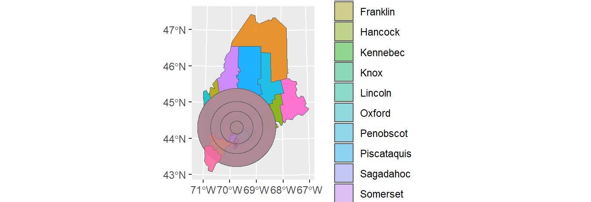

# Vector operations in R 

<table class="package_ver_table">
<tbody>
  <tr>
   <td style="text-align:left;color: black !important;background-color: #ffc178 !important;text-align: center;font-size: 12px !important; 
              margin:5px; 
              border-radius: 8px;
              border: 2px solid white;
              padding-top: 1px;
              padding-bottom: 1px;
              padding-left: 4px;
              padding-right: 4px;"> R </td>
   <td style="text-align:left;color: black !important;background-color: #ffc178 !important;text-align: center;font-size: 12px !important; 
              margin:5px; 
              border-radius: 8px;
              border: 2px solid white;
              padding-top: 1px;
              padding-bottom: 1px;
              padding-left: 4px;
              padding-right: 4px;"> sf </td>
   <td style="text-align:left;color: black !important;background-color: #ffc178 !important;text-align: center;font-size: 12px !important; 
              margin:5px; 
              border-radius: 8px;
              border: 2px solid white;
              padding-top: 1px;
              padding-bottom: 1px;
              padding-left: 4px;
              padding-right: 4px;"> ggplot2 </td>
  </tr>
  <tr>
   <td style="text-align:left;color: white !important;background-color: #AAAAAA !important;text-align: center;font-size: 12px !important; 
              margin:5px; 
              border-radius: 8px;
              border: 2px solid white;
              padding-top: 1px;
              padding-bottom: 1px;
              padding-left: 4px;
              padding-right: 4px;"> 4.1.1 </td>
   <td style="text-align:left;color: white !important;background-color: #AAAAAA !important;text-align: center;font-size: 12px !important; 
              margin:5px; 
              border-radius: 8px;
              border: 2px solid white;
              padding-top: 1px;
              padding-bottom: 1px;
              padding-left: 4px;
              padding-right: 4px;"> 1.0.2 </td>
   <td style="text-align:left;color: white !important;background-color: #AAAAAA !important;text-align: center;font-size: 12px !important; 
              margin:5px; 
              border-radius: 8px;
              border: 2px solid white;
              padding-top: 1px;
              padding-bottom: 1px;
              padding-left: 4px;
              padding-right: 4px;"> 3.3.5 </td>
  </tr>
</tbody>
</table>


<style type="text/css">
.scroll1 {
  max-height: 100px;
  overflow-y: auto;
  background-color: inherit;
}
</style>

Earlier versions of this tutorial made use of a combination of packages including `raster` and `rgeos` to perform most vector operations highlighted in this exercise. Many of these vector operations can now be performed using the `sf` package. As such, all code chunks in this tutorial make use `sf` for most vector operations.

We'll first load spatial objects used in this exercise. These include: A polygon layer that delineates Maine counties (USA), `s1.sf`; A polygon layer that delineates distances to Augusta (Maine) as concentric circles, `s2.sf`; A polyline layer of the interstate highway system that runs through Maine. These data are stored as `sf` objects.


```r
library(sf)

z <- gzcon(url("https://github.com/mgimond/Spatial/raw/master/Data/Income_schooling_sf.rds"))
s1.sf <- readRDS(z)

z <- gzcon(url("https://github.com/mgimond/Spatial/raw/master/Data/Dist_sf.rds"))
s2.sf <- readRDS(z)

z <- gzcon(url("https://github.com/mgimond/Spatial/raw/master/Data/Highway_sf.rds"))
l1.sf <- readRDS(z)
```

A map of the above layers is shown below. We'll use the `ggplot2` package too generate this and subsequent maps in this tutorial.


```r
library(ggplot2)

ggplot() + 
  geom_sf(data = s1.sf) +
  geom_sf(data = s2.sf, alpha = 0.5, col = "red") +
  geom_sf(data = l1.sf, col = "blue")
```


The attributes table for both polygon objects (`s1.sf` and `s2.sf`) are shown next. Note that each shape object has a unique set of attributes as well as a unique number of records

<div class="figure">

<p class="caption">(\#fig:unnamed-chunk-5)Attribute tables for the Maine spatial object, `s1.sf`, (left table) and the distance to Augusta spatial object, `s2.sf` (right table).</p>
</div>

## Dissolving geometries {-}

### Dissolving by contiguous shape {-}

There are two different ways to dissolve geometries that share a common boundary. Both are presented next.

#### Option 1 {-}

To dissolve all polygons that share at least one line segment, simply pass the object name to `sf`'s `st_union` function while making sure that the `by_feature` option is set to `FALSE`. In this example, we dissolve all polygons to create a single outline of the state of Maine.


```r
ME <- st_union(s1.sf, by_feature = FALSE)

ggplot(ME) + geom_sf(fill = "grey")
```


Note that the dissolving process removed all attributes from the original spatial object. You'll also note that `st_union` returns an `sfc` object even though the input object is `sf`. You can convert the output to an `sf` object using the `st_sf()` function as in `st_sf(ME)`.

#### Option 2 {-}

Another approach is to make use of the `dplyr` package and its `group_by`/`summarise` functions.


```r
library(dplyr)

ME <- s1.sf %>% 
  group_by() %>% 
  summarise()

ggplot(ME) + geom_sf(fill = "grey")
```


Note that this option will also remove any attributes associated with the input spatial object, however, the output remains an `sf` object (this differs from the `st_union` output).

### Dissolving by attribute {-}

You can also choose to dissolve based on an attribute's values. First, we'll create a new column whose value will be binary (TRUE/FALSE) depending on whether or not the county income is below the counties' median income value.


```r
s1.sf$med <- s1.sf$Income > median(s1.sf$Income)

ggplot(s1.sf) + geom_sf(aes(fill = med))
```


Next, we'll dissolve all polygons by the `med` attribute. Any polygons sharing at least one line segment that have the same `med` value will be dissolved into a single polygon.

Two approaches are presented here: one using `sf`'s `aggregate` function, the other using the `dplyr` approach.

#### Option 1 {-}


```r
ME.inc <- aggregate(s1.sf["med"], by = list(diss = s1.sf$med), 
                    FUN = function(x)x[1], do_union = TRUE)
```

This option will a new field defined in the `by = ` parameter (`diss` in this working example).


```r
st_drop_geometry(ME.inc) # Print the layer's attributes table
```

```
   diss   med
1 FALSE FALSE
2  TRUE  TRUE
```

#### Option 2 {-}


```r
ME.inc <- s1.sf %>% 
     group_by(med) %>% 
     summarise() 
```

This option will limit the attributes to that/those listed in the `group_by` function.


```r
st_drop_geometry(ME.inc)
```

```
# A tibble: 2 x 1
  med  
* <lgl>
1 FALSE
2 TRUE 
```


A map of the resulting layer follows.


```r
ggplot(ME.inc) + geom_sf(aes(fill = med))
```


The dissolving (aggregating) operation will, by default, eliminate all other attribute values. If you wish to summarize other attribute values along with the attribute used for dissolving, use the `dplyr` piping operation option. For example, to compute the median `Income` value for each of the below/above median income groups type the following:


```r
ME.inc <- s1.sf %>%  
     group_by(med) %>%   
     summarize(medinc = median(Income)) 

ggplot(ME.inc) + geom_sf(aes(fill = medinc))
```


To view the attributes table with both the aggregate variable, `med`, and the median income variable, `Income`, type:


```r
st_drop_geometry(ME.inc)
```

```
# A tibble: 2 x 2
  med   medinc
* <lgl>  <dbl>
1 FALSE  21518
2 TRUE   27955
```

## Subsetting by attribute {-}

You can use conventional R dataframe manipulation operations to subset by attribute values. For example, to subset by county name (e.g. `Kennebec` county), type:


```r
ME.ken <- s1.sf[s1.sf$NAME == "Kennebec",]
```

You can, of course, use piping operations to perform the same task as follows:


```r
ME.ken <- s1.sf %>% 
      filter(NAME == "Kennebec")
```


```r
ggplot(ME.ken) + geom_sf()
```


To subset by a range of attribute values (e.g. subset by income values that are less than the median value), type:


```r
ME.inc2 <- s1.sf %>% 
    filter(Income < median(Income))

ggplot(ME.inc2) + geom_sf()
```


## Intersecting layers {-}

To intersect two polygon objects, use `sf`'s `st_intersection` function.


```r
clp1 <- st_intersection(s1.sf, s2.sf)

ggplot(clp1) + geom_sf()
```


`st_intersection` keeps all features that overlap along with their combined attributes. Note that new polygons are created which will increase the size of the attributes table beyond the size of the combined input attributes table.


```r
st_drop_geometry(clp1)
```

```{.scroll1}
             NAME Income   NoSchool  NoSchoolSE IncomeSE   med distance
8        Kennebec  25652 0.00570358 0.000917087  360.000  TRUE       20
12        Lincoln  27839 0.00278315 0.001030800  571.515  TRUE       20
14      Sagadahoc  28122 0.00285524 0.000900782  544.849  TRUE       20
1        Somerset  21025 0.00521153 0.001150020  390.909 FALSE       50
5        Franklin  21744 0.00508507 0.001641740  530.909 FALSE       50
6          Oxford  21885 0.00700822 0.001318160  536.970 FALSE       50
7           Waldo  23020 0.00498141 0.000918837  450.909 FALSE       50
8.1      Kennebec  25652 0.00570358 0.000917087  360.000  TRUE       50
9    Androscoggin  24268 0.00830953 0.001178660  460.606  TRUE       50
11           Knox  27141 0.00652269 0.001863920  684.849  TRUE       50
12.1      Lincoln  27839 0.00278315 0.001030800  571.515  TRUE       50
13     Cumberland  32549 0.00494917 0.000683236  346.061  TRUE       50
14.1    Sagadahoc  28122 0.00285524 0.000900782  544.849  TRUE       50
1.1      Somerset  21025 0.00521153 0.001150020  390.909 FALSE       80
2     Piscataquis  21292 0.00633830 0.002128960  724.242 FALSE       80
3       Penobscot  23307 0.00684534 0.001025450  242.424 FALSE       80
5.1      Franklin  21744 0.00508507 0.001641740  530.909 FALSE       80
6.1        Oxford  21885 0.00700822 0.001318160  536.970 FALSE       80
7.1         Waldo  23020 0.00498141 0.000918837  450.909 FALSE       80
9.1  Androscoggin  24268 0.00830953 0.001178660  460.606  TRUE       80
10        Hancock  28071 0.00238996 0.000784584  585.455  TRUE       80
11.1         Knox  27141 0.00652269 0.001863920  684.849  TRUE       80
12.2      Lincoln  27839 0.00278315 0.001030800  571.515  TRUE       80
13.1   Cumberland  32549 0.00494917 0.000683236  346.061  TRUE       80
14.2    Sagadahoc  28122 0.00285524 0.000900782  544.849  TRUE       80
1.2      Somerset  21025 0.00521153 0.001150020  390.909 FALSE      120
2.1   Piscataquis  21292 0.00633830 0.002128960  724.242 FALSE      120
3.1     Penobscot  23307 0.00684534 0.001025450  242.424 FALSE      120
5.2      Franklin  21744 0.00508507 0.001641740  530.909 FALSE      120
6.2        Oxford  21885 0.00700822 0.001318160  536.970 FALSE      120
7.2         Waldo  23020 0.00498141 0.000918837  450.909 FALSE      120
10.1      Hancock  28071 0.00238996 0.000784584  585.455  TRUE      120
13.2   Cumberland  32549 0.00494917 0.000683236  346.061  TRUE      120
15           York  28496 0.00529228 0.000737195  332.121  TRUE      120
```

## Clipping spatial objects using other spatial objects {-}

The `st_intersection` can also be used to clip an input layer using another layer's outer geometry boundaries as the "cookie cutter". But note that the latter must be limited to its outer boundaries which may require that it be run through a dissolving operation (shown earlier in this tutorial) to dissolve internal boundaries.

To clip `s2.sf` using the outline of `s1.sf`, type:


```r
clp2 <- st_intersection(s2.sf, st_union(s1.sf)) 

ggplot(clp2) + geom_sf()
```


The order the layers are passed to the `st_intersection` function matters. Flipping the input layer in the last example will clip `s1.sf` to `s2.sf`'s bounding polygon(s).


```r
clp2 <- st_intersection(s1.sf, st_union(s2.sf)) 

ggplot(clp2) + geom_sf()
```


Line geometries can also be clipped to polygon features. The output will be a line object that falls within the polygons of the input polygon object. For example, to output all line segments that fall within the concentric distance circles of `s2.sf`, type:


```r
clp3 <- st_intersection(l1.sf, st_union(s2.sf))
```

A plot of the clipped line features is shown with the outline of the clipping feature.


```r
ggplot(clp3) + 
  geom_sf(data = clp3) +
  geom_sf(data = st_union(s2.sf), col = "red", fill = NA )
```


## Unioning layers {-}

To union two polygon objects, use `sf`'s `st_union` function. For example,


```r
un1  <- st_union(s2.sf,s1.sf)

ggplot(un1) + geom_sf(aes(fill = NAME), alpha = 0.4)
```



This produces the following attributes table.


```{.scroll1}
     distance         NAME Income   NoSchool  NoSchoolSE IncomeSE   med
1          20    Aroostook  21024 0.01338720 0.001406960  250.909 FALSE
2          50    Aroostook  21024 0.01338720 0.001406960  250.909 FALSE
3          80    Aroostook  21024 0.01338720 0.001406960  250.909 FALSE
4         120    Aroostook  21024 0.01338720 0.001406960  250.909 FALSE
1.1        20     Somerset  21025 0.00521153 0.001150020  390.909 FALSE
2.1        50     Somerset  21025 0.00521153 0.001150020  390.909 FALSE
3.1        80     Somerset  21025 0.00521153 0.001150020  390.909 FALSE
4.1       120     Somerset  21025 0.00521153 0.001150020  390.909 FALSE
1.2        20  Piscataquis  21292 0.00633830 0.002128960  724.242 FALSE
2.2        50  Piscataquis  21292 0.00633830 0.002128960  724.242 FALSE
3.2        80  Piscataquis  21292 0.00633830 0.002128960  724.242 FALSE
4.2       120  Piscataquis  21292 0.00633830 0.002128960  724.242 FALSE
1.3        20    Penobscot  23307 0.00684534 0.001025450  242.424 FALSE
2.3        50    Penobscot  23307 0.00684534 0.001025450  242.424 FALSE
3.3        80    Penobscot  23307 0.00684534 0.001025450  242.424 FALSE
4.3       120    Penobscot  23307 0.00684534 0.001025450  242.424 FALSE
1.4        20   Washington  20015 0.00478188 0.000966036  327.273 FALSE
2.4        50   Washington  20015 0.00478188 0.000966036  327.273 FALSE
3.4        80   Washington  20015 0.00478188 0.000966036  327.273 FALSE
4.4       120   Washington  20015 0.00478188 0.000966036  327.273 FALSE
1.5        20     Franklin  21744 0.00508507 0.001641740  530.909 FALSE
2.5        50     Franklin  21744 0.00508507 0.001641740  530.909 FALSE
3.5        80     Franklin  21744 0.00508507 0.001641740  530.909 FALSE
4.5       120     Franklin  21744 0.00508507 0.001641740  530.909 FALSE
1.6        20       Oxford  21885 0.00700822 0.001318160  536.970 FALSE
2.6        50       Oxford  21885 0.00700822 0.001318160  536.970 FALSE
3.6        80       Oxford  21885 0.00700822 0.001318160  536.970 FALSE
4.6       120       Oxford  21885 0.00700822 0.001318160  536.970 FALSE
1.7        20        Waldo  23020 0.00498141 0.000918837  450.909 FALSE
2.7        50        Waldo  23020 0.00498141 0.000918837  450.909 FALSE
3.7        80        Waldo  23020 0.00498141 0.000918837  450.909 FALSE
4.7       120        Waldo  23020 0.00498141 0.000918837  450.909 FALSE
1.8        20     Kennebec  25652 0.00570358 0.000917087  360.000  TRUE
2.8        50     Kennebec  25652 0.00570358 0.000917087  360.000  TRUE
3.8        80     Kennebec  25652 0.00570358 0.000917087  360.000  TRUE
4.8       120     Kennebec  25652 0.00570358 0.000917087  360.000  TRUE
1.9        20 Androscoggin  24268 0.00830953 0.001178660  460.606  TRUE
2.9        50 Androscoggin  24268 0.00830953 0.001178660  460.606  TRUE
3.9        80 Androscoggin  24268 0.00830953 0.001178660  460.606  TRUE
4.9       120 Androscoggin  24268 0.00830953 0.001178660  460.606  TRUE
1.10       20      Hancock  28071 0.00238996 0.000784584  585.455  TRUE
2.10       50      Hancock  28071 0.00238996 0.000784584  585.455  TRUE
3.10       80      Hancock  28071 0.00238996 0.000784584  585.455  TRUE
4.10      120      Hancock  28071 0.00238996 0.000784584  585.455  TRUE
1.11       20         Knox  27141 0.00652269 0.001863920  684.849  TRUE
2.11       50         Knox  27141 0.00652269 0.001863920  684.849  TRUE
3.11       80         Knox  27141 0.00652269 0.001863920  684.849  TRUE
4.11      120         Knox  27141 0.00652269 0.001863920  684.849  TRUE
1.12       20      Lincoln  27839 0.00278315 0.001030800  571.515  TRUE
2.12       50      Lincoln  27839 0.00278315 0.001030800  571.515  TRUE
3.12       80      Lincoln  27839 0.00278315 0.001030800  571.515  TRUE
4.12      120      Lincoln  27839 0.00278315 0.001030800  571.515  TRUE
1.13       20   Cumberland  32549 0.00494917 0.000683236  346.061  TRUE
2.13       50   Cumberland  32549 0.00494917 0.000683236  346.061  TRUE
3.13       80   Cumberland  32549 0.00494917 0.000683236  346.061  TRUE
4.13      120   Cumberland  32549 0.00494917 0.000683236  346.061  TRUE
1.14       20    Sagadahoc  28122 0.00285524 0.000900782  544.849  TRUE
2.14       50    Sagadahoc  28122 0.00285524 0.000900782  544.849  TRUE
3.14       80    Sagadahoc  28122 0.00285524 0.000900782  544.849  TRUE
4.14      120    Sagadahoc  28122 0.00285524 0.000900782  544.849  TRUE
1.15       20         York  28496 0.00529228 0.000737195  332.121  TRUE
2.15       50         York  28496 0.00529228 0.000737195  332.121  TRUE
3.15       80         York  28496 0.00529228 0.000737195  332.121  TRUE
4.15      120         York  28496 0.00529228 0.000737195  332.121  TRUE
```

Note that the union operation can generate many *overlapping* geometries. This is because each geometry of the layers being unioned are paired up with one another creating unique combinations of each layer's geometries.


For example, the *Aroostook County* polygon from `s1.sf` is paired with each annulus of the `s2.sf` layer creating four new geometries.


```r
un1 %>% filter(NAME == "Aroostook")
```

```{.scroll1}
Simple feature collection with 4 features and 7 fields
Geometry type: MULTIPOLYGON
Dimension:     XY
Bounding box:  xmin: 318980.1 ymin: 4788093 xmax: 596500.1 ymax: 5255569
CRS:           +proj=utm +zone=19 +datum=NAD83 +units=m +no_defs +ellps=GRS80 +towgs84=0,0,0
  distance      NAME Income  NoSchool NoSchoolSE IncomeSE   med
1       20 Aroostook  21024 0.0133872 0.00140696  250.909 FALSE
2       50 Aroostook  21024 0.0133872 0.00140696  250.909 FALSE
3       80 Aroostook  21024 0.0133872 0.00140696  250.909 FALSE
4      120 Aroostook  21024 0.0133872 0.00140696  250.909 FALSE
                        geometry
1 MULTIPOLYGON (((438980 4928...
2 MULTIPOLYGON (((438980 4958...
3 MULTIPOLYGON (((438980 4988...
4 MULTIPOLYGON (((438980 5028...
```

The union operation creates all possible pairs of geometries between both input objects (i.e. 4 circle geometries from `s2.sf` times 16 county geometries from `s1.sf` for a total of 64 geometries).

## Buffering geometries {-}

To buffer point, line or polygon geometries, use `sf`'s `st_buffer` function. For example, the following code chunk generates a 10 km (10,000 m) buffer around the polyline segments.


```r
l1.sf.buf <- st_buffer(l1.sf, dist = 10000)

ggplot(l1.sf.buf) + geom_sf() + coord_sf(ndiscr = 1000)
```


To create a continuous polygon geometry (i.e. to eliminate overlapping buffers), we'll follow up with one of the dissolving techniques introduced earlier in this tutorial.


```r
l1.sf.buf.dis <- l1.sf.buf %>% 
  group_by()  %>% 
  summarise()

ggplot(l1.sf.buf.dis) + geom_sf() 
```


If you want to preserve an attribute value (such as highway number), modify the above code as follows:


```r
l1.sf.buf.dis <- l1.sf.buf %>% 
    group_by(Number)  %>% 
    summarise()

ggplot(l1.sf.buf.dis, aes(fill=Number) ) + geom_sf(alpha = 0.5)
```


