# Mapping data in R

<table class="package_ver_table">
<tbody>
  <tr>
   <td style="text-align:left;color: black !important;background-color: #ffc178 !important;text-align: center;font-size: 12px !important; 
              margin:5px; 
              border-radius: 8px;
              border: 2px solid white;
              padding-top: 1px;
              padding-bottom: 1px;
              padding-left: 4px;
              padding-right: 4px;"> R </td>
   <td style="text-align:left;color: black !important;background-color: #ffc178 !important;text-align: center;font-size: 12px !important; 
              margin:5px; 
              border-radius: 8px;
              border: 2px solid white;
              padding-top: 1px;
              padding-bottom: 1px;
              padding-left: 4px;
              padding-right: 4px;"> sf </td>
   <td style="text-align:left;color: black !important;background-color: #ffc178 !important;text-align: center;font-size: 12px !important; 
              margin:5px; 
              border-radius: 8px;
              border: 2px solid white;
              padding-top: 1px;
              padding-bottom: 1px;
              padding-left: 4px;
              padding-right: 4px;"> tmap </td>
   <td style="text-align:left;color: black !important;background-color: #ffc178 !important;text-align: center;font-size: 12px !important; 
              margin:5px; 
              border-radius: 8px;
              border: 2px solid white;
              padding-top: 1px;
              padding-bottom: 1px;
              padding-left: 4px;
              padding-right: 4px;"> ggplot2 </td>
   <td style="text-align:left;color: black !important;background-color: #ffc178 !important;text-align: center;font-size: 12px !important; 
              margin:5px; 
              border-radius: 8px;
              border: 2px solid white;
              padding-top: 1px;
              padding-bottom: 1px;
              padding-left: 4px;
              padding-right: 4px;"> raster </td>
  </tr>
  <tr>
   <td style="text-align:left;color: white !important;background-color: #AAAAAA !important;text-align: center;font-size: 12px !important; 
              margin:5px; 
              border-radius: 8px;
              border: 2px solid white;
              padding-top: 1px;
              padding-bottom: 1px;
              padding-left: 4px;
              padding-right: 4px;"> 4.1.1 </td>
   <td style="text-align:left;color: white !important;background-color: #AAAAAA !important;text-align: center;font-size: 12px !important; 
              margin:5px; 
              border-radius: 8px;
              border: 2px solid white;
              padding-top: 1px;
              padding-bottom: 1px;
              padding-left: 4px;
              padding-right: 4px;"> 1.0.2 </td>
   <td style="text-align:left;color: white !important;background-color: #AAAAAA !important;text-align: center;font-size: 12px !important; 
              margin:5px; 
              border-radius: 8px;
              border: 2px solid white;
              padding-top: 1px;
              padding-bottom: 1px;
              padding-left: 4px;
              padding-right: 4px;"> 3.3.2 </td>
   <td style="text-align:left;color: white !important;background-color: #AAAAAA !important;text-align: center;font-size: 12px !important; 
              margin:5px; 
              border-radius: 8px;
              border: 2px solid white;
              padding-top: 1px;
              padding-bottom: 1px;
              padding-left: 4px;
              padding-right: 4px;"> 3.3.5 </td>
   <td style="text-align:left;color: white !important;background-color: #AAAAAA !important;text-align: center;font-size: 12px !important; 
              margin:5px; 
              border-radius: 8px;
              border: 2px solid white;
              padding-top: 1px;
              padding-bottom: 1px;
              padding-left: 4px;
              padding-right: 4px;"> 3.4.13 </td>
  </tr>
</tbody>
</table>

There are many mapping environments that can be adopted in R. Three are presented in this tutorial: `tmap`, `ggplot2` and `plot_sf`.


## Sample files for this exercise {-} 

Data used in the following exercises can be loaded into your current R session by running the following chunk of code.


```r
library(sf)

load(url("http://github.com/mgimond/Spatial/raw/master/Data/Sample1.RData"))
```

The data objects consist of five layers: an elevation raster (`elev.r`), an interstate polyline layer (`inter.sf`), a point cities layer (p.sf), a railroad polyline layer (`rail.sf`) and a Maine counties polygon layer (`s.sf`). All vector layers are `sf` objects. All layers are in a UTM/NAD83 projection (Zone 19N) except `p.sf` which is in a WGS 1984 geographic coordinate system.

## `tmap`  {-}

The `tmap` package is specifically developed for mapping spatial data. As such, it offers the greatest mapping options. The package  recognizes `sf`, `raster` and `Spatial*` objects.

### The basics {-}

To map the counties polygon layer using a grey color scheme, type:
  

```r
library(tmap) 
tm_shape(s.sf) + tm_polygons(col="grey", border.col="white")
```


The `tm_shape` function loads the spatial object (vector or raster) into the mapping session. The `tm_polygons`  function is one of many `tmap` functions that dictates how the spatial object is to be mapped. The `col` parameter defines either the polygon fill color or the spatial object's attribute column to be used to define the polygons' color scheme. For example, to use the `Income` attribute value to define the color scheme, type:
  

```r
tm_shape(s.sf) + tm_polygons(col="Income", border.col = "white")
```

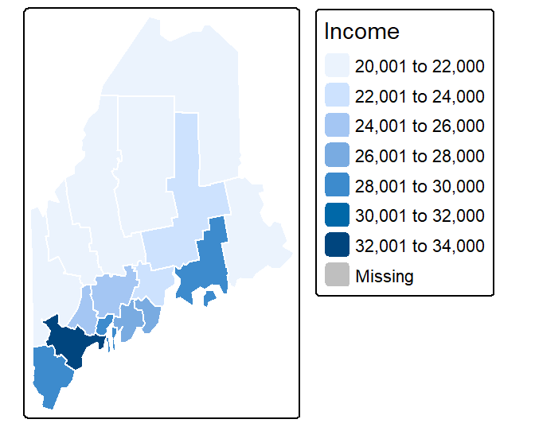

Note the `+` symbol used to piece together the functions (this is similar to the `ggplot2` syntax).

You can customize the map by piecing together various map element functions. For example, to move the legend box outside of the main map body add the `tm_legend(outside = TRUE)` function to the mapping operation. 


```r
tm_shape(s.sf) + tm_polygons("Income",  border.col = "white") + 
  tm_legend(outside = TRUE)
```


You can also choose to omit the legend box (via the `legend.show = FALSE` parameter) and the data frame border (via the `tm_layout(frame = FALSE)` function):


```r
tm_shape(s.sf) + 
  tm_polygons("Income",  border.col = "white", legend.show=FALSE) +
  tm_layout(frame = FALSE)
```


If you want to omit the polygon border lines from the plot, simply add the `border.col = NULL` parameter to the `tm_polygons` function.


```r
tm_shape(s.sf) + 
  tm_polygons("Income", border.col = NULL) + 
  tm_legend(outside = TRUE)
```

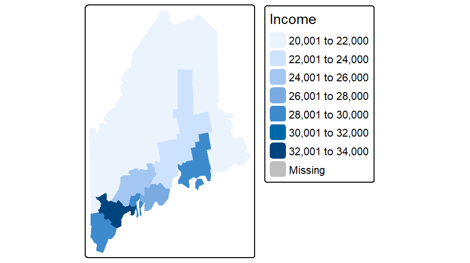

Note that the `tm_fill` function is nearly identical to the `tm_polygons` function with the difference being that the `tm_fill` function does not draw polygon borders.

### Combining layers {-}

You can easily stack layers by piecing together additional `tm_shape`functions. In the following example, the railroad layer and the point layer are added to the income map. The railroad layer is mapped using the `tm_lines` function and the cities point layer is mapped using the `tm_dots` function. Note that layers are pieced together using the `+` symbol.


```r
tm_shape(s.sf) + 
  tm_polygons("Income", border.col = NULL) + 
  tm_legend(outside = TRUE) +
 tm_shape(rail.sf) + tm_lines(col="grey70") +
 tm_shape(p.sf) + tm_dots(size=0.3, col="black") 
```

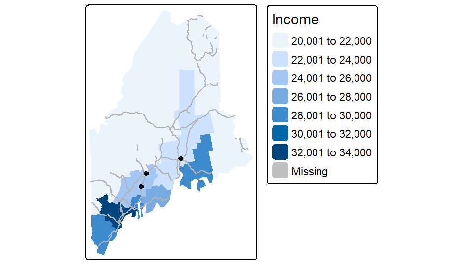

Layers are stacked in the order in which they are listed. In the above example, the point layer is the last layer called therefore it is drawn on top of the previously drawn layers.

Note that if a layer's coordinate system is properly defined, `tmap` will reproject, on-the-fly, any layer whose coordinate system does not match that of the first layer in the stack. In this example, `s.sf` defines the map's coordinate system (UTM/NAD83). `p.sf` is in a geographic coordinate system and is thus reprojected on-the-fly to properly overlap the other layers in the map.

### Tweaking classification schemes {-}

You can control the classification type, color scheme, and bin numbers via the `tm_polygons` function. For example, to apply a quantile scheme with 6 bins and varying shades of green, type:


```r
tm_shape(s.sf) + 
  tm_polygons("Income", style = "quantile", n = 6, palette = "Greens") + 
  tm_legend(outside = TRUE)
```

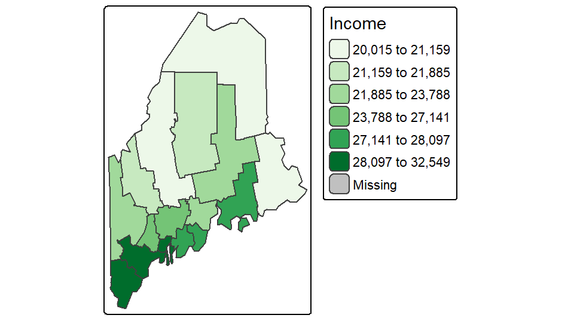


Other `style` classification schemes include  `fixed`, `equal`, `jenks`, `kmeans` and `sd`. If you want to control the breaks manually set `style=fixed` and specify the classification breaks using the `breaks`  parameter. For example,


```r
tm_shape(s.sf) + 
  tm_polygons("Income", style = "fixed",palette = "Greens",
              breaks = c(0, 23000, 27000, 100000 )) + 
  tm_legend(outside = TRUE)
```

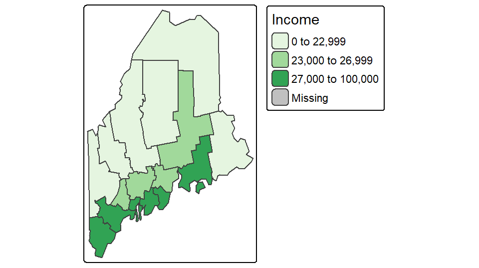

If you want a bit more control over the legend elements, you can tweak the `labels` parameter as in,


```r
tm_shape(s.sf) + 
  tm_polygons("Income", style = "fixed",palette = "Greens",
              breaks = c(0, 23000, 27000, 100000 ),
              labels = c("under $23,000", "$23,000 to $27,000", "above $27,000"),
              text.size = 1) + 
  tm_legend(outside = TRUE)
```


### Tweaking colors {-}

There are many color schemes to choose from, but you will probably want to stick to color swatches established by [Cynthia Brewer](http://colorbrewer2.org). These palettes are available in `tmap` and their names are listed below.

For **sequential** color schemes, you can choose from the following palettes.


For **divergent** color schemes, you can choose from the following palettes.


For **categorical** color schemes, you can choose from the following palettes.


For example, to map the county names using the `Pastel1` categorical color scheme, type:


```r
tm_shape(s.sf) + 
  tm_polygons("NAME", palette = "Pastel1") + 
  tm_legend(outside = TRUE)
```


To map the percentage of the population not having attained a high school degree (column labeled `NoSchool` in `s.sf`) using a `YlOrBr` palette with 8 bins while modifying the legend title to read _"Fraction without a HS degree"_, type:


```r
tm_shape(s.sf) + 
  tm_polygons("NoSchool", style="quantile", palette = "YlOrBr", n=8, 
              title="Fraction without \na HS degree") + 
  tm_legend(outside = TRUE)
```


The character `\n` in the "`Fraction without \na HS degree`" string is interpreted by R as a _new line_ (carriage return). 

If you want to reverse the color scheme simply add the minus symbol `-` in front of the palette name as in `palette = "-YlOrBr"`

### Adding labels {-}

You can add text and labels using the `tm_text` function. In the following example, point labels are added to the right of the points with the text left justified (`just = "left"`) and with an x offset of 0.5 units for added buffer between the point and the text.


```r
tm_shape(s.sf) + 
    tm_polygons("NAME", palette = "Pastel1", border.col = "white") + 
  tm_legend(outside = TRUE) +
  tm_shape(p.sf) +   
    tm_dots(size=  .3, col = "red") +
    tm_text("Name", just = "left", xmod = 0.5, size = 0.8)
```

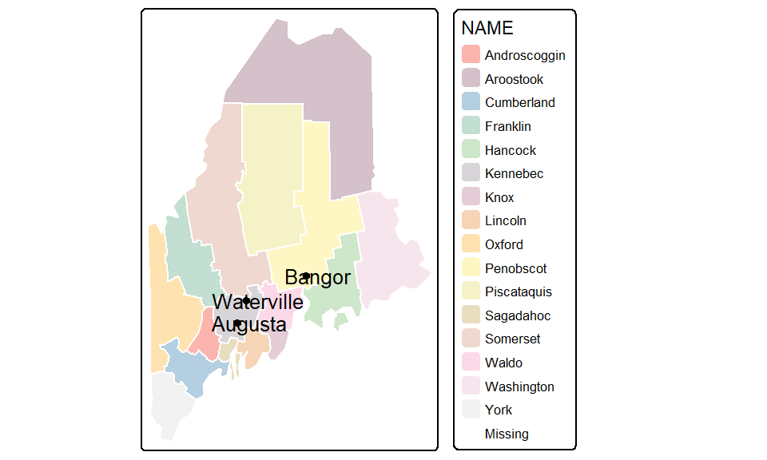

The `tm_text` function accepts an auto placement option via the parameter `auto.placement = TRUE`. This uses a simulated annealing algorithm. Note that this automated approach may not generate the same text placement after each run.

### Adding a grid or graticule {-}

You can add a grid or graticule to the map using the `tm_grid` function. You will need to modify the map's default viewport setting via the `tm_layout` function to provide space for the grid labels. In the following example, the grid is generated using the layer's UTM coordinate system and is divided into roughly four segments along the x-axis and five segments along the y-axis. The function will adjust the grid placement so as to generate "pretty" label values.


```r
tm_shape(s.sf) + 
  tm_polygons("NAME", palette = "Pastel1") + 
  tm_legend(outside = TRUE) +
  tm_layout(outer.margins = c(.1,.1,.1,.1)) +
  tm_grid(labels.inside.frame = FALSE,
          n.x = 4, n.y = 5)
```

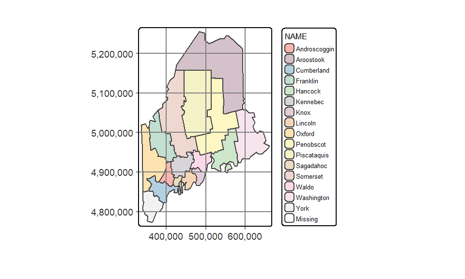

To generate a graticule (lines of latitude and longitude), simply modify the grid's coordinate system to a geographic one using either an [EPSG](https://spatialreference.org/ref/epsg/) defined coordinate system, or a [PROJ4](https://proj4.org/apps/proj.html) formatted string. But note that the `PROJ` string syntax is falling out of favor in current and future R spatial environments so, if possible, adopt an EPSG (or OGC) code. Here, we'll use `EPSG:4326` which defines the WGS 1984 geographic coordinate system.

We will also modify the grid placement by explicitly specifying the lat/long grid values. 


```r
tm_shape(s.sf) + 
  tm_polygons("NAME", palette = "Pastel1") + 
  tm_legend(outside = TRUE) +
  tm_layout(outer.margins = c(.1,.1,.1,.1)) +
  tm_grid(labels.inside.frame = FALSE, 
          x = c(-70.5, -69, -67.5),
          y = c(44, 45, 46, 47),
          projection = "EPSG:4326")
```


Adding the &deg; symbol to the lat/long values requires a bit more code:


```r
tm_shape(s.sf) + 
  tm_polygons("NAME", palette = "Pastel1") + 
  tm_legend(outside = TRUE) +
  tm_layout(outer.margins = c(.1,.1,.1,.1)) +
  tm_grid(labels.inside.frame = FALSE, 
          x =  c(-70.5, -69, -67.5) ,
          y = c(44, 45, 46, 47),
          projection = "+proj=longlat",
          labels.format = list(fun=function(x) {paste0(x,intToUtf8(176))} ) )
```


Here, we use the unicode *decimal* representation of the &deg; symbol (unicode *176*) and pass it to the `intToUtf8` function. A list of unicode characters and their decimal representation can be found on this [Wikipedia](https://en.wikipedia.org/wiki/List_of_Unicode_characters#Latin-1_Supplement) page.

### Adding statistical plots {-}

A histogram of the variables being mapped can be added to the legend element. By default, the histogram will inherit the colors used in the classification scheme.


```r
tm_shape(s.sf) + 
  tm_polygons("NoSchool", palette = "YlOrBr", n = 6, 
              legend.hist = TRUE, title = "% no school") + 
  tm_legend(outside = TRUE, hist.width = 2) 
```

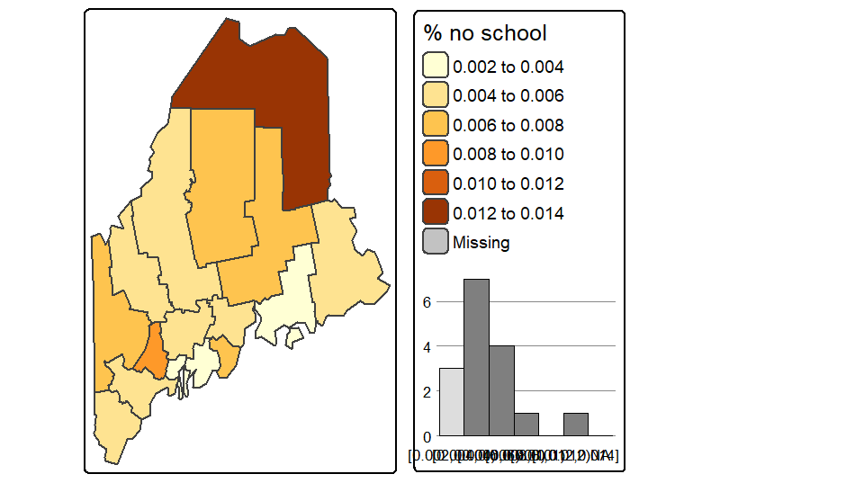

### Mapping raster files {-}

Raster objects can be mapped by specifying the `tm_raster` function. For example to plot the elevation raster and assign 64 continuous shades of the built-in terrain color ramp, type:


```r
tm_shape(elev.r) + 
  tm_raster(style = "cont", title = "Elevation (m)",
            palette = terrain.colors(64))+
  tm_legend(outside = TRUE)
```

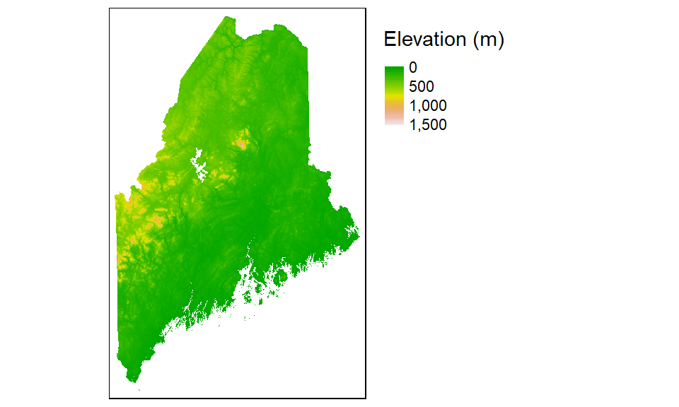

Note the use of another `style` parameter option: `cont` for *continuous* color scheme. 

You can choose to symbolize the raster using classification breaks instead of continuous colors. For example, to manually set the breaks to 50, 100, 500, 750, 1000, and 15000 meters, type:


```r
tm_shape(elev.r) + 
  tm_raster(style = "fixed", title = "Elevation (m)",
            breaks = c(0, 50, 100, 500, 750, 1000, 15000),
            palette = terrain.colors(5))+
  tm_legend(outside = TRUE)
```

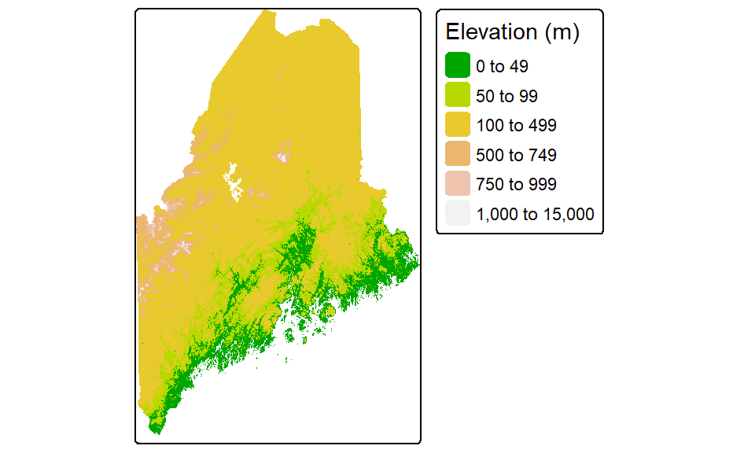

Other color gradients that R offers include, `heat.colors`, `rainbow`, and `topo.colors`. You can also create your own color ramp via the `colorRampPalette` function. For example, to generate a 12 bin quantile classification scheme using a color ramp that changes from `darkolivegreen4` to `yellow` to `brown` (these are built-in R colors), and adding a histogram to view the distribution of colors across pixels, type:


```r
tm_shape(elev.r) + 
  tm_raster(style = "quantile", n = 12, title = "Elevation (m)",
            palette = colorRampPalette( c("darkolivegreen4","yellow", "brown"))(12),
            legend.hist = TRUE)+
  tm_legend(outside = TRUE, hist.width = 2)
```


Note that the Brewer palette names can also be used with rasters.


### Changing coordinate systems {-}

`tmap` can change the output's coordinate system without needing to reproject the data layers. In the following example, the elevation raster, railroad layer and point city layer are mapped onto a *USA Contiguous Albers Equal Area Conic* projection. A lat/long grid is added as a reference.


```r
# Define the Albers coordinate system
aea <-  "+proj=aea +lat_1=29.5 +lat_2=45.5 +lat_0=37.5 +lon_0=-96 +ellps=GRS80 +datum=NAD83"

# Map the data
tm_shape(elev.r, projection = aea) + 
  tm_raster(style = "quantile", n = 12,
            palette = colorRampPalette( c("darkolivegreen4","yellow", "brown"))(12),
            legend.show = FALSE) +
  tm_shape(rail.sf) + tm_lines(col = "grey70")+
  tm_shape(p.sf) +tm_dots(size=0.5) +
  tm_layout(outer.margins = c(.1,.1,.1,.1)) +
  tm_grid(labels.inside.frame = FALSE, 
          x = c(-70.5, -69, -67.5),
          y = c(44, 45, 46, 47),
          projection = "+proj=longlat")
```


The first data layer's `projection=` parameter will define the map's coordinate system. Note that this parameter does not need to be specified in the other layers taking part in the output map.

If a projection is not explicitly defined in the first call to `tm_shape`, then the output map will default to the first layer's reference system.

### Side-by-side maps {-}

You can piece maps together side-by-side using the `tmap_arrange` function. You first need to save each map to a separate object before combining them. For example: 


```r
inc.map <- tm_shape(s.sf) + tm_polygons(col="Income")+
  tm_legend(outside=TRUE) 
school.map <- tm_shape(s.sf) + tm_polygons(col="NoSchool")+
  tm_legend(outside=TRUE) 
name.map <- tm_shape(s.sf) + tm_polygons(col="NAME")+
  tm_legend(outside=TRUE) 

tmap_arrange(inc.map, school.map, name.map)
```


### Splitting data by polygons or group of polygons {-}

You can split the output into groups of features based on a column attribute. For example, to split the income map into individual polygons via the `NAME` attribute, type:


```r
tm_shape(s.sf) + tm_polygons(col = "Income") +
  tm_legend(outside = TRUE) +
  tm_facets( by = "NAME", nrow = 2)
```


The order of the faceted plot follows the alphanumeric order of the faceting attribute values. If you want to change the faceted order, you will need to change the attribute's [level order](https://mgimond.github.io/ES218/Week02a.html#Rearranging_level_order).

## `ggplot2` {-}

If you are already familiar with `ggplot2`, you will find it easy to transition to spatial data visualization. The key *geom* used when mapping spatial data is `geom_sf()`.

### The basics {-}

If you wish to simply plot the geometric elements of a layer, type:


```r
library(ggplot2)
ggplot(data = s.sf) + geom_sf()
```

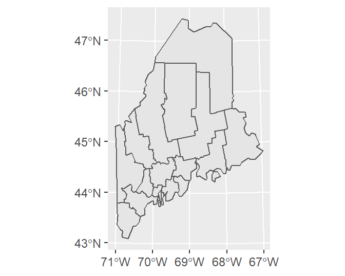

As with any ggplot operation, you can also pass the object's name to the `geom_sf()` instead of the `ggplot` function as in:


```r
ggplot() + geom_sf(data = s.sf)
```

This will prove practical later in this exercise when multiple layers are plotted on the map.

By default, `ggplot` will add a graticule to the plot, even if the coordinate system associated with the layer is in a projected coordinate system. You can adopt any one of `ggplot2`'s gridline removal strategies to eliminate the grid from the plot. Here, we'll make use of the `theme_void()` function.


```r
ggplot(data = s.sf) + geom_sf() + theme_void()
```

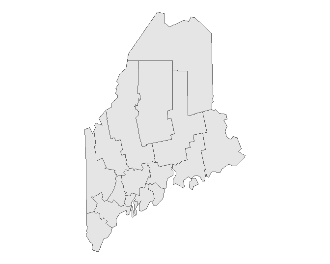

If you want to have ggplot adopt the layer's native coordinate system (UTM NAD 1983 in this example) instead of the default geographic coordinate system, type:


```r
ggplot(data = s.sf) + geom_sf() + coord_sf(datum = NULL)
```

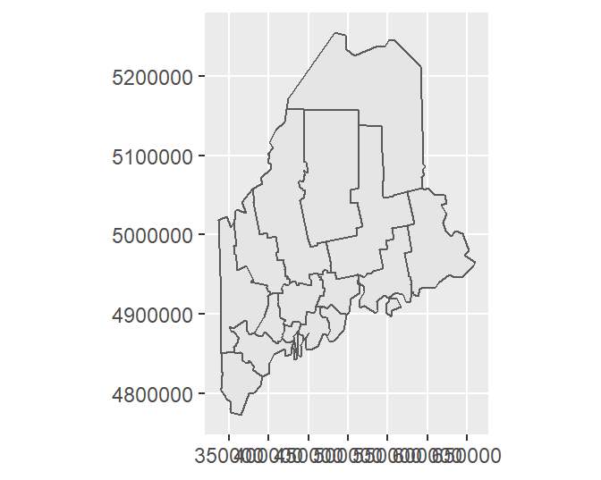

Or, you can explicitly assign the data layer's datum via a call to `st_crs` as in `... + coord_sf(datum = st_crs(s.sf))`

By setting `datum` to `NULL`, you prevent ggplot from figuring out how to convert the layer's native coordinate system to a geographic one. 

You can control grid/graticule intervals using ggplot's  `scale_..._continuous` functions. For example:


```r
ggplot(data = s.sf) + geom_sf() + 
   scale_x_continuous(breaks = c(-70, -69, -68)) +
   scale_y_continuous(breaks = 44:47)
```

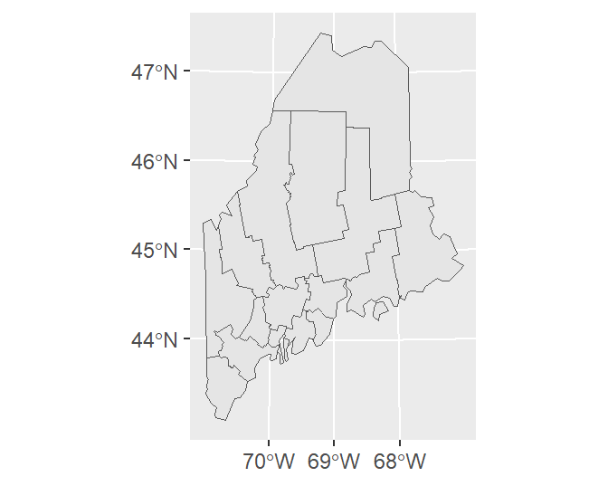

If you wish to apply a grid native to the layer's coordinate system, type:


```r
ggplot(data = s.sf) + geom_sf() + 
   coord_sf(datum = NULL) +
   scale_x_continuous(breaks = c(400000, 500000, 600000)) +
   scale_y_continuous(breaks = c(4900000, 5100000))
```

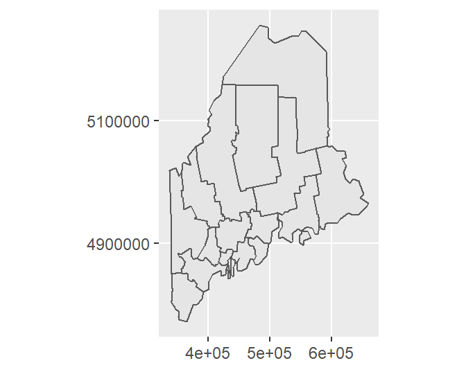

To symbolize a layer's geometries using one of the layer's attributes, add the `aes()` function.


```r
ggplot(data = s.sf, aes(fill = Income)) + geom_sf() 
```

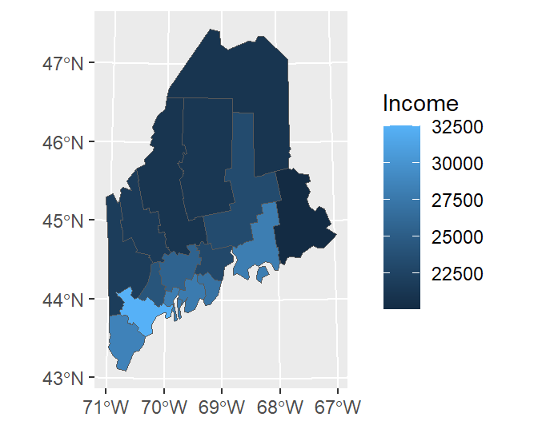

Note that the data and aesthetics can be defined in the `geom_sf` function as well:


```r
ggplot() + geom_sf(data = s.sf, aes(fill = Income)) 
```
To change the border color, type: 


```r
ggplot(data = s.sf, aes(fill = Income)) + 
  geom_sf(col = "white") 
```

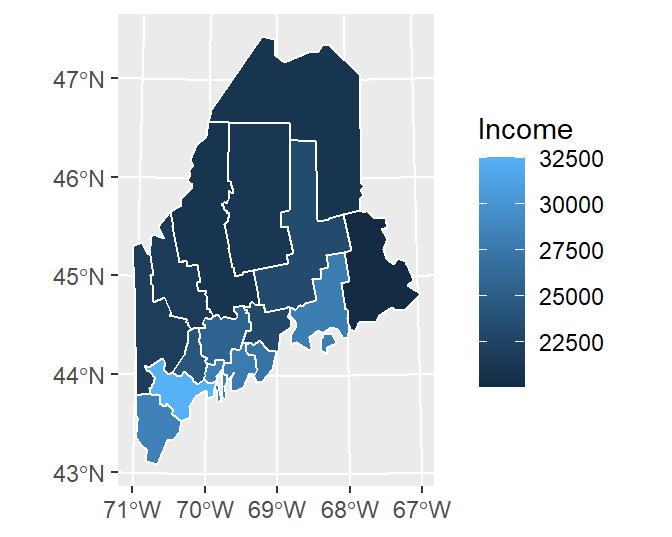

To remove outlines, simply pass `NA` to `col` (e.g. `col = NA`) in the `geom_sf` function.

### Tweaking classification schemes {-}

To bin the color scheme by assigning ranges of income values to a unique set of color swatches defined by hex values, use one of the `scale_fill_steps*` family of functions. 


```r
ggplot(data = s.sf, aes(fill = Income)) + geom_sf() +
  scale_fill_stepsn(colors = c("#D73027", "#FC8D59", "#FEE08B", 
                               "#D9EF8B", "#91CF60") ,
                    breaks = c(22000, 25000, 27000, 30000))
```

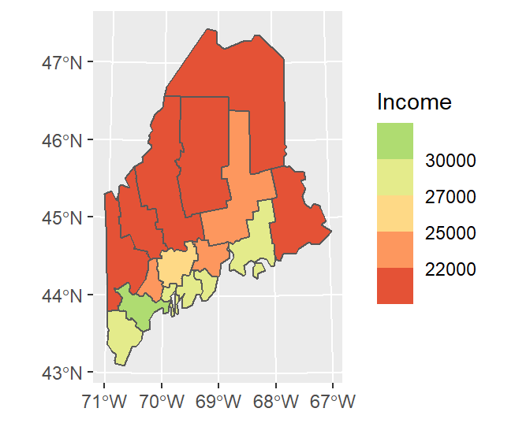

You can adopt Brewer's color schemes (see [the section](#app2_2_3) on Brewer's color schemes) by applying one of the `scale_..._fermenter()` functions and specifying the classification type (sequential, `seq`; divergent, `div`; or categorical, `qual`) and the palette name. For example, to adopt a divergent color scheme using the `"PRGn"` colors, type:


```r
ggplot(data = s.sf, aes(fill = Income)) + geom_sf() +
   scale_fill_fermenter(type = "div", palette = "PRGn", n.breaks = 4)
```

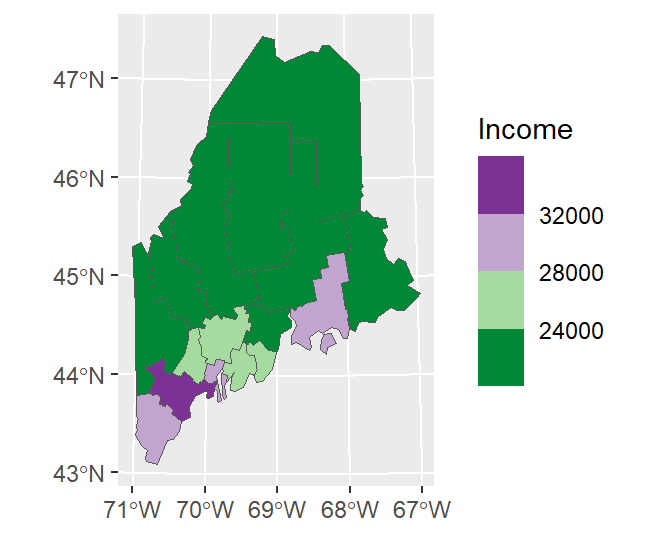

The flip the color scheme set `direction` to `1`.


```r
ggplot(data = s.sf, aes(fill = Income)) + geom_sf() +
   scale_fill_fermenter(type = "div", palette = "PRGn", n.breaks = 4, direction = 1)
```


ggplot offers many advanced options. For example, we can modify the bin intervals by generating a non-uniform classification scheme and scale the legend bar so as to reflect the non-uniform intervals using the `guide_coloursteps()` function and its `even.steps = FALSE` argument. We’ll also modify the legend bar dimensions and title in this code chunk.


```r
ggplot(data = s.sf, aes(fill = Income)) + geom_sf() +
  scale_fill_stepsn(colors = c("#D73027", "#FC8D59", "#FEE08B", 
                               "#D9EF8B", "#91CF60", "#1A9850") ,
                    breaks = c(22000, 25000, 26000, 27000, 30000),
                    values = scales::rescale(c(22000, 25000, 26000, 27000, 30000), c(0,1)),
                    guide = guide_coloursteps(even.steps = FALSE,
                                              show.limits = TRUE,
                                              title = "Per capita Income \n(US dollars)",
                                              barheight = unit(2.2, "in"),
                                              barwidth = unit(0.15, "in"))) 
```

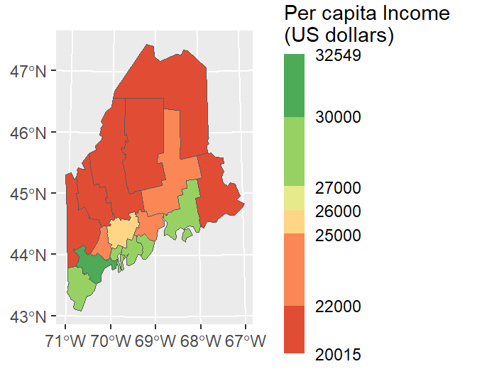


### Combining layers {-}

You can overlap layers in the map by adding calls to `geom_sf`. In such a scenario, it might be best for readability sake to specify the layer name in the `geom_sf` function instead of the `ggplot` function.


```r
ggplot() + 
  geom_sf(data = s.sf, aes(fill = Income)) +
  geom_sf(data = rail.sf, col = "white") +
  geom_sf(data = p.sf, col = "green")
```

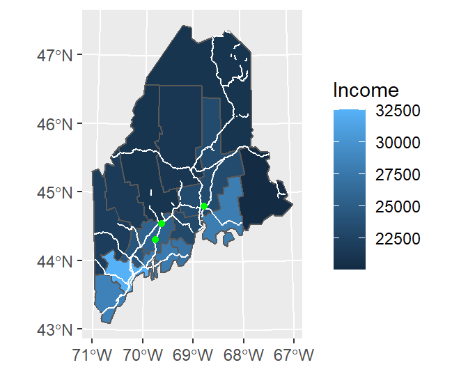

Note that ggplot will convert coordinate systems on-the-fly as needed. Here, `p.sf` is in a coordinate system different from the other layers.

You can also add raster layers to the map. However, the raster layer must be in a dataframe format with `x`, `y` and `z` columns. The `elev.r` raster is in a `RasterLayer` format and will need to be converted to a dataframe using the `as.data.frame` function from the `raster` package. This function has a special method for raster layers, as such, it adds parameters unique to this method. These include `xy = TRUE` which instructs the function to create x and y coordinate columns from the data, and `na.rm = TRUE` which removes blank cells (this will help reduce the size of our dataframe given that `elev.r` does not fill its extent's rectangular outline).

Since the layers are drawn in the order listed, we will move the `rail.sf` vector layer to the bottom of the stack. Note that we also need to load the `raster` package to take advantage of its `as.data.frame` method.


```r
library(raster) # Used to coerce raster to dataframe

ggplot() + 
  geom_raster(data = as.data.frame(elev.r, xy=TRUE, na.rm = TRUE), 
              aes(x = x, y = y, fill = elev)) +
  scale_fill_gradientn(colours = terrain.colors(7)) +
  geom_sf(data = rail.sf, col = "white") +
  geom_sf(data = p.sf, col = "black") +
  theme(axis.title = element_blank())  # Removes axes labels
```

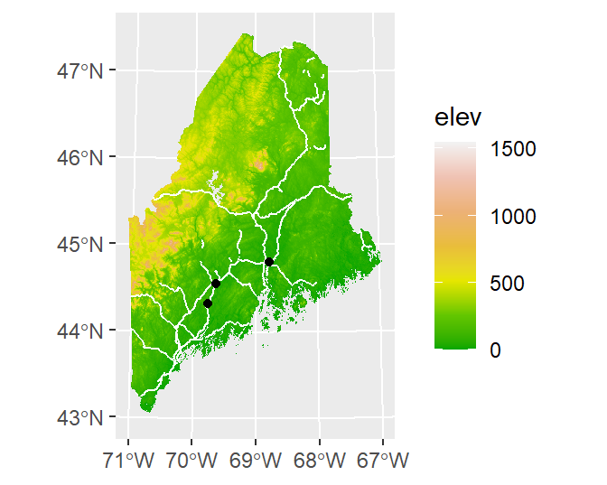


## `plot_sf` {-}

The `sf` package has its own plot method. This is a convenient way to generate simple plots without needing additional plotting packages.

### The basics {-}

By default, when passing an `sf` object to `plot, the function will generate as may plots as there are attribute columns. For example


```r
plot(s.sf)
```


To limit the plot to just one of the attribute columns, limit the dataset using basic R indexing techniques. For example, to plot the `Income` column, type


```r
plot(s.sf["Income"])
```

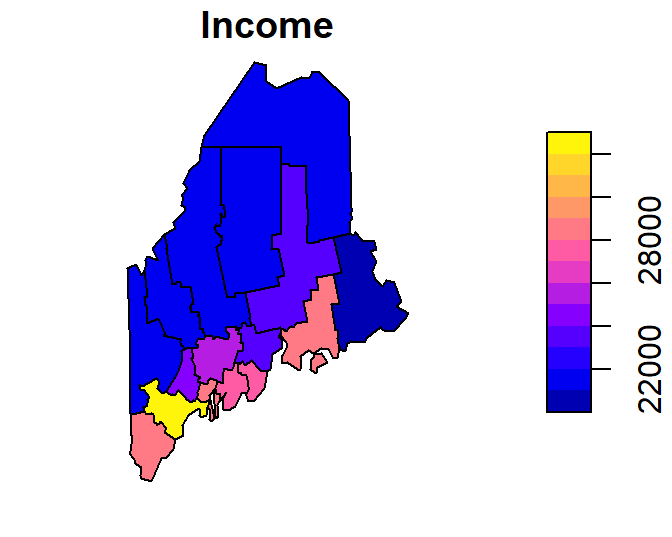

To limit the output to just the layer's geometry, wrap the object name with the `st_geometry` function. 


```r
plot(st_geometry(s.sf))
```


You can control the fill and border colors using the `col` and `border` parameters respectively.


```r
plot(st_geometry(s.sf), col ="grey", border = "white")
```

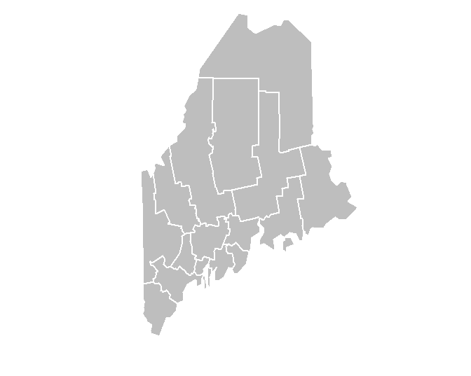

### Adding a graticule {-}

You can add a graticule by setting the graticule parameter to `TRUE`. To add graticule labels, set `axes` to `TRUE`.


```r
plot(st_geometry(s.sf), col ="grey", border = "white", graticule = TRUE, axes= TRUE)
```

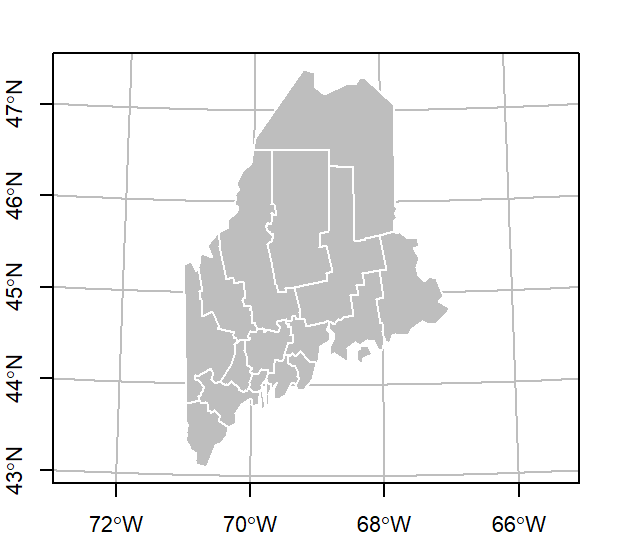

### Combining layers {-}

To add layers, generate a new call to `plot` with the `add` parameter set to `TRUE`. For example, to add `rail.sf` and `p.sf` to the map, type:


```r
plot(st_geometry(s.sf), col ="grey", border = "white", graticule = TRUE, axes= TRUE)
plot(rail.sf,  col = "grey20", add = TRUE)
```


Note that `plot_sf` requires that the layers be in the same coordinate system. For example, adding `p.sf` will not show the points on the map given that it's in a different coordinate system.

`sf` layers can be combined with raster layers. The order in which layers are listed will matter. You will usually want to map the raster layer first, then add the vector layer(s).


```r
plot(elev.r, col = terrain.colors(30))
plot(st_geometry(rail.sf), col ="grey", border = "white", add = TRUE)
```

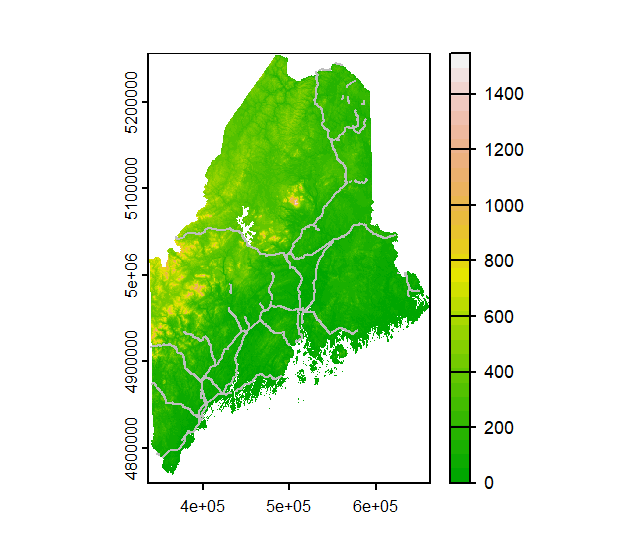

### Tweaking colors {-}

You can tweak the color schemes as well as the legend display. The latter will require the use of R's built-in `par` function whereby the `las = 1` parameter will render the key labels horizontal, and the `omi` parameter will prevent the legend labels from being cropped.


```r
OP <- par(las = 1, omi=c(0,0,0,0.6))
p1 <- plot(s.sf["Income"], breaks = c(20000, 22000, 25000, 26000, 27000, 30000, 33000),
     pal = c("#D73027", "#FC8D59", "#FEE08B", 
             "#D9EF8B", "#91CF60", "#1A9850"),
     key.width = 0.2,
     at = c(20000, 22000, 25000, 26000, 27000, 30000, 33000))
par(OP)
```


While `plot_sf` offers succinct plotting commands and independence from other mapping packages, it is limited in its customization options.


